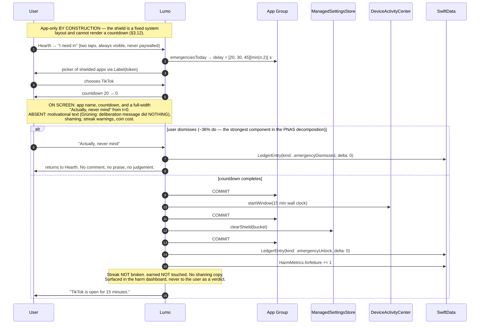

# Lumo — Architecture & Implementation Specification

**Status:** ready for implementation. **Toolchain:** Xcode 26.5 / Swift 6.3.2 / iOS SDK 26.5. **Floor:** iOS 18.0.
**Companion documents:** `~/.claude/plans/i-want-to-build-enchanted-mochi.md` (product plan — authoritative on platform facts),
`~/.claude/plans/i-want-to-build-enchanted-mochi-agent-aa9d224a6f3935859.md` (science/competitive dossier).

---

## 0. Verification log — what I checked, and what it changed

Everything in §1–§7 was typechecked against the real iOS 26.5 SDK before being written down. The Swift in
this document compiles under `-swift-version 6` unless explicitly marked as pseudocode. Method:
`xcrun swiftc -typecheck -swift-version 6 -target arm64-apple-ios18.0 -sdk $(xcrun --sdk iphoneos --show-sdk-path)`,
plus reading the shipped `.swiftinterface` files at
`$SDK/System/Library/Frameworks/{ManagedSettings,ManagedSettingsUI,DeviceActivity,FamilyControls}.framework/Modules/*.swiftmodule/arm64e-apple-ios.swiftinterface`.

### 0.1 Findings that change the plan file

| # | Finding | Evidence | Impact |
|---|---|---|---|
| **F1** | `ShieldActionResponse.openParentalControlsApp` **exists**, `@available(iOS 26.5, *)` | `ManagedSettings.swiftinterface` | The plan's central "you cannot open the containing app from a ShieldAction extension" constraint has an **official iOS 26.5+ escape hatch**. Adds a *third* redemption path. Semantics need a device spike (SPIKE-3) before we design UX on it. |
| **F2** | `ManagedSettingsStore.refresh(_ tokens: inout [ApplicationToken]) throws` **exists**, static, `@available(iOS 26.5, *)`; also `[ActivityCategoryToken]` and `[WebDomainToken]` overloads | ibid. | Token rotation — "complaint #2 across every competitor" — has an **official repair API on 26.5+**. Self-heal is automatic above 26.5 and only heuristic below it. |
| **F3** | `ManagedSettingsStore.TokenExpiryMessage` + `NotificationCenter.MessageIdentifier.tokensDidExpire` **exist**, `@available(iOS 26.5, *)` | ibid. | There is an **official push signal** for token rotation. Self-heal becomes event-driven, not just launch-polled. |
| **F4** | `secondaryButtonSubmenuItems` is `[String]`, and the response arrives as `ShieldAction.firstSecondarySubmenuItemPressed` / `.second…` / `.third…` — **positional, max 3, no identifier round-trip** | `ManagedSettingsUI` + `ManagedSettings` interfaces | The plan does not mention this. It creates a **cross-process index contract** between the config extension (which renders the list) and the action extension (which receives an index). Mis-ordering silently sells the wrong tier. Designed around in §3.6. |
| **F5** | `ShieldConfiguration` is built from `UIColor` / `UIImage` / `UIBlurEffect.Style`, and **`import UIKit` is required** (the project has `SWIFT_UPCOMING_FEATURE_MEMBER_IMPORT_VISIBILITY = YES`, so it does not arrive transitively) | typecheck failed without it, passed with it | The plan's extension import allowlist **omits UIKit and is wrong**. Corrected in §1.4. Consequence: `LumoShieldKit` must never expose UIKit types, or the 6 MB monitor extension inherits a UIKit link. |
| **F6** | **Nothing** in `ManagedSettings` / `DeviceActivity` is `Sendable`. Confirmed non-Sendable: `Token<T>` (= `ApplicationToken`), `DeviceActivityName`, `DeviceActivityEvent`, `DeviceActivityEvent.Name`, `DeviceActivitySchedule`, `DeviceActivityCenter`, `ManagedSettingsStore.Name`, `FamilyActivitySelection` | typecheck errors | Swift 6 strict concurrency is unusable across these types without a shim. Solved in §5.3. |
| **F7** | `SWIFT_DEFAULT_ACTOR_ISOLATION = MainActor` (currently set on the app target) **makes it impossible to subclass `DeviceActivityMonitor`** in Swift 6 mode — `error: main actor-isolated instance method 'intervalDidEnd(for:)' has different actor isolation from nonisolated overridden declaration`, plus the same error on `init()` | typecheck | Extension targets **must** set `SWIFT_DEFAULT_ACTOR_ISOLATION = nonisolated`. This is a non-obvious hard build-setting requirement, not a preference. |
| **F8** | `UserDefaults`' `Sendable` conformance is **explicitly marked unavailable** (`@_nonSendable(_assumed)`) — a retroactive conformance cannot be added | typecheck note | The App Group defaults handle must be a `nonisolated(unsafe)` global (verified to compile clean). §5.4. |
| **F9** | `DeviceActivityEvent.init(…, threshold:, includesPastActivity: Bool)` exists `@available(iOS 17.4, *)`. We are on an 18.0 floor, so we can **always** pass it | `DeviceActivity.swiftinterface` | `includesPastActivity: false` is almost certainly the correct mitigation for the "threshold fires immediately" regression. The older initializer (no parameter) must never be used. |
| **F10** | `DeviceActivitySchedule.init` takes `warningTime: DateComponents?`, and `DeviceActivityCenter.startMonitoring` takes an **`events:` dictionary** | ibid. | Multiple threshold events cost **zero** extra activities against the 20-activity cap. This replaces the plan's "chained watchdog schedules at +15/+30/+44m", which would burn 3 activities per session and flirt with `intervalTooShort`. §3.8. |
| **F11** | `ShieldSettings.ActivityCategoryPolicy` has `.all(except: Set<Token<Activity>>)` and `.specific(_, except:)` — but `except:` takes **tokens**, which we still cannot synthesize for Health apps | ibid. | The `except:` mechanism does **not** rescue the safety allowlist. The plan's "hard-code a safety allowlist" is **not implementable as written**. See §0.2/F12 — this is a P0 safety gap. |
| **F12** | `Application.bundleIdentifier` is `String?` and `Application.token` is `ApplicationToken?`; `Application(bundleIdentifier:)` exists but whether it yields a usable `token` is undocumented | ibid. | The entire hard-coded allowlist hinges on this. Elevated to **SPIKE-1, P0, blocking onboarding copy**. Fallback design in §3.9. |
| **F13** | `DeviceActivityCenter.MonitoringError` cases are exactly `excessiveActivities`, `intervalTooLong`, `intervalTooShort`, `invalidDateComponents`, `unauthorized` — there is **no** token-count error | ibid. | Confirms the 51-token failure is silent. Nothing to catch; must be prevented in the picker. |
| **F14** | `FamilyControlsError` gains `.unauthorized` `@available(iOS 26.4, *)` | `FamilyControls.swiftinterface` | Per-error recovery switch must be `@unknown default`-safe and `#available`-gate the new case. |

### 0.2 Where I disagree with the plan file

These are judgment calls, not corrections of fact. Each is argued at the referenced section.

| # | Plan says | I recommend instead | Why | Where |
|---|---|---|---|---|
| **D1** | Coin spend order: **debit → unshield → start monitoring** | **debit → arm monitoring → unshield** | The plan's order creates a crash window where apps are unshielded with no armed timer — i.e. *unbounded free access*, the worst possible failure. Arming first makes every crash state either a clean rollback or already-protected-by-the-OS. Proof table in §3.5.3. **This is the single most important change in this document.** | §3.5 |
| **D2** | `LumoShieldKit` = one framework, `Foundation + ManagedSettings` only | **Split into `LumoCore` (portable, Foundation-only) + `LumoShieldKit` (iOS-only adapters)**, both static, both local SPM packages | `LumoCore` then compiles and tests **on macOS** with zero Screen Time frameworks — verified. That converts "the shield path can never be integration-tested" into "~90% of the risky logic runs in CI in seconds." It is the difference between a testable and an untestable project. | §1.5, §7, §10 |
| **D3** | "Partition the selection into fixed **buckets**" — size unspecified | **A bucket is exactly one token.** 1 app = 1 named store (or 1 category = 1 store). Cap at **40 app tokens**, not 50 | An N-app bucket over-delivers on unlock (you pay for TikTok, you get Instagram free), which breaks the response-deprivation pricing the whole economy rests on. 40 also buys headroom under *both* the 50-token silent cliff and the 50-named-store cap. | §3.9 |
| **D4** | Layer 5: "Both shield extensions reconcile on every invocation" | Config extension gets **observe-only reconcile**: it may compute state and render truthfully, and write drift breadcrumbs, but **never** touch `ManagedSettingsStore` | Writing `shield.applications` from inside the "what should I render?" callback invites re-entrant invalidation. The config extension is on a latency-sensitive render path and can be invoked repeatedly. | §3.3, §3.7 |
| **D5** | Layer 3: "Chained watchdog schedules at +15/+30/+44m" | **Threshold-event heartbeats inside the single session activity** (free), plus a genuinely independent **local-notification watchdog** | Chained schedules cost 3 activities/session against a 20 cap, sit exactly on the 15-min `intervalTooShort` floor, and — critically — *share the same failure mode* as the thing they are watching (they are all DeviceActivity). A watchdog that dies with its subject is not a watchdog. | §3.8 |
| **D6** | Journal is pruned once "settled" | **Only the app may prune the journal**; extensions may append and advance phase only. Settled entries survive until ingested into the SwiftData ledger | The journal is the only durable record of an extension-side spend. Prune-on-settle destroys the audit trail and makes the wallet unreconcilable. The journal *is* the extension→SwiftData write-ahead log. | §3.4, §6.4 |
| **D7** | "Hard-code a safety allowlist (Phone, Messages, Maps, Wallet, Health & Medical)" | **User-authored essential-apps deny-set**, subtracted at every write, seeded by hard-coded bundle IDs *only if* SPIKE-1 shows `Application(bundleIdentifier:).token` works | Tokens are opaque; you cannot recognise a CGM app by token. Shipping onboarding copy that promises a hard-coded medical allowlist you cannot implement is worse than shipping no promise. | §3.9 |
| **D8** | Swift language mode 5 (current project setting) | **Swift 6 mode now**, on all targets, day one | 3 template files exist. Migration cost is ~zero today and grows superlinearly. The only real blocker (F6, non-Sendable Apple types) is solved by one 8-line shim file, verified. And F7 means the extensions need explicit isolation settings *anyway*. | §5.1 |
| **D9** | The 26.4 submenu path settles the transaction in the ShieldAction extension | Same, **but** the tier list must be a **pure deterministic function** of (bucket, wallet, policy), recomputed and re-validated in the action extension | F4: the submenu round-trips a *position*, not an identity. A written handshake between two extensions is a race; a pure function evaluated twice is not. | §3.6 |

### 0.3 Second-pass verification against Apple's live documentation

A follow-up research pass fetched Apple's DocC JSON (the backing store for `developer.apple.com/documentation`)
plus Apple Developer Forums threads. It confirmed F1–F14 and produced **six further findings, three of which are
load-bearing.** Verbatim Apple text is quoted; anything unquoted is inference and labelled.

| # | Finding | Status | Impact |
|---|---|---|---|
| **F15** 🔴 | **`eventDidReachThreshold` is still firing immediately on iOS 26.5.2, and `includesPastActivity: false` does NOT mitigate it.** Forum thread 838510 (~Jul 2026), developer reports threshold *"recorded trigger time is +0 seconds from monitoring start (immediate)… fires without any real usage, and after 2 minutes of actual use no notification and no ManagedSettings shield are applied,"* explicitly with `includesPastActivity = false`. No Apple reply. April 2026's "apparently fixed in 26.5 beta 1" (thread 819997) was self-qualified as inconsistently reproducible and inferred from a radar update on one of several FBs. | **CONTRADICTS** my F9 assumption | **Layer 1 cannot be the primary expiry mechanism.** Inverts the plan's layering: wall clock becomes primary, usage threshold becomes an advisory early-close behind a sanity floor. Kills sub-15-minute tiers by default. See §3.8.1 — **this is the second most important change in this document.** |
| **F16** 🔴 | **`AuthorizationStatus.approvedWithDataAccess` is a new case in iOS 26.4.** Any `status == .approved` comparison is now *incorrect* on 26.4+. | VERIFIED (SDK + docs) | Every authorization check must be a `switch` with `@unknown default`, never an `==`. A single `== .approved` shipped here silently disables shielding for every 26.4+ user who granted data access. §7.2. |
| **F17** | **`FamilyActivityData.shared.installedApplications: [Application] { get async throws }`** (iOS 26.4+, `macCatalyst` unavailable), alongside `visitedWebDomains` and `activityCategories`. Enumerates installed apps **as `Application` values without `FamilyActivityPicker`** — and `Application` carries both `bundleIdentifier: String?` and `token: ApplicationToken?`. | VERIFIED (SDK + docs) | **Partially rescues the safety allowlist (D7/F12).** On 26.4+ we can plausibly map hard-coded bundle IDs → tokens and build a genuine deny-set. Below 26.4, user-authored only. Folded into SPIKE-1. |
| **F18** | **`DeviceActivityData.activityData(filteredBy:using:)`** → `some AsyncSequence<DeviceActivityData, any Error>`, with `DeviceActivityData.Policy` (`.cached`/`.live`) and `.Error` (`.unavailable`/`.unauthorized`/`.missingData`), iOS 26.4+. **Reads activity data outside the `DeviceActivityReport` extension sandbox.** | VERIFIED (SDK + docs) | Potentially replaces the threshold-ladder baseline inference with real numbers on 26.4+. Deferred to Phase 4 as an *optional accelerator*; the threshold ladder stays as the 18.0–26.3 path. Do not make the economy depend on it before SPIKE-5. |
| **F19** | `openParentalControlsApp` semantics: Apple abstract, verbatim — *"An instruction for the system to open your parental controls app that is responsible for shielding the application or web browser."* It is a **peer enum case, not a modifier**, and the handler returns exactly one value, so **you cannot both `.close` the shielded app and open Lumo.** No associated value ⇒ **no context, no deep link.** Shield-dismissal behaviour and `.individual`-vs-`.child` scope are **undocumented**. | PARTIALLY VERIFIED | Confirms F1 is real and is genuinely the fix for FB15079668 in shape. But the App Group handoff is still mandatory (write intent *before* calling the completion handler). Gated behind SPIKE-3. |
| **F20** | Submenu contract, all VERIFIED verbatim: *"Add up to three array elements"*; *"the system displays a submenu on secondary button taps"* (tap, not long-press); *"The system automatically adds a Cancel button"* (**do not spend a slot on Cancel**); and *"If you provide nil or an empty array… instead invokes the `secondaryButtonPressed` action."* ⇒ **supplying a submenu suppresses `.secondaryButtonPressed`; the delegate must implement both paths.** `warningTime`: *"If the components specify a longer time interval than the schedule's interval, the system clamps…"* — documented maximum, **no documented minimum** (the widely-repeated "15-minute minimum" is community lore, not Apple text). Apple explicitly recommends `warningTime` *over* many schedules to avoid `startMonitoring` errors. | VERIFIED | Locks §3.6 and independently confirms **D5**. |

Two housekeeping items from the same pass, both accepted:

- **iOS 26.6 / Xcode 26.6 (17F113) is current**; this machine has 26.5 (17F42). **TASK-002a: install Xcode 26.6 and re-diff the four `.swiftinterface` files before Phase 1 locks.** Anything in §0.1–§0.3 could have moved.
- `ShieldAction`, `ShieldActionResponse`, `AuthorizationStatus` and `FamilyControlsError` are all library-evolution enums. **Every `switch` over them requires `@unknown default`.** Make it a lint rule.

### 0.4 Consolidated availability ladder

Everything version-gated in one place. `#available` checks are cheap; guessing is not.

| Capability | Floor | Below the floor |
|---|---|---|
| `shield.applications`, named stores, `clearAllSettings()` | 16.0 (we require 18.0) | n/a |
| `DeviceActivityEvent(includesPastActivity:)` | 17.4 | n/a — never use the legacy init (F9: default is undocumented) |
| `secondaryButtonSubmenuItems` + 3 submenu actions | **26.4** | notification-bridge path (§4.3b) |
| `FamilyControlsError.unauthorized` | **26.4** | `@unknown default` catch-all |
| `AuthorizationStatus.approvedWithDataAccess` | **26.4** | `switch`, never `==` (F16) |
| `FamilyActivityData.shared.installedApplications` | **26.4** | user-authored essential set only (F17) |
| `DeviceActivityData.activityData(filteredBy:using:)` | **26.4** | threshold-ladder baseline inference (F18) |
| `ManagedSettingsStore.isActive` | **26.5** | `clearAllSettings()` + re-apply |
| `ManagedSettingsStore.stores`, `deleteStore()`, `deleteStores(_:)` | **26.5** | maintain our own slot table (we do anyway) |
| `ManagedSettingsStore.refresh(_:)` ×3 token kinds | **26.5** | detection + user-assisted re-pick (§3.10) |
| `TokenExpiryMessage` / `.tokensDidExpire` | **26.5** | poll on every foreground (we do anyway) |
| `ShieldActionResponse.openParentalControlsApp` | **26.5** | notification-bridge path (§4.3b) |

---

## 1. Target topology & dependency rules

### 1.1 The graph

```
                          ┌───────────────────────────────┐
                          │  Lumo  (app, iOS 18.0)        │
                          │  SwiftUI · SwiftData · DS     │
                          └──┬───────────┬────────────┬───┘
             embeds          │           │            │  links
        ┌────────────────────┼───────────┼────────────┼──────────────┐
        │                    │           │            │              │
        ▼                    ▼           ▼            ▼              │
┌────────────────┐  ┌─────────────────┐ ┌──────────────────┐        │
│ LumoMonitor    │  │ LumoShieldConfig│ │ LumoShieldAction │        │
│ Extension      │  │ Extension       │ │ Extension        │        │
│ ≤ 6 MB  ⚠️     │  │ ≤ 20 MB         │ │ ≤ 20 MB          │        │
└───────┬────────┘  └────────┬────────┘ └────────┬─────────┘        │
        │                    │                   │                  │
        └────────────────────┴───────────────────┴──────────────────┘
                                   │ links (static)
                          ┌────────▼─────────────────────┐
                          │ LumoShieldKit  (static lib)  │
                          │ ManagedSettings·DeviceActivity│
                          │ Foundation.  NO UIKit.       │
                          └────────┬─────────────────────┘
                                   │ depends
                          ┌────────▼─────────────────────┐
                          │ LumoCore  (static lib)       │
                          │ Foundation ONLY.             │
                          │ iOS 18 + macOS 14  ← CI      │
                          └──────────────────────────────┘
```

Strictly acyclic, exactly two levels of shared code, and the bottom level is platform-portable.

### 1.2 Target matrix

| | **Lumo** | **LumoShieldKit** | **LumoCore** | **LumoMonitorExtension** | **LumoShieldConfigExtension** | **LumoShieldActionExtension** |
|---|---|---|---|---|---|---|
| Product type | `.application` | SPM `.library(type: .static)` | SPM `.library(type: .static)` | `.app-extension` | `.app-extension` | `.app-extension` |
| Extension point | — | — | — | `com.apple.deviceactivity.monitor-extension` | `com.apple.ManagedSettings.shield-configuration-service` | `com.apple.ManagedSettings.shield-action-service` |
| Principal class | — | — | — | `LumoDeviceActivityMonitor` | `LumoShieldConfigurationDataSource` | `LumoShieldActionDelegate` |
| Bundle ID | `com.habib.Lumo` | — | — | `com.habib.Lumo.monitor` | `com.habib.Lumo.shieldconfig` | `com.habib.Lumo.shieldaction` |
| Deployment target | 18.0 | 18.0 | iOS 18.0 / **macOS 14.0** | 18.0 | 18.0 | 18.0 |
| Swift language mode | 6 | 6 | 6 | 6 | 6 | 6 |
| `SWIFT_DEFAULT_ACTOR_ISOLATION` | `MainActor` | `nonisolated` | `nonisolated` | **`nonisolated`** (F7) | **`nonisolated`** (F7) | **`nonisolated`** (F7) |
| `SWIFT_APPROACHABLE_CONCURRENCY` | `YES` | `YES` | `YES` | `YES` | `YES` | `YES` |
| Family Controls entitlement | ✅ dev + dist | n/a | n/a | ✅ dev + dist | ✅ dev + dist | ✅ dev + dist |
| App Group `group.com.habib.Lumo` | ✅ | n/a | n/a | ✅ | ✅ | ✅ |
| Other capabilities | Push (local only), Background Modes: **none** | — | — | — | — | — |
| **Memory budget** | normal | — | — | **peak ≤ 3 MB, alarm 4.5, ceiling 6** | peak ≤ 20 MB | peak ≤ 20 MB |
| Binary size budget (`__TEXT`+`__DATA`) | — | ≤ 400 KB | ≤ 250 KB | **≤ 1.2 MB** | ≤ 2 MB | ≤ 1.5 MB |

Notes on the memory column: the **6 MB** figure is documented (and Jetsam-enforced) only for `DeviceActivityMonitor`.
The two ManagedSettingsUI extensions are more generous but *undocumented* — the 20 MB budget is a self-imposed
guardrail, not a platform number. Treat any extension as hostile territory.

### 1.3 Entitlements per target

`Lumo.entitlements`:
```xml
<key>com.apple.developer.family-controls</key><true/>
<key>com.apple.security.application-groups</key>
<array><string>group.com.habib.Lumo</string></array>
```
Each extension gets an identical pair. That is **four** separate Family Controls Distribution requests
(app + 3 extensions). `LumoReportExtension` is deferred, so it is not a fifth — the plan file says "4–5 requests";
the answer is **4**, and filing a request for a bundle ID you never ship is wasted latency on a queue with no SLA.

Explicitly **not** requested, ever: `denyAppRemoval` (exists — F14 area — and is user-hostile and undocumented
under `.individual`), MDM (Guideline 5.5), Background Modes (`BGTaskScheduler` is banned per the plan; no
background mode is needed because every wake-up we rely on is OS-initiated).

### 1.4 The import allowlist — corrected

| Target | Allowed imports |
|---|---|
| `LumoCore` | `Foundation` — **and nothing else, ever** |
| `LumoShieldKit` | `Foundation`, `ManagedSettings`, `DeviceActivity`, `UserNotifications`, `LumoCore` |
| `LumoMonitorExtension` | `Foundation`, `DeviceActivity`, `ManagedSettings`, `UserNotifications`, `LumoShieldKit`, `LumoCore` |
| `LumoShieldConfigExtension` | `Foundation`, `ManagedSettings`, `ManagedSettingsUI`, **`UIKit`** (F5 — mandatory), `LumoShieldKit`, `LumoCore` |
| `LumoShieldActionExtension` | `Foundation`, `ManagedSettings`, `UserNotifications`, `LumoShieldKit`, `LumoCore` |
| `Lumo` | anything |

Two changes from the plan: **UIKit is added** (and is mandatory, not optional — F5), and it is scoped to the
config extension only. `ManagedSettingsUI` is likewise config-extension-only; the monitor extension must never
see it, because it drags in UIKit.

`LumoShieldKit` must not export UIKit types. Concretely: the shield's visual spec crosses the boundary as
plain data, and `UIColor` is constructed *inside* the config extension.

```swift
// LumoCore — portable, no UIKit
public struct ColorSpec: Codable, Sendable, Hashable {
    public let r: Double, g: Double, b: Double, a: Double
}
public struct ShieldSpec: Codable, Sendable {
    public let background: ColorSpec
    public let title: String
    public let titleColor: ColorSpec
    public let subtitle: String
    public let subtitleColor: ColorSpec
    public let primaryButton: String
    public let secondaryButton: String?
    public let submenuItems: [String]      // ≤ 3, index == submenu position (F4)
    public let iconAssetName: String?
}
```

### 1.5 Enforcement of the import rule — mechanical, not cultural

An import rule that lives in a README gets violated in month three. Three layers, all in CI, all fail-the-build:

**(a) Source grep gate** — cheapest, catches intent before it links.
```bash
# Scripts/lint-imports.sh   (run as a CI step AND an Xcode "Run Script" phase on each extension)
set -euo pipefail
declare -A ALLOWED=(
  [LumoMonitorExtension]="Foundation DeviceActivity ManagedSettings UserNotifications LumoShieldKit LumoCore"
  [LumoShieldConfigExtension]="Foundation ManagedSettings ManagedSettingsUI UIKit LumoShieldKit LumoCore"
  [LumoShieldActionExtension]="Foundation ManagedSettings UserNotifications LumoShieldKit LumoCore"
)
fail=0
for target in "${!ALLOWED[@]}"; do
  [ -d "$target" ] || continue
  while IFS=: read -r file _ mod; do
    mod=$(echo "$mod" | sed -E 's/^ *(@[A-Za-z_]+ +)*import +([A-Za-z_0-9.]+).*/\2/' | cut -d. -f1)
    [ -z "$mod" ] && continue
    case " ${ALLOWED[$target]} " in
      *" $mod "*) ;;
      *) echo "::error file=$file::forbidden import '$mod' in $target"; fail=1 ;;
    esac
  done < <(grep -rnE '^[[:space:]]*(@[A-Za-z_]+[[:space:]]+)*import[[:space:]]+' "$target" --include='*.swift')
done
exit $fail
```

**(b) Link-graph gate** — catches transitive arrival, which the grep cannot.
```bash
# Scripts/assert-link-graph.sh <path-to-built-.appex>
BIN="$1/$(basename "$1" .appex)"
FORBIDDEN='UIKit|SwiftUI|SwiftData|CoreData|ManagedSettingsUI|Combine|Network|CFNetwork'
if otool -L "$BIN" | grep -qE "/($FORBIDDEN)\.framework"; then
  echo "::error::$1 links a forbidden framework:"; otool -L "$BIN" | grep -E "/($FORBIDDEN)\."; exit 1
fi
```
Applied to `LumoMonitorExtension.appex` with the full list, and to the two shield extensions with
`SwiftUI|SwiftData|CoreData|Network|CFNetwork`.

**(c) Size gate** — an early-warning proxy for the 6 MB runtime ceiling, which CI cannot measure directly.
```bash
# Scripts/assert-binary-size.sh <binary> <max-bytes>
sz=$(size -m "$1" | awk '/Segment __TEXT|Segment __DATA/ {gsub(/[^0-9]/,"",$3); s+=$3} END{print s}')
[ "$sz" -le "$2" ] || { echo "::error::$1 is ${sz}B > ${2}B budget"; exit 1; }
```
Binary size is not memory footprint, but a monitor extension whose binary doubles is a monitor extension
whose footprint moved, and it is the only signal available without a device.

Gate (b) is the one that actually protects the 6 MB ceiling, because the failure mode the plan warns about —
*a 6 MB overrun means the shield never re-applies, silently, invisible in metrics* — is overwhelmingly caused
by accidentally linking a heavy framework, not by allocating too many structs.

### 1.6 `LumoShieldKit`: static library, and why

**Recommendation: two local SPM packages, both `.library(type: .static)`.** Not a dynamic framework.

| Option | Extension launch cost | 6 MB budget | Testability | Verdict |
|---|---|---|---|---|
| **Dynamic framework** (`.framework`, `MH_DYLIB`) | dyld must map, rebase, bind and run initialisers for an extra image on every extension launch — and the monitor extension is launched *frequently and briefly* | `__DATA`, dyld bookkeeping and the LINKEDIT working set are dirty and count against the high-watermark. Buys nothing back, since there is no meaningful text-page sharing across four processes that rarely run simultaneously | fine | ❌ Pays a recurring launch and footprint tax for a sharing benefit that does not materialise |
| **Xcode static framework / static lib target** | zero extra image | best | requires an iOS destination to build → **no macOS unit tests** | ⚠️ Good runtime, bad CI |
| **Local SPM package, static** ✅ | zero extra image (statically archived into each of the four binaries) | best | `swift test` on macOS for `LumoCore`; also far less `project.pbxproj` surgery than a framework target — `XCLocalSwiftPackageReference` + one `XCSwiftPackageProductDependency` per consumer, versus a full `PBXNativeTarget` with build phases, four build configurations and an embed step | ✅ |

The static choice is not a micro-optimisation. The plan's own risk register leads with *"a 6 MB overrun means the
shield never re-applies — silent total failure, invisible in metrics."* A dynamic framework spends part of that
budget on dyld for no return. Static linking spends none.

The duplication objection does not apply: the four binaries are four processes that essentially never run at the
same time, so there is no resident-set saving to lose. Disk cost is a few hundred KB.

**Two packages, not one**, because a single package containing iOS-only code cannot be `swift build`-ed on macOS,
which is exactly the capability we are buying:

```
Packages/
  LumoCore/          Package.swift   platforms: [.iOS(.v18), .macOS(.v14)]
    Sources/LumoCore/…             import Foundation only
    Tests/LumoCoreTests/…          ← runs on a macOS CI runner, no simulator, no device
  LumoShieldKit/     Package.swift   platforms: [.iOS(.v18)]   dependencies: [LumoCore]
    Sources/LumoShieldKit/…        import ManagedSettings / DeviceActivity / UserNotifications
```

```swift
// Packages/LumoCore/Package.swift
// swift-tools-version: 6.0
import PackageDescription

let package = Package(
    name: "LumoCore",
    platforms: [.iOS(.v18), .macOS(.v14)],
    products: [.library(name: "LumoCore", type: .static, targets: ["LumoCore"])],
    targets: [
        .target(name: "LumoCore", swiftSettings: [
            .swiftLanguageMode(.v6),
            .defaultIsolation(nil),                     // nonisolated
        ]),
        .testTarget(name: "LumoCoreTests", dependencies: ["LumoCore"],
                    swiftSettings: [.swiftLanguageMode(.v6), .defaultIsolation(nil)]),
    ]
)
```

```swift
// Packages/LumoShieldKit/Package.swift
// swift-tools-version: 6.0
import PackageDescription

let package = Package(
    name: "LumoShieldKit",
    platforms: [.iOS(.v18)],
    products: [.library(name: "LumoShieldKit", type: .static, targets: ["LumoShieldKit"])],
    dependencies: [.package(path: "../LumoCore")],
    targets: [
        .target(name: "LumoShieldKit",
                dependencies: [.product(name: "LumoCore", package: "LumoCore")],
                swiftSettings: [.swiftLanguageMode(.v6), .defaultIsolation(nil)]),
    ]
)
```

Each of the four app/extension targets links **both** products directly. Static libraries do not nest, and
letting each target state its own dependency keeps the link graph explicit and greppable.

---

## 2. Module decomposition inside the app target

### 2.1 Folder structure

`PBXFileSystemSynchronizedRootGroup` means folders *are* the structure — no pbxproj edits when adding files.
Use that: the directory tree is the architecture, and it is enforceable by script.

```
Lumo/
├─ App/
│   ├─ LumoApp.swift                     @main · Layer-4 sync reconcile in init()
│   ├─ AppDelegate.swift                 willEnterForeground → sync reconcile (earliest hook)
│   ├─ RootView.swift                    routes: onboarding | hearth | safeMode
│   ├─ AppEnvironment.swift              the DI container (§7.5)
│   └─ Navigation/
│       ├─ Route.swift                   enum Route: Hashable
│       └─ Router.swift                  @MainActor @Observable, NavigationStack path
├─ DesignSystem/                         ← knows NOTHING about Lumo's domain
│   ├─ Tokens/
│   │   ├─ Palette.swift                 ink soot ember flare moss haze
│   │   ├─ Typography.swift              Bricolage (headlines+coins) · SF Pro Rounded · SF Mono
│   │   ├─ Spacing.swift  Radii.swift  Motion.swift
│   ├─ Primitives/
│   │   ├─ LumoButton.swift  LumoCard.swift  CoinBadge.swift
│   │   ├─ LightRadius.swift              THE signature component
│   │   └─ BreathingModifier.swift        idle loop; honours .accessibilityReduceMotion
│   ├─ Feedback/  ConfettiFreeMotes.swift  HapticEngine.swift
│   └─ Resources/  Bricolage-Grotesque[wdth,wght].ttf
├─ Features/
│   ├─ Onboarding/
│   │   ├─ OnboardingFlow.swift           coordinator
│   │   ├─ Steps/  WelcomeStep · SelfControlStep · EssentialAppsStep (P0 safety)
│   │   │           AuthorizationStep · AppPickerStep · FirstHabitStep · EndowedProgressStep
│   │   └─ OnboardingModel.swift           @MainActor @Observable
│   ├─ Hearth/                             the home screen
│   │   ├─ HearthView.swift  HearthModel.swift
│   │   └─ Components/  BuddyStage.swift · ShieldedAppRow.swift (Label(token)) · WindowCountdown.swift
│   ├─ HabitTimer/
│   │   ├─ TimerView.swift  TimerModel.swift        pause + retroactive logging (both mandatory)
│   │   └─ HabitEditorView.swift                   user authors name + duration (autonomy support)
│   ├─ AppPicker/
│   │   ├─ AppPickerScreen.swift            DEDICATED screen, never a nested sheet
│   │   └─ AppPickerModel.swift             40-token cap, live count, no silent truncation
│   ├─ Spend/
│   │   ├─ SpendSheet.swift  SpendModel.swift       the pre-26.4 bridge lands here
│   │   └─ EmergencyUnlockView.swift        ~20s delay + prominent dismiss, NO motivational text
│   ├─ Buddy/
│   │   ├─ BuddyView.swift                  protocol-backed so Rive/sprites can swap in
│   │   ├─ BuddyRenderer.swift              protocol BuddyRendering
│   │   └─ VectorBuddyRenderer.swift        v1 impl, SwiftUI shapes
│   ├─ Wallet/  WalletView.swift  LedgerView.swift  (SF Mono tabular)
│   ├─ Settings/  SettingsView.swift  RemoveLumoView.swift   ← "Unlock everything and remove Lumo"
│   └─ Debug/  DebugPanelView.swift  DebugModel.swift        hidden, but shipped
├─ Domain/                                 ← app-tier services. No SwiftUI. No View imports.
│   ├─ Authorization/  AuthorizationService.swift  AuthorizationRecovery.swift
│   ├─ Shield/  ShieldCoordinator.swift    thin app-side facade over LumoShieldKit
│   ├─ Selection/  SelectionService.swift  BucketAssignmentService.swift
│   ├─ Habits/  HabitEngine.swift  SessionRecorder.swift
│   ├─ Economy/  WalletService.swift  GrantScheduler.swift  PricingService.swift
│   ├─ Baseline/  BaselineObserver.swift   ThresholdLadder.swift
│   ├─ Streaks/  StreakService.swift  ComebackBonusService.swift
│   ├─ Notifications/  NotificationService.swift
│   └─ Telemetry/  HarmMetrics.swift        forfeiture, failure, frustration, rage-uninstall
└─ Persistence/
    ├─ ModelContainer+Lumo.swift            ModelConfiguration(groupContainer:)
    ├─ Models/  Habit · HabitSession · LedgerEntry · WeekGrant · StreakState · BaselineObservation
    ├─ Repositories/  HabitRepository · LedgerRepository · BaselineRepository
    └─ Migration/  SwiftDataMigrationPlan.swift
```

### 2.2 The layering rule

```
   ┌──────────────────────────────────────────────────────┐
   │  Features/  (SwiftUI views + @MainActor @Observable) │  may import: DesignSystem, Domain
   └───────────────────────┬──────────────────────────────┘
                           │ (one direction only)
   ┌───────────────────────▼──────────────────────────────┐
   │  Domain/  (services, protocols, orchestration)       │  may import: Persistence, LumoShieldKit, LumoCore
   └───────────────────────┬──────────────────────────────┘
   ┌───────────────────────▼──────────────────────────────┐
   │  Persistence/  (SwiftData models + repositories)     │  may import: LumoCore
   └──────────────────────────────────────────────────────┘

   DesignSystem/  is a sibling island: imports SwiftUI ONLY. It may not import Domain,
                  Persistence, LumoCore, or LumoShieldKit. Nothing domain-shaped enters it.
   App/           may import everything (it is the composition root, and only it is allowed to be).
```

| Layer | May depend on | May **not** depend on | Rationale |
|---|---|---|---|
| `DesignSystem` | SwiftUI, its own resources | everything else | A design system that knows about coins cannot be reused, previewed in isolation, or snapshot-tested without booting the domain. `CoinBadge` takes an `Int`, not a `Wallet`. |
| `Features/*` | `DesignSystem`, `Domain` | `Persistence` (directly), other `Features/*`, `LumoShieldKit` | Views must never touch `ModelContext` or `ManagedSettingsStore` directly. Cross-feature reach is what turns a feature folder into a ball of mud; features communicate via `Router` and `Domain`. |
| `Domain/*` | `Persistence`, `LumoShieldKit`, `LumoCore`, Foundation | SwiftUI, any `Features/*` | Keeps the business rules headless and therefore unit-testable, and keeps `@MainActor` out of the rules. |
| `Persistence` | `LumoCore`, SwiftData | `Domain`, `Features` | Repositories expose domain-free row types; mapping happens in `Domain`. |
| `App` | everything | — | Composition root. Sole owner of wiring. |

Enforcement: extend `Scripts/lint-imports.sh` (§1.5a) with per-directory rules for `Lumo/DesignSystem`,
`Lumo/Features`, `Lumo/Domain`, `Lumo/Persistence`. Same script, more rows. Add one guard the grep can express
cheaply and that matters a lot in practice:

```bash
# no SwiftData outside Persistence/ ; no ManagedSettings/DeviceActivity outside Domain/Shield/
grep -rn '^import SwiftData' Lumo --include='*.swift' | grep -v '^Lumo/Persistence/' && exit 1
grep -rnE '^import (ManagedSettings|DeviceActivity|FamilyControls)' Lumo --include='*.swift' \
  | grep -vE '^Lumo/(Domain/(Shield|Selection|Authorization|Baseline)/|Features/(AppPicker|Hearth)/|Debug/)' && exit 1
```

`FamilyControls` gets a slightly wider allowance than the others because `FamilyActivityPicker` and
`Label(token)` are genuinely view-layer APIs — `Hearth` and `AppPicker` need them. That is the one place the
layering bends, and it bends because Apple put a SwiftUI view in a domain framework.

### 2.3 What is *not* a module

Deliberate omissions, so nobody adds them out of habit:

- **No `Utils/`, `Helpers/`, `Extensions/` grab-bag.** Extensions live next to the type they extend or in the module that needs them.
- **No `Managers/`.** Every service in `Domain/` is named for what it does.
- **No networking layer.** Lumo has no server (locked decision). There is no `APIClient`, no `Reachability`. If one appears, the App Group data plane has been misunderstood.
- **No analytics SDK.** `Telemetry/HarmMetrics` writes to SwiftData locally. A third-party SDK in the app is a privacy liability and, if it ever leaked into an extension, a 6 MB liability.
- **No coordinator-per-feature.** One `Router` with a `Route` enum. Seven surfaces do not need seven coordinators (YAGNI).

---

## 3. The cross-process state machine

This is the crux. Four processes read or mutate shield state, none of them can see each other's memory, any of
them can be killed at any instruction boundary, and the user-visible cost of getting it wrong is either
"my coins vanished" or "the apps never locked again."

The design rests on five invariants. Everything else follows from them.

> **INV-1 — Callbacks are triggers, never data.** No code path may branch on *which* `DeviceActivityName` or
> event name arrived. Every reconcile recomputes desired state from persisted truth plus `now`. This makes the
> documented spurious-`intervalDidEnd` trap, F15's phantom threshold fires, and duplicate deliveries all
> harmless by construction.
>
> **INV-2 — One writer per key, except `lumo.state`, which is guarded by a file lock.** §3.2.
>
> **INV-3 — A reconcile is a single atomic transition.** State is persisted exactly once, at the end, under the
> lock. Never mid-pass. Every side effect issued before that persist is idempotent, so a crash re-runs the
> whole pass from an unchanged starting state.
>
> **INV-4 — Arm the recovery mechanism before granting the reward.** The unshield is always the last effect.
> §3.5. This is **D1**, and it is what makes "apps unlocked forever" unreachable.
>
> **INV-5 — When in doubt, shield.** Any unrecoverable ambiguity resolves to *locked*, never *unlocked* —
> except that the essential-apps deny-set is never shielded and the in-app emergency unlock always works.

### 3.1 The state machine

State is **per bucket** (D3: one bucket = one token). There is no global session; a user may hold several
independent windows at once, capped by the activity budget (§3.8.3).

```
                              ┌───────────────┐
                    ┌────────►│  SafeMode     │  version mismatch / undecodable state
                    │         │  (all locked) │  app-only exit, after migration
                    │         └───────┬───────┘
                    │  any process            │ app repairs
                    │  detects corruption     ▼
        ┌───────────┴──────────────────────────────────────────────┐
        │                                                          │
        │                    ┌──────────┐                          │
        │      ┌────────────►│  Locked  │◄───────────┐             │
        │      │             └────┬─────┘            │             │
        │      │                  │                   │             │
        │      │   spendRequested │ (user tap)        │ relock      │
        │      │   [balance ≥ p]  ▼                   │ (INV-1)     │
        │      │            ┌──────────┐              │             │
        │      │            │ Intended │  journal #1 written        │
        │      │            └────┬─────┘              │             │
        │      │  rollback       │ armMonitoring      │             │
        │      ├─────────────────┤ (startMonitoring)  │             │
        │      │                 ▼                    │             │
        │      │            ┌──────────┐              │             │
        │      │            │  Armed   │  journal #2: debit durable │
        │      │            └────┬─────┘  + activity live           │
        │      │  rollback+      │ unshield                         │
        │      │  reshield       │ (isActive=false / clearAll)      │
        │      ├─────────────────┤                                  │
        │      │                 ▼                                  │
        │      │            ┌──────────┐   journal #3: settled      │
        │      │            │ Unlocked │───────────────────────────►│
        │      │            └────┬─────┘   expiry: wall clock (L2)  │
        │      │                 │         · usage (L1, advisory)   │
        │      │      warningTime│         · watchdog (L3)          │
        │      │                 ▼         · foreground (L4)        │
        │      │            ┌──────────┐   · shield ext (L5)        │
        │      └────────────┤ Expiring │───────────────────────────►┘
        │                   └──────────┘   cosmetic only; no
        │                                  authority to change state
        │        ┌────────────────┐
        └───────►│   Emergency    │  free, ~20s friction, app-only, logged
                 │   Unlocked     │  same expiry machinery as Unlocked
                 └────────────────┘
```

`Expiring` is deliberately powerless. It exists so the hearth can dim the light radius and so we can fire a
courtesy notification. It has no transition authority, because `intervalWillEndWarning` has no documented
reliability guarantee (F20) and a state that can only be *entered* by an unreliable callback must never gate
anything.

### 3.2 Transition table — trigger, actor, authority

| # | From → To | Trigger | Who may fire it | Notes |
|---|---|---|---|---|
| T1 | `Locked` → `Intended` | user taps a price tier | **app** (spend sheet), **action ext** (26.4 submenu) | requires `wallet.total ≥ price` and a deterministic tier match (§3.6) |
| T2 | `Intended` → `Armed` | `startMonitoring` returned without throwing | same process that fired T1 | debit becomes durable **here**, not at T1 — §3.5.2 |
| T3 | `Armed` → `Unlocked` | store unshield returned | same process | writes the window; journal → `.settled` |
| T4 | `Intended`/`Armed` → `Locked` | reconcile finds an unsettled journal entry | **any of the 4** (config ext: detect + flag only) | full refund; §3.5.3 |
| T5 | `Unlocked` → `Expiring` | `intervalWillEndWarning` | monitor ext | cosmetic; also fires the courtesy notification |
| T6 | `Unlocked`/`Expiring` → `Locked` | `now ≥ window.endsAt` | **any of the 4** (config ext: render-only) | **L2, primary** |
| T7 | `Unlocked` → `Locked` | usage budget exhausted **and** `now − startedAt ≥ honorFloor` | monitor ext, app | **L1, advisory** — F15 sanity floor, §3.8.1 |
| T8 | `Unlocked` → `Locked` | bucket no longer exists in the bucket table | app | user removed the app from their selection |
| T9 | any → `SafeMode` | schema mismatch or undecodable `lumo.state` | any of the 4 | INV-5: shields everything, refuses to write |
| T10 | `SafeMode` → `Locked` | migration or rebuild-from-ledger succeeded | **app only** | extensions never migrate |
| T11 | `Locked` → `EmergencyUnlocked` | friction timer completed | **app only** | shield cannot render a delay, so this is app-only *by construction* (§3.11) |

Writer authority, summarised:

| Process | `lumo.state` | `lumo.buckets` | `lumo.policy` | `lumo.render` | `ManagedSettingsStore` | `DeviceActivityCenter` | prune journal |
|---|---|---|---|---|---|---|---|
| **Lumo** (app) | RW | RW | RW | R | RW | RW | ✅ **only** |
| **Monitor ext** | RW | R | R | — | RW | RW | ❌ |
| **ShieldAction ext** | RW | R | R | R | RW | RW | ❌ |
| **ShieldConfig ext** | **R** | R | R | **W** | ❌ **never** | ❌ **never** | ❌ |

The config extension's read-only-ness (**D4**) is enforced structurally: it is handed a `ShieldStateReading`
existential, not a `ShieldReconciler`. It cannot write shields because it is never given anything that can.

### 3.3 App Group UserDefaults schema

Suite: `group.com.habib.Lumo`. Container path for the lock file and backups:
`FileManager.default.containerURL(forSecurityApplicationGroupIdentifier: "group.com.habib.Lumo")`.

**Design decision: the hot mutable state is ONE Codable blob under ONE key**, not a scatter of scalar keys.
`UserDefaults` gives us atomicity per *value*, not across values, so a multi-key state is torn-read-able and
torn-write-able by construction. One blob makes every state transition a single atomic `set(_:forKey:)`.
The remaining keys are split out on two axes: **who writes them** (so INV-2 is structural) and **who needs to
decode them** (so the 6 MB monitor extension decodes ~4 KB, not ~30 KB).

| Key | Swift type | Writers | Readers | Budget | Purpose |
|---|---|---|---|---|---|
| `lumo.schema.version` | `Int` | app | all 4 | 8 B | Migration gate. Read **first**, before anything else. |
| `lumo.state` | `Data` → `SharedState` | app, monitor, action (under lock) | all 4 | ≤ 4 KB | Wallet, live windows, spend journal, mirror, flags. The only contended key. |
| `lumo.state.bak` | `Data` → `SharedState` | same, written *before* `lumo.state` | all 4 | ≤ 4 KB | Torn/corrupt-write recovery. §3.4.3. |
| `lumo.buckets` | `Data` → `BucketTable` | app | all 4 | ≤ 20 KB | slot → token payload, essential deny-set, cap metadata. |
| `lumo.policy` | `Data` → `Policy` | app | all 4 | ≤ 2 KB | Prices, ramp factor, window lengths, shield copy, feature gates, `honorFloor`. |
| `lumo.render` | `Data` → `RenderProvenance` | **config ext only** | app | ≤ 2 KB | Last render, unknown-token sightings, drift flags. The config extension's *only* write. |
| `lumo.diag` | `Data` → `DiagRing` | all 4 | app | ≤ 8 KB | 64-entry ring buffer for the debug panel. Best-effort; never gates logic. |

Explicitly **not** in UserDefaults: habit definitions, session history, the coin ledger, streaks, baseline
observations. Those are SwiftData, app-only (§6). If an extension ever needs one of them, the design is wrong.

`lumo.buckets` is a separate key from `lumo.state` for a specific reason: it is the largest payload (up to 40
encoded tokens) and it is app-write-only. Keeping it out of the contended blob means a spend transaction never
re-serialises 20 KB of tokens under a lock.

### 3.4 Codable payload shapes

All of these live in `LumoCore` and are Foundation-only, `Sendable`, and `Equatable` (so tests can assert whole
states rather than field-by-field).

```swift
// ============ LumoCore/SharedState.swift ============

/// Opaque, portable stand-in for an ApplicationToken. LumoCore never sees ManagedSettings.
/// Identity is NEVER derived from these bytes — the bucket slot is the identity (§3.9.2).
public struct TokenBlob: Hashable, Codable, Sendable {
    public let raw: Data
    public init(raw: Data) { self.raw = raw }
}

public struct BucketID: Hashable, Codable, Sendable, Comparable {
    public let slot: Int                     // 0..<48, stable for a token's lifetime
    public init(slot: Int) { self.slot = slot }
    public var storeNameRaw: String { String(format: "lumo.bucket.%02d", slot) }
    public static func < (a: Self, b: Self) -> Bool { a.slot < b.slot }
}

public enum BucketKind: String, Codable, Sendable { case application, category }

public struct Bucket: Codable, Sendable, Equatable {
    public var id: BucketID
    public var kind: BucketKind
    public var token: TokenBlob
    public var addedAt: Date
    /// Opportunistically captured if the shield config extension ever sees a populated
    /// `Application.localizedDisplayName`. Display-only; never used for identity or logic.
    public var observedDisplayName: String?
}

public struct BucketTable: Codable, Sendable, Equatable {
    public var buckets: [BucketID: Bucket]
    /// Never shielded. Subtracted at every write. §3.9.3.
    public var essential: Set<TokenBlob>
    public var maxApplicationTokens: Int      // 40
    public var maxCategoryTokens: Int         // 8
    public var lastPickerCommitAt: Date?
}

// ---- wallet: the grant/earned split is load-bearing and must be structural ----
public struct Wallet: Codable, Sendable, Equatable {
    public var granted: Int                  // house money. Misses deduct HERE, only here.
    public var earned: Int                   // user's own. NEVER deducted except by their own spend.
    public var total: Int { granted + earned }
}

public struct WeekLedger: Codable, Sendable, Equatable {
    public var weekStart: Date               // local midnight, Monday
    public var grantIssued: Int
    public var missesThisWeek: Int
    public var grantDeductedThisWeek: Int
    public var comebackBonusArmed: Bool      // set on a miss, consumed by the next completed session
}

public struct UnlockWindow: Codable, Sendable, Equatable {
    public var bucket: BucketID
    public var startedAt: Date
    public var endsAt: Date                  // wall clock — L2, PRIMARY (F15)
    public var usageBudget: TimeInterval     // L1 advisory only
    public var usageExhausted: Bool
    public var activityName: String          // fresh UUID per session
    public var origin: Origin
    public var intentID: UUID
    public enum Origin: String, Codable, Sendable { case purchased, emergency }
}

public enum SpendPhase: String, Codable, Sendable {
    case intended     // journal written; NO effects yet, NO durable debit
    case armed        // debit durable + DeviceActivity armed; store still SHIELDED
    case settled      // store unshielded, window live
    case rolledBack   // fully undone; awaiting app-side pruning
}

public struct SpendIntent: Codable, Sendable, Equatable {
    public var id: UUID
    public var bucket: BucketID
    public var phase: SpendPhase
    public var createdAt: Date
    public var activityName: String
    // the offer, captured so rollback and ledger ingestion are exact
    public var price: Int
    public var usageBudget: TimeInterval
    public var windowSeconds: TimeInterval
    public var tierIndex: Int                // 0..2, the submenu position (F4)
    public var policyFingerprint: String     // §3.6
    // debit split, recorded at T2 so refunds restore the exact grant/earned shape
    public var debitedGranted: Int
    public var debitedEarned: Int
    public var balanceBefore: Wallet
    /// Only the app sets this, after writing a SwiftData LedgerEntry. Gates pruning (D6).
    public var ingestedIntoLedger: Bool
    public var origin: UnlockWindow.Origin
}

/// What we last successfully wrote to each ManagedSettingsStore. Enables delta-only writes,
/// so a steady-state reconcile issues ZERO IPC calls.
public struct ShieldMirror: Codable, Sendable, Equatable {
    public var shielded: Set<BucketID>
    public var unshielded: Set<BucketID>
    public var lastWriteAt: Date?
}

public struct Flags: OptionSet, Codable, Sendable {
    public let rawValue: Int
    public init(rawValue: Int) { self.rawValue = rawValue }
    public static let safeMode            = Flags(rawValue: 1 << 0)
    public static let needsMigration      = Flags(rawValue: 1 << 1)
    public static let tokenDriftDetected  = Flags(rawValue: 1 << 2)   // §3.10
    public static let authorizationLost   = Flags(rawValue: 1 << 3)
    public static let thresholdUntrusted  = Flags(rawValue: 1 << 4)   // F15 tripwire, §3.8.1
    public static let activityBudgetFull  = Flags(rawValue: 1 << 5)
}

public enum ProcessTag: String, Codable, Sendable {
    case app, monitor, shieldAction, shieldConfig
}

public struct SharedState: Codable, Sendable, Equatable {
    public var version: Int
    public var wallet: Wallet
    public var week: WeekLedger
    public var windows: [UnlockWindow]
    public var journal: [SpendIntent]        // ≤ 16; only the app prunes (D6)
    public var mirror: ShieldMirror
    public var flags: Flags
    public var lastReconcileAt: Date?
    public var lastReconcileBy: ProcessTag?
    /// Set by the shield-action extension on the pre-26.4 path; consumed by the app. §4.3b
    public var pendingSpendRequest: PendingSpendRequest?

    public struct PendingSpendRequest: Codable, Sendable, Equatable {
        public var bucket: BucketID
        public var requestedAt: Date
        public var tierIndex: Int?           // nil ⇒ user pressed the plain secondary button
    }
}
```

#### 3.4.1 Every field added after v1 must decode from absence

Forward and backward compatibility is not optional here, because during an OS-triggered extension launch we
have no control over ordering. Hand-write `init(from:)` for `SharedState` — synthesised `Codable` throws on a
missing key, and a throw here means SafeMode, which means every app the user owns is shielded.

```swift
extension SharedState {
    public init(from decoder: any Decoder) throws {
        let c = try decoder.container(keyedBy: CodingKeys.self)
        version         = try c.decodeIfPresent(Int.self,     forKey: .version)  ?? 1
        wallet          = try c.decodeIfPresent(Wallet.self,  forKey: .wallet)   ?? .zero
        week            = try c.decodeIfPresent(WeekLedger.self, forKey: .week)  ?? .empty
        windows         = try c.decodeIfPresent([UnlockWindow].self, forKey: .windows) ?? []
        journal         = try c.decodeIfPresent([SpendIntent].self,  forKey: .journal) ?? []
        mirror          = try c.decodeIfPresent(ShieldMirror.self,   forKey: .mirror)  ?? .empty
        flags           = try c.decodeIfPresent(Flags.self,   forKey: .flags)    ?? []
        lastReconcileAt = try c.decodeIfPresent(Date.self,    forKey: .lastReconcileAt)
        lastReconcileBy = try c.decodeIfPresent(ProcessTag.self, forKey: .lastReconcileBy)
        pendingSpendRequest = try c.decodeIfPresent(PendingSpendRequest.self, forKey: .pendingSpendRequest)
    }
}
```

Rule for reviewers: **a PR that adds a stored property to any `lumo.*` payload without a `decodeIfPresent`
default is rejected.** Covered by test `T-CODEC-04` (§10.1).

#### 3.4.2 Schema versioning and migration

```swift
public enum SchemaVersion {
    public static let current = 1
    public static let minimumReadable = 1
}
```

- **Only the app migrates** (T10). Extensions read `lumo.schema.version` first; anything other than
  `current` ⇒ SafeMode, no writes, INV-5 applies.
- Migrations are a chain of single-step, pure, unit-testable functions on the *decoded* payloads, not on JSON:
  `func migrate_1_to_2(_ old: SharedState_v1) -> SharedState`. Keep every retired shape as a frozen
  `_vN` struct in `LumoCore/Migration/`. Never mutate a released shape in place.
- The whole migration runs inside `LumoApp.init()`, under the cross-process lock, **before the first reconcile**,
  and bumps `lumo.schema.version` **last** — so a crash mid-migration re-runs it from the old version.
- In practice an app-bundle update is atomic, so version skew between app and extension should be impossible.
  We defend anyway because the failure is silent and total, and the defence costs one `Int` comparison.

#### 3.4.3 Corruption recovery — why there is a `.bak`

`lumo.state` is the wallet. Rebuilding it from nothing would delete the user's coins, which is the exact
"betrayal" failure the dossier says harms your most engaged users (Halpern 2015; Hamari; Thom et al.).
So the recovery ladder never zeroes a balance:

1. Decode `lumo.state`. Success → proceed.
2. Failure → decode `lumo.state.bak`. Success → adopt it, flag `tokenDriftDetected`-style diagnostic, proceed.
   The backup is at most one transition stale, and every transition is idempotent, so re-running from it is safe.
3. Both fail → **SafeMode**. Shield everything, refuse to write, surface an in-app banner.
4. On next app launch, rebuild the wallet by folding the **SwiftData ledger** (§6.4), which is the durable
   audit trail, then write a `LedgerEntry(kind: .recoveryAdjustment)` recording the delta. Exit SafeMode.

Write order is always `.bak` then main, both inside the lock. Two sequential atomic writes cannot both be torn.

### 3.5 The transactional coin-spend protocol

`UserDefaults` has no transactions, and a spend spans three effects across two subsystems plus one durable
counter. This is the highest-risk correctness problem in the project.

#### 3.5.1 The ordering argument (D1)

The plan file specifies **debit → unshield → start monitoring**. That ordering has a fatal crash window:

> Process dies after the unshield but before `startMonitoring`. The store is now unshielded and **no timer of
> any kind is armed**. The OS will never call us. The window never ends. The user has unlimited free access to
> the app they were trying to limit, indefinitely, until they happen to open Lumo.

That is the worst outcome the product can produce — worse than losing coins, because it silently destroys the
mechanic and the user will never report it as a bug.

Inverting the last two effects removes the window entirely:

> **debit → arm monitoring → unshield.**
> The unshield — the only user-visible grant — is the *last* effect, and by the time it happens the OS is
> already holding a timer that will call `intervalDidEnd` and re-shield us. Even total process death after the
> unshield is self-healing.

#### 3.5.2 The protocol

Three commit points, not five. The debit is deliberately **not** persisted on its own: making it durable only
*together with* a successful `startMonitoring` means a crash before arming leaves nothing to refund.

```
                      ┌─────────────────────────────────────────────┐
                      │ 0. acquire cross-process lock (flock, ≤50ms)│
                      │    load version/state/buckets/policy        │
                      │    validate: authz · bucket · price ≤ total │
                      │              · policyFingerprint matches    │
                      └────────────────────┬────────────────────────┘
                                           ▼
   ╔═══════════════════════════════════════════════════════════════════════╗
   ║ COMMIT #1   journal.append(intent, phase: .intended)                  ║
   ║             PERSIST                                                   ║
   ║             ── write-ahead. No effects have happened. Wallet UNTOUCHED.║
   ╚════════════════════════════════════┬══════════════════════════════════╝
                                        ▼
              ┌─────────────────────────────────────────────────┐
              │ EFFECT A: activities.startWindow(name, endsAt,  │
              │           usageBudget, tokens, now)             │
              │  throws → refund nothing (no debit yet),        │
              │           phase = .rolledBack, PERSIST, return  │
              └─────────────────────────┬───────────────────────┘
                                        ▼
   ╔═══════════════════════════════════════════════════════════════════════╗
   ║ COMMIT #2   wallet.granted -= min(price, granted)                     ║
   ║             wallet.earned  -= remainder                               ║
   ║             intent.debitedGranted / .debitedEarned recorded           ║
   ║             phase = .armed ;  PERSIST                                 ║
   ║             ── debit durable ONLY now, and only alongside a live timer ║
   ╚════════════════════════════════════┬══════════════════════════════════╝
                                        ▼
              ┌─────────────────────────────────────────────────┐
              │ EFFECT B: shields.clearShield(bucket)           │
              │  26.5+: store.isActive = false  (no token churn)│
              │  <26.5: store.clearAllSettings()               │
              │  throws → stop(activity); refund; .rolledBack;  │
              │           PERSIST; return failure               │
              └─────────────────────────┬───────────────────────┘
                                        ▼
   ╔═══════════════════════════════════════════════════════════════════════╗
   ║ COMMIT #3   windows.append(UnlockWindow(...))                         ║
   ║             mirror.unshielded.insert(bucket)                          ║
   ║             phase = .settled (ingestedIntoLedger: false)               ║
   ║             PERSIST                                                   ║
   ╚════════════════════════════════════┬══════════════════════════════════╝
                                        ▼
                      ┌──────────────────────────────────────┐
                      │ post Darwin ping · release lock      │
                      │ return .success(window)              │
                      └──────────────────────────────────────┘
```

Spend-from-**granted**-first is deliberate, not arbitrary: granted coins expire at week rollover, so spending
them first is strictly better for the user, and it preserves `earned` as the durable store the user worked for.
Combined with "misses deduct only from `granted`, floored at 0," `earned` becomes structurally untouchable —
there is no code path that decrements it except a spend the user initiated. Test `T-LEDGER-03`.

#### 3.5.3 Crash-safety proof

Every possible kill point, the durable state it leaves, and what `reconcile()` does about it. This table is the
specification for tests `T-JOURNAL-01…07`.

| Kill point | Durable journal phase | Real-world effects possibly in place | `reconcile()` action | User-visible net |
|---|---|---|---|---|
| before COMMIT #1 | *(no entry)* | none | nothing | no-op; retry works |
| after #1, before EFFECT A | `.intended` | none | mark `.rolledBack` | no-op |
| **during/after EFFECT A, before #2** | `.intended` | **activity armed** | mark `.rolledBack`; activity GC stops the unknown name (§3.8.3) | no-op — and the orphan timer is reaped |
| after #2, before EFFECT B | `.armed` | debit durable, activity armed | refund `debitedGranted`/`debitedEarned` exactly; `stop(activityName)`; ensure bucket shielded; `.rolledBack` | no-op; coins returned |
| **after EFFECT B, before #3** | `.armed` | debit durable, activity armed, **store unshielded** | refund exactly; `stop(activityName)`; **re-shield** (mirror says unshielded ≠ desired) | coins returned; a few seconds of unintended access, then locked |
| after #3 | `.settled` | all three | enforce the window; app ingests into ledger, then prunes | success |

Two properties fall out, and both are worth stating to reviewers:

- **"Coins gone, apps locked" is unreachable** — every phase that can hold a durable debit also carries an
  exact refund record, and refunds are computed from `intent.debitedGranted/.debitedEarned` (absolute values),
  never from a delta, so re-running the recovery pass is idempotent.
- **"Apps unlocked forever" is unreachable** — the only phase in which a store can be unshielded (`.armed` or
  `.settled`) always has an armed OS timer, and if that timer never fires, L4/L5 catch it (§3.8).

The worst case is the bolded row: a brief unintended unshield. Acceptable, bounded, and self-healing.

#### 3.5.4 Signature

```swift
// LumoCore
public enum SpendFailure: Error, Sendable, Equatable {
    case insufficientFunds(needed: Int, have: Int)
    case unknownBucket(BucketID)
    case staleOffer(expected: String, got: String)   // policyFingerprint mismatch (§3.6)
    case activityBudgetExhausted                     // 20-activity cap
    case schedulingFailed(String)                    // MonitoringError, stringified
    case unshieldFailed(String)
    case notAuthorized
    case safeMode
    case lockUnavailable
}

public struct SpendResult: Sendable, Equatable {
    public let window: UnlockWindow
    public let walletAfter: Wallet
}

public struct SpendCoordinator: Sendable {
    public init(shields: any ShieldStoring, activities: any ActivityScheduling,
                store: any SharedStateStoring, clock: any NowProviding,
                diagnostics: any DiagnosticSink)

    /// Synchronous and self-contained: safe to call from the ShieldAction extension,
    /// where there is no runway for async work before the completion handler must fire.
    public func spend(bucket: BucketID, tierIndex: Int,
                      by process: ProcessTag) -> Result<SpendResult, SpendFailure>
}
```

### 3.6 The submenu index contract (F4/F20)

`secondaryButtonSubmenuItems` is `[String]`. The tap comes back as `.firstSecondarySubmenuItemPressed` /
`.second…` / `.third…` — a **position**, with no identifier and no payload. Two different extension processes
therefore have to agree on the ordering of a price list, and they never talk to each other.

A written handshake (config extension stores the array, action extension reads it) is a race: the wallet can
change between render and tap, and the config extension may render for several apps before any tap arrives.

**Solution: make the tier list a pure deterministic function, evaluated independently in both processes,
plus a fingerprint check.**

```swift
// LumoCore/Pricing.swift
public struct Tier: Codable, Sendable, Equatable {
    public let usageMinutes: Int
    public let windowMinutes: Int          // wall clock; ≥ 15 (F20 + intervalTooShort)
    public let price: Int
    public let label: String               // "20 min · 25 coins"
}

public enum TierLadder {
    /// Deterministic and total. Same inputs ⇒ same output, in any process, at any time.
    /// `now` is quantised to the minute so the two processes cannot disagree over a clock tick.
    public static func tiers(bucket: BucketID, wallet: Wallet, policy: Policy,
                            quantisedNow: Date) -> [Tier]

    /// Cheap, order-sensitive digest of every inflow to `tiers(...)`.
    /// Carried in SpendIntent.policyFingerprint and re-derived in the action extension.
    public static func fingerprint(bucket: BucketID, wallet: Wallet, policy: Policy,
                                   quantisedNow: Date) -> String
}
```

Flow:

1. Config extension computes `tiers(...)`, takes `Array(tiers.prefix(3))` (F20: **never** more than 3, and
   **never** add a "Cancel" — the system supplies one), renders the labels.
2. Action extension receives an index, recomputes `tiers(...)` from *current* state, and:
   - `index >= tiers.count` → `.none`, record diagnostic. The shield re-renders with truthful state.
   - `tiers[index].price > wallet.total` → `.none`. The user sees an updated subtitle rather than a silent
     wrong-tier purchase.
   - otherwise → spend `tiers[index]`, storing `fingerprint(...)` in the intent.
3. The app-side spend sheet uses the identical function, so the two redemption paths cannot drift.

**F20 consequence that must not be missed:** supplying a non-empty submenu array **suppresses**
`.secondaryButtonPressed` entirely. The delegate must implement *both* shapes — submenu cases on 26.4+, plain
secondary below — and `@unknown default` for future cases. Test `T-TIER-01…04`.

### 3.7 `ShieldReconciler.reconcile()`

The single most important function in the codebase. **Synchronous, idempotent, callable from all four
processes, no `await` anywhere on the path.**

```swift
// ============ LumoCore/ShieldReconciler.swift ============

public enum ReconcileReason: String, Sendable {
    case appLaunch, appForeground, intervalDidEnd, intervalDidStart, intervalWillEndWarning
    case eventThreshold, shieldActionInvoked, shieldConfigObserved, afterSpend
    case selectionChanged, migrationCompleted, debugForced
}

public struct ReconcileReport: Sendable, Equatable {
    public var relockedBuckets: Int
    public var unshieldedBuckets: Int
    public var journalCompleted: Int
    public var journalRolledBack: Int
    public var activitiesReaped: Int
    public var activitiesRearmed: Int
    public var enteredSafeMode: Bool
    public var lockUnavailable: Bool
    public var thresholdIgnoredAsUntrusted: Int      // F15 counter
    public static let noChange = ReconcileReport()
}

public struct ShieldReconciler: Sendable {
    private let shields: any ShieldStoring
    private let activities: any ActivityScheduling
    private let store: any SharedStateStoring
    private let lock: any CrossProcessLocking
    private let clock: any NowProviding
    private let diag: any DiagnosticSink

    public init(shields: any ShieldStoring, activities: any ActivityScheduling,
                store: any SharedStateStoring, lock: any CrossProcessLocking,
                clock: any NowProviding, diag: any DiagnosticSink) { /* … */ }

    // MARK: - the entry point

    @discardableResult
    public func reconcile(reason: ReconcileReason, by process: ProcessTag) -> ReconcileReport {
        // Config extension is observe-only (D4). It must never reach the mutating path.
        precondition(process != .shieldConfig,
                     "shieldConfig must call observe(), not reconcile()")

        guard let handle = lock.acquire(timeout: .milliseconds(50)) else {
            diag.record(.lockUnavailable(reason: reason, process: process))
            return ReconcileReport(lockUnavailable: true)
        }
        defer { lock.release(handle) }

        var report = ReconcileReport()
        let now = clock.now

        // ---- 1. schema gate. INV-5: any doubt ⇒ shield everything. -------------
        guard store.schemaVersion() == SchemaVersion.current else {
            enterSafeMode(&report, now: now, process: process)
            return report
        }
        guard var state = store.loadState(), let table = store.loadBuckets(),
              let policy = store.loadPolicy() else {
            enterSafeMode(&report, now: now, process: process)
            return report
        }
        if state.flags.contains(.safeMode) && process != .app {
            // only the app may leave SafeMode (T10)
            applyFullShield(table: table, now: now)
            return report
        }

        // ---- 2. journal recovery. MUST precede expiry: a completed intent -------
        //         can create a live window that expiry then evaluates.
        recoverJournal(&state, table: table, now: now, process: process, report: &report)

        // ---- 3. compute desired shield state for EVERY bucket -------------------
        //         Derived purely from persisted truth + now. INV-1.
        var desired: [BucketID: Bool] = [:]           // true == shielded
        for id in table.buckets.keys { desired[id] = true }

        var survivors: [UnlockWindow] = []
        for w in state.windows {
            let bucketGone   = table.buckets[w.bucket] == nil
            let wallClockUp  = now >= w.endsAt                     // L2 — PRIMARY
            let usageUp      = w.usageExhausted
                               && now.timeIntervalSince(w.startedAt) >= policy.thresholdHonorFloor // L1 — advisory, F15
            if w.usageExhausted && !usageUp {
                report.thresholdIgnoredAsUntrusted += 1
                state.flags.insert(.thresholdUntrusted)
                diag.record(.thresholdRejectedTooSoon(bucket: w.bucket,
                            elapsed: now.timeIntervalSince(w.startedAt)))
            }
            if bucketGone || wallClockUp || usageUp {
                activities.stop(named: [w.activityName])
                report.relockedBuckets += 1
                diag.record(.windowClosed(bucket: w.bucket,
                            cause: bucketGone ? .bucketRemoved : (wallClockUp ? .wallClock : .usage)))
            } else {
                desired[w.bucket] = false
                survivors.append(w)
            }
        }
        state.windows = survivors

        // ---- 4. delta apply. Steady state ⇒ ZERO IPC calls. --------------------
        for (id, shouldShield) in desired.sorted(by: { $0.key < $1.key }) {
            guard let bucket = table.buckets[id] else { continue }
            let believedShielded = state.mirror.shielded.contains(id)
            guard believedShielded != shouldShield else { continue }
            do {
                if shouldShield {
                    // INV-5 exception: the essential deny-set is NEVER shielded (§3.9.3)
                    guard !table.essential.contains(bucket.token) else {
                        try shields.clearShield(bucket: id)
                        state.mirror.shielded.remove(id); state.mirror.unshielded.insert(id)
                        continue
                    }
                    try shields.applyShield(bucket: id, tokens: [bucket.token])
                    state.mirror.shielded.insert(id); state.mirror.unshielded.remove(id)
                } else {
                    try shields.clearShield(bucket: id)
                    report.unshieldedBuckets += 1
                    state.mirror.shielded.remove(id); state.mirror.unshielded.insert(id)
                }
                state.mirror.lastWriteAt = now
            } catch {
                // Leave the mirror unchanged so the next reconcile retries. Idempotent.
                diag.record(.shieldWriteFailed(bucket: id, message: "\(error)"))
            }
        }

        // ---- 5. activity GC + re-arm ------------------------------------------
        let live = Set(activities.liveActivityNames().filter { $0.hasPrefix(policy.activityPrefix) })
        let expected = Set(state.windows.map(\.activityName)).union(policy.persistentActivityNames)
        let orphans = live.subtracting(expected)
        if !orphans.isEmpty {
            activities.stop(named: Array(orphans))          // kills spurious intervalDidEnd sources
            report.activitiesReaped = orphans.count
        }
        for w in state.windows where !live.contains(w.activityName) {
            // OS dropped our activity (or we crashed before it registered). Re-arm the remainder.
            let remaining = w.endsAt.timeIntervalSince(now)
            guard remaining > 0 else { continue }
            do {
                try activities.startWindow(named: w.activityName, endsAt: w.endsAt,
                                           usageBudget: w.usageBudget,
                                           tokens: [table.buckets[w.bucket]?.token].compactMap { $0 },
                                           now: now)
                report.activitiesRearmed += 1
            } catch { diag.record(.rearmFailed(activity: w.activityName, message: "\(error)")) }
        }
        state.flags.remove(.activityBudgetFull)
        if live.count >= policy.activityBudgetWarn { state.flags.insert(.activityBudgetFull) }

        // ---- 6. single atomic persist (INV-3). Never earlier. ------------------
        state.lastReconcileAt = now
        state.lastReconcileBy = process
        store.saveState(state)                              // writes .bak first, then main
        DarwinPing.post(.stateChanged)                       // best effort, never load-bearing
        return report
    }

    // MARK: - journal recovery

    private func recoverJournal(_ state: inout SharedState, table: BucketTable, now: Date,
                                process: ProcessTag, report: inout ReconcileReport) {
        for i in state.journal.indices {
            var intent = state.journal[i]
            switch intent.phase {
            case .intended:
                // No durable debit. Any armed activity is reaped by step 5.
                intent.phase = .rolledBack
                report.journalRolledBack += 1

            case .armed:
                // Durable debit exists. Refund the EXACT recorded split (idempotent).
                state.wallet.granted += intent.debitedGranted
                state.wallet.earned  += intent.debitedEarned
                activities.stop(named: [intent.activityName])
                // Force step 4 to re-shield by clearing the mirror belief.
                state.mirror.unshielded.remove(intent.bucket)
                state.mirror.shielded.remove(intent.bucket)
                intent.phase = .rolledBack
                report.journalRolledBack += 1
                diag.record(.spendRolledBack(intent: intent.id, refunded: intent.price))

            case .settled:
                // Ensure the window exists (a crash could have lost it before persist).
                if !state.windows.contains(where: { $0.intentID == intent.id }),
                   now < intent.createdAt.addingTimeInterval(intent.windowSeconds) {
                    state.windows.append(UnlockWindow(
                        bucket: intent.bucket, startedAt: intent.createdAt,
                        endsAt: intent.createdAt.addingTimeInterval(intent.windowSeconds),
                        usageBudget: intent.usageBudget, usageExhausted: false,
                        activityName: intent.activityName, origin: intent.origin,
                        intentID: intent.id))
                    report.journalCompleted += 1
                }

            case .rolledBack:
                break
            }
            state.journal[i] = intent
        }

        // D6: ONLY the app prunes, and only after the ledger has the entry.
        if process == .app {
            state.journal.removeAll { $0.phase == .rolledBack && $0.ingestedIntoLedger }
            state.journal.removeAll { $0.phase == .settled    && $0.ingestedIntoLedger }
        }
        // Hard bound so a pathological loop cannot grow the blob past its 4 KB budget.
        if state.journal.count > 16 {
            state.journal.removeFirst(state.journal.count - 16)
            diag.record(.journalTruncated)
        }
    }

    // MARK: - observe-only path for the shield config extension (D4)

    /// Computes what the shield SHOULD say without mutating ManagedSettings or the wallet.
    /// The only write it performs is a render breadcrumb to `lumo.render`.
    public func observe(bucketFor token: TokenBlob) -> ObservedShieldState { /* … */ }
}

public struct ObservedShieldState: Sendable, Equatable {
    public var bucket: BucketID?           // nil ⇒ UNKNOWN TOKEN (rotation; §3.10)
    public var wallet: Wallet
    public var tiers: [Tier]
    public var drift: Bool                 // invoked for a bucket we believe is unshielded
    public var safeMode: Bool
}
```

**Why this is idempotent.** Steps 3–5 are pure functions of `(persisted state, bucket table, policy, now)`.
Nothing reads a callback parameter (INV-1). Refunds use absolute recorded amounts, not deltas. Shield writes are
gated on a mirror comparison and the underlying `ManagedSettingsStore` assignment is itself idempotent.
`stop(named:)` on a dead activity is a no-op. So `reconcile(); reconcile()` ≡ `reconcile()`.

**Why it can be synchronous.** Every seam is a synchronous protocol requirement (§7). `ManagedSettingsStore` and
`DeviceActivityCenter` are both synchronous APIs. Mutual exclusion comes from `flock`, not from an `actor` —
because an actor would force `await`, and Layer 4 must not `await` (§5.5).

**Cost in the 6 MB extension.** One `flock`, three `UserDefaults` reads (~26 KB), one JSON decode of ≤ 4 KB,
zero-to-few IPC writes, one JSON encode, two `UserDefaults` writes. No `URLSession`, no SwiftData, no UIKit.

### 3.8 The expiry layers — reordered for F15

The plan's layering assumes the usage threshold is trustworthy. F15 says it is not: as of iOS 26.5.2,
`eventDidReachThreshold` is documented by a developer to fire at **+0 seconds with no real usage**, and
`includesPastActivity: false` does **not** fix it. If we let that signal close windows, a user pays 25 coins and
their window shuts instantly — the single most enraging bug we could ship.

So the layers are re-ranked. **Wall clock is primary; usage is an advisory optimisation behind a sanity floor.**

| Layer | Mechanism | Trust | Role |
|---|---|---|---|
| **L0** | App Group `lumo.state` | authoritative | source of truth; never inferred from callbacks |
| **L2** ⬆ | `DeviceActivitySchedule` `intervalDidEnd` at `windowEnd` (wall clock) | **primary** | the window's real contract |
| **L1** ⬇ | `DeviceActivityEvent` threshold on foreground usage | **advisory** | early close, *only* if `now − startedAt ≥ thresholdHonorFloor` |
| **L3** | Local notification at `windowEnd` (user-mediated) + optional widget timeline | independent | the only layer that does not share DeviceActivity's failure mode |
| **L4** | App foreground: **synchronous** `reconcile()` before any UI or DB work | strong | corrects everything the instant the user touches Lumo |
| **L5** | ShieldAction ext: full reconcile · ShieldConfig ext: `observe()` only | strong | corrects the instant the user touches a shielded app |

#### 3.8.1 The F15 sanity floor

```swift
// in Policy
public var thresholdHonorFloor: TimeInterval = 120     // seconds of wall clock
```

`eventDidReachThreshold` sets `window.usageExhausted = true`. `reconcile()` only *acts* on it once
`now − startedAt ≥ thresholdHonorFloor`. A phantom fire at +0 s is recorded, counted, and ignored; the
`.thresholdUntrusted` flag surfaces in the debug panel and in harm telemetry.

This costs almost nothing when the API works (a real 20-minute window cannot exhaust 15 minutes of foreground
usage inside 2 minutes) and it converts F15 from a product-killing bug into a logged anomaly.

**Product consequence, and it is a real one:** because the schedule floor is 15 minutes (`intervalTooShort`) and
the threshold cannot be trusted, **sub-15-minute unlock tiers do not exist in v1.** The tier ladder starts at
15 minutes of wall clock. SPIKE-2 may reopen this; the default answer is no. Copy must say
*"20 minutes — ends around 2:45,"* never *"15 minutes of actual use."*

#### 3.8.2 One activity per session, many events (F10/F20)

Apple explicitly recommends `warningTime` over multiple tightly-scheduled activities (F20). So each unlock
session registers **exactly one** `DeviceActivityName` carrying:

- schedule `now → windowEnd`, `repeats: false`, `warningTime: DateComponents(minute: 5)`
- events: `lumo.budget` (threshold = usage budget, `includesPastActivity: false`), plus
  `lumo.tick.N` heartbeats at fractions of the budget

Heartbeat events cost **zero** additional activities and give extra reconcile opportunities for free. They are
the replacement for the plan's chained watchdog schedules (**D5**), which would have consumed three activities
per session, sat on the `intervalTooShort` boundary, and — decisively — shared the exact failure mode of the
thing they were watching.

#### 3.8.3 The 20-activity budget

```
budget = 20 total, across app + all extensions
  1  × baseline observation (daily repeating, 4 threshold events)   → §6.5
  1  × weekly grant / rollover tick
  N  × live unlock sessions
  ──────────────────────────────────────────────────────────────────
  ⇒ hard cap N ≤ 15;  warn at 12 (`Flags.activityBudgetFull`)
```

GC runs on every reconcile (step 5) and stops any `lumo.*`-prefixed activity not in the expected set. The prefix
filter matters: never call `stopMonitoring([])`, which stops *everything* including activities we did not create.

#### 3.8.4 What Layer 3 actually is

A local notification cannot execute code. It is a **user-mediated** watchdog: scheduled with
`UNCalendarNotificationTrigger` at `windowEnd`, its copy is *"Your window has ended."* Tapping it opens Lumo,
which triggers L4. Value: it is the only layer that survives a total DeviceActivity outage — the documented
iOS 26.3.1 case where `intervalDidEnd` never fired at all.

`UserNotifications` is on the allowed import list for the monitor and action extensions precisely for this.
If notification permission is denied, L3 is simply absent; L4 and L5 still hold. Never treat it as load-bearing.

A **widget** timeline entry at `windowEnd` *would* be a genuine code-executing independent watchdog (WidgetKit
runs your provider in its own process at scheduled dates, with a ~30 MB budget, and it can link
`LumoShieldKit`). That is the strongest available Layer 3 and no competitor has it — but it is a sixth target
and pbxproj surgery. Deferred to §12 Future Improvements, with the note that the widget is also the
Finch-style living-presence retention surface, so it earns its keep twice.

### 3.9 Bucket partitioning, caps, and the safety allowlist

#### 3.9.1 One token per bucket (D3)

The plan says "partition the selection into fixed buckets, one named store each" but never says how big a bucket
is. Make it **one**. An N-app bucket means paying for TikTok unlocks Instagram too, which destroys the
response-deprivation pricing the entire economy rests on (a contingency only reinforces when the required ratio
sits *above* the user's baseline ratio; free extra apps drive the effective ratio down, and below baseline
**the contingency becomes a punisher**).

The limits line up almost suspiciously well:

| Limit | Value | Our cap | Headroom |
|---|---|---|---|
| Shielded application tokens | 50 (silent total failure at 51) | **40** | 10 |
| Named `ManagedSettingsStore`s | 50 | 40 app + 8 category = **48** | 2 |
| Concurrent DeviceActivity activities | 20 | 15 sessions + 2 persistent | 3 |

40, not 50, for three reasons: the 51-token cliff is silent and catastrophic (F13 — there is no error to catch);
the named-store cap is *also* 50 and we need slots for categories; and a picker that lets a user select 50 apps
has already failed them as a product.

#### 3.9.2 Slot assignment — why tokens never move

```
Selection commit (app only, under lock):
  1. added   = newSelection.applicationTokens  −  currentTable.tokens
     removed = currentTable.tokens             −  newSelection.applicationTokens
  2. if currentCount − |removed| + |added| > 40:
        REJECT the whole commit. Return the overflow set to the UI.
        Never silently truncate — silent truncation IS "it blocked the wrong thing."
  3. for t in removed:  clearShield(slot(t)); (26.5+) store.deleteStore(); free the slot
  4. for t in added:    slot = lowest free index in 0..<40; write bucket; applyShield
  5. categories occupy slots 40..<48 by the same rule
```

A token's slot is assigned once and never changes while the token remains selected. That is what structurally
avoids the known stale-shield bug where a migrated token leaves the shield UI rendering a dead block — there is
no migration path to take.

**Identity note.** `TokenBlob` equality is byte equality of an encoding, which is a *proxy* for token identity.
The design never relies on it: the **bucket slot is the identity**, and `TokenBlob` is only ever a payload handed
to `applyShield`. Encoding determinism is still worth a device assertion (`T-DEV-11`) because set arithmetic in
step 1 uses it — but if it ever failed, the failure is a redundant re-write, not a wrong shield.

Encode tokens through a **keyed container**, never as a bare value:

```swift
private struct TokenBox: Codable { let t: ApplicationToken }   // always valid top-level JSON
```

`Set<ApplicationToken>` also encodes safely (a JSON array is a valid top level), but a *single* bare `Token`
relies on top-level-fragment support. One tiny wrapper removes the question.

#### 3.9.3 The safety allowlist — the plan is not implementable as written (D7)

The plan says: *"Hard-code a safety allowlist. Permanently exempt Phone, Messages, Maps, Wallet, and the
Health & Medical category."* **You cannot do this on iOS 18–26.3.** `ApplicationToken`s are opaque; there is no
bundle ID, no name, no string (§0.1/F12). `ActivityCategoryPolicy.all(except:)` looks like the answer but its
`except:` parameter also takes **tokens** (F11), so it does not help. There is no API that says "this token is a
CGM app."

This matters more than any other gap in the document, because the driving evidence is a user writing
*"I am a type 1 diabetic and it would block my pump… I can die from that."* Shipping onboarding copy that
promises a hard-coded medical allowlist we cannot deliver is worse than promising nothing.

**The implementable design, in three tiers:**

**Tier A — user-authored essential set (all iOS versions, ships in v1, mandatory onboarding step).**
A dedicated onboarding screen, *before* the blocklist picker, with its own `FamilyActivityPicker` writing to
`BucketTable.essential`. Copy names the categories explicitly so the user knows what to look for:

> **Never lock these.**
> Add anything you must always reach — your phone, messages, maps, wallet, and especially any health app:
> a glucose monitor, insulin pump, medication reminder, emergency contact.
> Lumo will refuse to lock these, even if you pick them later.

`essential` is subtracted at **every** write (reconciler step 4 has an explicit early-out for it) and the app
picker filters it out of the selectable set. Belt and braces: the subtraction is in the reconciler, not only in
the picker, so a stale bucket table cannot resurrect a shield on an essential app.

**Tier B — automatic seeding on iOS 26.4+ (F17).** `FamilyActivityData.shared.installedApplications` returns
`[Application]`, and `Application` carries **both** `bundleIdentifier: String?` and `token: ApplicationToken?`.
If those are co-populated, we can seed `essential` automatically from a hard-coded bundle-ID list:

```swift
public enum SafetyAllowlist {
    /// Seed list. NOT exhaustive and NOT a substitute for Tier A.
    public static let bundleIDs: Set<String> = [
        "com.apple.mobilephone", "com.apple.MobileSMS", "com.apple.Maps",
        "com.apple.Passbook", "com.apple.Health", "com.apple.shortcuts",
        "com.dexcom.g7", "com.dexcom.Stelo", "com.abbott.libre3",
        "com.medtronic.minimed.mobile", "com.insulet.omnipod5", "com.tandemdiabetes.tconnect",
        // … maintained list; additions are a patch release, never a migration
    ]
}
```

Gated on **SPIKE-1**. If `token` comes back `nil` there, Tier B does not exist and we say so in-app.

**Tier C — honesty.** Whatever Tiers A and B achieve, the settings screen carries a permanent, plainly-worded
panel: what Lumo can and cannot guarantee, that iOS does not let us recognise a medical app automatically, and a
one-tap "unlock everything now." Per the dossier this is cheap, true, and differentiating — every competitor eats
1★ reviews for platform limits they never explain.

**Non-negotiable invariant, tested (`T-ALLOW-01…04`):** no code path may write a token from `essential` into any
`ManagedSettingsStore`, and the emergency unlock must clear every bucket without requiring a Screen Time
passcode. `denyAppRemoval` is never set, under any circumstance.

### 3.10 Token-rotation self-heal

Complaint #2 across every competitor. Root cause: iOS reissues `ApplicationToken`s unpredictably
(FB14082790 / FB18764644, independently reported by ScreenZen, Jomo and Opal). Apple's own DTS said in July 2025
there was *"no code-level workaround, because tokens are opaque by definition."* iOS 26.5 finally shipped one.

**Three-tier strategy, by OS version:**

**iOS 26.5+ — automatic (F2/F3).**
```swift
@available(iOS 26.5, *)
func repairTokens(_ table: inout BucketTable) throws {
    var apps = table.buckets.values.filter { $0.kind == .application }.map(\.token)
        .compactMap { try? TokenCodec.decode($0) }
    try ManagedSettingsStore.refresh(&apps)          // all three overloads exist; refresh each kind
    // …re-derive the slot table from the refreshed array
}
```
Driven by **two** triggers, and the proactive one is authoritative:
1. `refresh(_:)` on every app foreground and on every `authorizationStatus` transition — **the authoritative path.**
2. Observing `ManagedSettingsStore.TokenExpiryMessage` — **opportunistic only.** `NotificationCenter` is
   process-local with no background wake-up, so an extension is too short-lived to observe it reliably. Since
   `TokenExpiryMessage.name` is `public`, the classic `NotificationCenter.default.addObserver(forName:…)` form
   works from non-async contexts and is the pragmatic route.

⚠️ The `inout` mutation contract is **undocumented**: whether order is preserved, whether non-expired elements
are untouched, and whether unrecoverable tokens are *dropped* (shortening the array). **Do not correlate by
index.** Re-derive the slot mapping defensively and treat a length change as "some tokens are unrecoverable →
Tier 2 repair for those." SPIKE-4.

**iOS 18.0–26.4 — detection plus user-assisted repair.** There is no automatic fix, and pretending otherwise is
how competitors get their reviews. Detection signals, all cheap:
- The shield config extension is invoked for a token matching **no** bucket → certain evidence of rotation.
  Record it in `lumo.render.unknownTokenSightings`, set `Flags.tokenDriftDetected`, and render the
  **generic Lumo shield** (never crash, never blank — §4.6).
- The config extension is invoked for a bucket the mirror says is *unshielded* → drift; set the flag.
- Launch-time integrity check: for each bucket, compare `store.shield.applications` (it has a getter) against
  the expected single token. A mismatch is repairable in place; an empty set where we expect one is drift.

Repair UX: a non-modal hearth banner — *"iOS reissued some app identifiers, so a few of your locks may be
stale. Tap to re-pick them (30 seconds)."* One tap opens the picker with the current selection pre-loaded.
Honest, bounded, and it converts a platform bug into a visible act of competence.

**All versions — never crash on an unknown token.** The config extension's `observe()` returns
`bucket: nil`, and the shield renders generic copy with the emergency path available. This is the single
highest-value defensive branch in the extension code.

### 3.11 Darwin notifications — and what must not depend on them

`CFNotificationCenterGetDarwinNotifyCenter()` is public API, cross-process, and **payload-free**.

```swift
// LumoShieldKit/DarwinPing.swift
public enum DarwinPing: String, Sendable {
    case stateChanged   = "group.com.habib.Lumo.stateChanged"
    case spendSettled   = "group.com.habib.Lumo.spendSettled"
    case driftDetected  = "group.com.habib.Lumo.driftDetected"

    public func post() {
        CFNotificationCenterPostNotification(
            CFNotificationCenterGetDarwinNotifyCenter(),
            CFNotificationName(rawValue as CFString), nil, nil, true)
    }
}
```

Observation requires a C-convention callback with **no captured context**, so the observer needs a file-scope
box. This is one of the few legitimate uses of `nonisolated(unsafe)`:

```swift
nonisolated(unsafe) private var _onPing: (@Sendable (DarwinPing) -> Void)?

private let _callback: CFNotificationCallback = { _, _, name, _, _ in
    guard let raw = name?.rawValue as String?, let ping = DarwinPing(rawValue: raw) else { return }
    _onPing?(ping)
}

public func startObservingDarwinPings(_ handler: @escaping @Sendable (DarwinPing) -> Void) {
    _onPing = handler
    for ping in [DarwinPing.stateChanged, .spendSettled, .driftDetected] {
        CFNotificationCenterAddObserver(
            CFNotificationCenterGetDarwinNotifyCenter(), nil, _callback,
            ping.rawValue as CFString, nil, .deliverImmediately)
    }
}
```

**What Darwin notifications ARE for:** refreshing the hearth's light radius, countdown, and balance while the app
is foregrounded, so the UI is live without polling.

**What must NEVER depend on them — state this in the file's header comment:**

| Must not depend on Darwin | Because |
|---|---|
| Window expiry / re-shielding | Not delivered to a suspended or non-running process. L1–L5 must be self-sufficient. |
| Any step of the spend transaction | The transaction settles in-process under a lock; a lost ping must not strand it. |
| Journal recovery or settling | Same. Recovery is driven by persisted phase, never by a signal. |
| Coin awards, streak updates, grant rollover | These are computed from persisted state and `now`. |
| Correctness of anything in `reconcile()` | INV-1: callbacks are triggers, never data — and a Darwin ping is the weakest possible trigger. |

Also ruled out and worth recording: **cross-process KVO on `UserDefaults` is unreliable** and must not be used;
`NSNotificationCenter` does not cross process boundaries; `BGTaskScheduler` is banned by the plan (no guarantee,
dead in Low Power Mode, dead when force-quit, arguably a 2.5.4 concern) and nothing here reintroduces it.

### 3.12 Emergency free unlock

Per Grüning et al. (2023, *PNAS*): the **dismiss option was the strongest component**, the **time delay also
worked**, and the **deliberation message did nothing**. So: a delay, a prominent "actually, never mind," and
**no motivational text at all.**

**It is app-only, by construction.** The shield is a fixed system layout — blur, one icon, title, subtitle,
≤2 buttons, text and colour only, no custom SwiftUI. It cannot render a 20-second countdown. So the friction
screen lives in Lumo. That is a platform consequence, not a design preference.

| Property | Value |
|---|---|
| Delay | 20 s first use in a day, then 30 s, then 45 s (capped). Escalation is same-day only and resets at local midnight. |
| Dismiss | Full-width, high-contrast, present from t=0, labelled "Actually, never mind" |
| Copy | The app name, the countdown, nothing else. **No** motivational text, **no** shaming, **no** "are you sure you want to break your streak" |
| Cost | 0 coins. Never debits `earned`. Never breaks a streak. |
| Rate limit | **None.** Escalating friction only. A hard cap is a trap, and "never trap the user" outranks the economy. |
| Grant | `windowMinutes: 15`, `origin: .emergency` — same expiry machinery as a purchased window |
| Logging | `LedgerEntry(kind: .emergencyUnlock, delta: 0)` + `HarmMetrics.forfeiture`. Surfaced in the harm dashboard, never to the user as a judgement |

Reachability requirement: **two taps from the hearth, always visible, never behind a paywall or a Screen Time
passcode.** Plus the permanent "Unlock everything and remove Lumo" path in Settings, which clears every bucket
and stops every activity before telling the user how to delete the app.

---

## 4. Sequence diagrams for the critical flows

Participants throughout: **U** user · **App** Lumo · **Cfg** LumoShieldConfigExtension ·
**Act** LumoShieldActionExtension · **Mon** LumoMonitorExtension · **AG** App Group store ·
**MS** ManagedSettingsStore · **DAC** DeviceActivityCenter · **OS** the system.

### 4.1 First run — authorization, essential apps, blocklist, bucket partitioning

```mermaid
sequenceDiagram
    autonumber
    participant U as User
    participant App as Lumo
    participant AG as App Group
    participant FC as AuthorizationCenter
    participant MS as ManagedSettingsStore
    participant DAC as DeviceActivityCenter

    U->>App: cold launch
    App->>App: LumoApp.init() → migrate() → reconcile(.appLaunch)  [sync, no await]
    Note over App: no state yet → writes v1 SharedState, empty BucketTable
    App->>U: Welcome · "Light comes first" (no shaming copy, no quiz shaming)
    U->>App: baseline self-control question (dials strictness — Mark/Czerwinski/Iqbal)

    rect rgb(38,30,50)
    Note over U,App: SAFETY STEP — comes BEFORE the blocklist, deliberately
    App->>U: "Never lock these" + FamilyActivityPicker (dedicated screen)
    U->>App: picks phone/messages/health/CGM …
    App->>AG: BucketTable.essential = tokens      (§3.9.3 Tier A)
    opt iOS 26.4+ and SPIKE-1 passed
        App->>FC: FamilyActivityData.shared.installedApplications  (async, off the hot path)
        App->>AG: essential ∪= tokens matching SafetyAllowlist.bundleIDs   (Tier B)
    end
    end

    App->>U: explain what shielding is + what iOS cannot guarantee (Tier C honesty)
    U->>App: "Continue"
    App->>FC: requestAuthorization(for: .individual)   [async — allowed here, not on Layer 4]
    alt granted (.approved OR .approvedWithDataAccess — F16: switch, never ==)
        FC-->>App: success
    else FamilyControlsError
        FC-->>App: .restricted / .unavailable / .invalidAccountType / .authorizationCanceled /
        Note over App: per-error recovery copy (§7.2). NEVER dead-ends.<br/>Habits + timer + buddy all work with auth declined (Guideline 5.1.2(i)).
        App->>U: "Continue without locking" → skips to First Habit
    end

    App->>U: AppPickerScreen — DEDICATED screen, never inside a sheet stack
    U->>App: selects N apps
    App->>App: N − |essential| ≤ 40 ?
    alt over cap
        App->>U: "You've picked 43. Remove 3 to continue." + shows which
        Note over App: REJECT whole commit. Never silently truncate (§3.9.2 step 2).
    else within cap
        App->>AG: commit BucketTable: lowest-free-slot per token, slots 0..39
        loop each new bucket
            App->>MS: store("lumo.bucket.NN").shield.applications = [token]
            Note over MS: shield.applications — NEVER application.blockedApplications
            opt iOS 26.5+
                App->>MS: store.isActive = true
            end
        end
        App->>AG: mirror.shielded = all bucket IDs
    end

    App->>DAC: startMonitoring("lumo.baseline", daily repeating,<br/>events: 15/30/60/120 min, includesPastActivity: false)
    Note over DAC: 1 activity, 4 events → the threshold ladder (§6.5)
    App->>U: first habit (user authors name + duration — autonomy support)
    App->>AG: wallet.granted = weeklyGrant ; endowed progress: 2 of 12 stamps pre-filled
    App->>U: Hearth. Light radius already faintly lit.
```

**Why the safety step precedes the blocklist:** if the user picks their CGM into the blocklist first, we have
already shielded it before they reach the exemption screen. Ordering is the mitigation.

### 4.2 Habit timer completion → coin award

```mermaid
sequenceDiagram
    autonumber
    participant U as User
    participant App as Lumo
    participant SD as SwiftData
    participant AG as App Group

    U->>App: start "Dishes · 10 min"
    App->>SD: insert HabitSession(startedAt:, plannedSeconds:, state: .running)
    U->>App: pause  (Unrot's #1 missing feature — mandatory)
    App->>SD: append PauseInterval
    U->>App: resume → completes
    App->>App: standard met?  elapsedActive ≥ plannedSeconds × policy.completionRatio
    Note over App: PERFORMANCE-contingent, never engagement-contingent.<br/>DKR 1999: −0.28 vs −0.40, the most harmful cell.

    alt standard met
        App->>App: award = PricingService.earn(for: session)   ← small; $0.09 beat $1.75
        opt unexpected bonus roll (low probability, never advertised)
            App->>App: award += sprinkle       ← unexpected rewards: d = 0.01, no undermining
        end
        opt comebackBonusArmed
            App->>App: award += comebackBonus ; week.comebackBonusArmed = false
            Note over App: #1 of 53 interventions across 61,293 people
        end
        App->>SD: LedgerEntry(kind: .earned, delta: +award, sessionID:)
        App->>SD: StreakState.advance()   — pauses, NEVER resets
        App->>AG: wallet.earned += award   [under lock; earned is append-only by construction]
        App->>U: informational competence feedback, not just a number rising
        Note over U,App: "Third day running. You're averaging 12 min — up from 8."<br/>Positive feedback d = +0.31…+0.36. THIS is the overjustification mitigation.
        App->>U: motes fly into buddy · light radius springs outward · buddy bounces
        Note over App: reduced-motion → opacity crossfade + static radius
    else standard not met
        App->>SD: LedgerEntry(kind: .partial, delta: 0)
        App->>U: "You got 6 of 10 minutes. That counts as showing up."
        Note over App: retroactive logging available. NEVER accuse the user of cheating.
    end
```

Note what is absent: no coins for merely opening the app, no coins on habits the user flagged
"for its own sake" (the un-monetised list), and no clawback anywhere in the diagram.

### 4.3a Shield → spend → unlock — **iOS 26.4+ in-shield submenu path**

```mermaid
sequenceDiagram
    autonumber
    participant U as User
    participant OS as iOS
    participant Cfg as ShieldConfig ext
    participant Act as ShieldAction ext
    participant AG as App Group
    participant MS as ManagedSettingsStore
    participant DAC as DeviceActivityCenter

    U->>OS: taps TikTok
    OS->>Cfg: configuration(shielding: Application)
    Cfg->>AG: read schema · state · buckets · policy   [observe() only — D4]
    Cfg->>Cfg: bucket = slot(for: application.token)
    alt unknown token (rotation — §3.10)
        Cfg-->>OS: generic Lumo shield, no tiers, "Open Lumo to fix this"
    else known
        Cfg->>Cfg: tiers = TierLadder.tiers(bucket, wallet, policy, quantisedNow)
        Note over Cfg: pure function — Act recomputes it independently (§3.6)
        Cfg->>AG: lumo.render breadcrumb (its ONLY write; never MS, never wallet)
        Cfg-->>OS: ShieldConfiguration(title "Locked", subtitle "You have 40 coins",<br/>primary "Not now", secondary "Spend coins",<br/>secondaryButtonSubmenuItems: Array(tiers.prefix(3)).map(\.label))
        Note over OS: system adds Cancel itself — never spend a slot on it (F20)
    end
    OS->>U: shield (fixed system layout — no custom SwiftUI, no motivational text)

    U->>OS: taps "Spend coins" → submenu opens on TAP (F20, not long-press)
    U->>OS: taps item 2 → "30 min · 45 coins"
    OS->>Act: handle(action: .secondSecondarySubmenuItemPressed, for: token, completionHandler:)
    Note over Act: submenu present ⇒ .secondaryButtonPressed is SUPPRESSED (F20).<br/>Delegate implements BOTH shapes + @unknown default.

    Act->>AG: acquire flock · load state/buckets/policy
    Act->>Act: tiers = TierLadder.tiers(...) recomputed from CURRENT wallet
    alt index ≥ tiers.count OR price > wallet.total OR fingerprint mismatch
        Act-->>OS: completionHandler(.none)
        Note over Act: shield re-renders with truthful state.<br/>Never silently buy a different tier than the one shown.
    else valid
        Act->>AG: COMMIT #1 journal += intent(.intended) ; PERSIST
        Act->>DAC: startMonitoring(uuid, schedule now→now+30m, warningTime 5m,<br/>events: budget + ticks, includesPastActivity: false)
        Act->>AG: COMMIT #2 debit granted-first ; phase = .armed ; PERSIST
        Act->>MS: 26.5+ isActive = false   |   else clearAllSettings()
        Act->>AG: COMMIT #3 window += ; mirror.unshielded += ; phase = .settled ; PERSIST
        Act->>Act: schedule L3 local notification at windowEnd
        Act->>AG: DarwinPing.spendSettled.post()   [best effort]
        Act->>Act: release flock
        alt iOS 26.5+ AND SPIKE-3 confirms .individual works
            Act-->>OS: completionHandler(.openParentalControlsApp)
            Note over Act: F19 — opens Lumo, carries NO context, so the App Group<br/>handoff above is still mandatory. Cannot ALSO .close (one response only).
            OS->>U: Lumo opens showing "TikTok is open for 30 min" + how to get there
        else 26.4 path
            Act-->>OS: completionHandler(.close)
            OS->>U: shielded app closes
            U->>OS: navigates to TikTok from Home
            Note over U,OS: unshield-then-user-navigates.<br/>There is NO way to launch a target app from an ApplicationToken (FB15500695).
        end
    end
```

### 4.3b Shield → spend → unlock — **iOS 18.0–26.3 local-notification bridge**

```mermaid
sequenceDiagram
    autonumber
    participant U as User
    participant OS as iOS
    participant Cfg as ShieldConfig ext
    participant Act as ShieldAction ext
    participant AG as App Group
    participant UN as UserNotifications
    participant App as Lumo
    participant MS as ManagedSettingsStore
    participant DAC as DeviceActivityCenter

    U->>OS: taps TikTok
    OS->>Cfg: configuration(shielding:)
    Cfg-->>OS: ShieldConfiguration(primary "Not now", secondary "Spend coins")
    Note over Cfg: 8-arg initializer — no submenu parameter exists below 26.4 (F20)
    U->>OS: taps "Spend coins"
    OS->>Act: handle(action: .secondaryButtonPressed, for: token, ch:)

    Act->>AG: state.pendingSpendRequest = (bucket, now, tierIndex: nil)   [under lock]
    Act->>UN: add(UNNotificationRequest, trigger: nil)
    Note over UN: "Tap to spend coins." — CANNOT name the app;<br/>tokens are opaque, so no interpolation is possible.
    Act-->>OS: completionHandler(.close)
    OS->>U: shielded app closes

    alt notifications authorized
        U->>UN: taps banner
        UN->>App: launch with deep link → Route.spend(bucket)
    else notifications denied
        Note over U,App: graceful degradation — the pending request simply waits.
        U->>App: opens Lumo from Home at some later point
    end

    App->>App: reconcile(.appForeground)  [SYNC, before any UI — L4]
    App->>AG: read pendingSpendRequest (TTL 10 min, else discard)
    App->>U: SpendSheet — tiers from the SAME TierLadder.tiers(...) function
    U->>App: picks "30 min · 45 coins"
    App->>AG: COMMIT #1 .intended ; PERSIST
    App->>DAC: startMonitoring(...)
    App->>AG: COMMIT #2 debit ; .armed ; PERSIST
    App->>MS: clearShield(bucket)
    App->>AG: COMMIT #3 window ; .settled ; PERSIST ; clear pendingSpendRequest
    App->>U: light radius surges; TikTok's icon lifts out of the dark
    App->>U: "TikTok is open for 30 minutes. Ends around 2:45."
    U->>OS: navigates to TikTok from Home
```

Cost of the pre-26.4 path: **two extra user actions** (tap banner, then navigate) and a dependency on
notification permission for the smooth version. This is the honest reason the 26.4 path is worth gating for.

### 4.4 Window expiry through all layers

```mermaid
sequenceDiagram
    autonumber
    participant OS as iOS
    participant Mon as Monitor ext
    participant AG as App Group
    participant MS as ManagedSettingsStore
    participant App as Lumo
    participant Cfg as ShieldConfig ext
    participant U as User

    rect rgb(30,42,36)
    Note over OS,MS: LAYER 1 — usage threshold (ADVISORY, F15)
    OS->>Mon: eventDidReachThreshold("lumo.budget", activity:)
    Mon->>AG: reconcile(.eventThreshold)  [ignores WHICH event — INV-1]
    Mon->>Mon: window.usageExhausted = true
    alt now − startedAt ≥ thresholdHonorFloor (120 s)
        Mon->>MS: applyShield(bucket)
        Mon->>AG: drop window; persist
    else fired too soon — the iOS 26.5.2 phantom
        Mon->>AG: report.thresholdIgnoredAsUntrusted += 1 ; Flags.thresholdUntrusted
        Note over Mon: window SURVIVES. This branch is why the user<br/>does not lose 45 coins to an Apple bug.
    end
    end

    rect rgb(30,36,50)
    Note over OS,MS: LAYER 2 — wall clock (PRIMARY)
    OS->>Mon: intervalWillEndWarning(for:)   → reconcile(.intervalWillEndWarning)
    Mon->>AG: state → Expiring (cosmetic only, no authority)
    Mon->>U: courtesy notification "About 5 minutes left"
    OS->>Mon: intervalDidEnd(for:)          → reconcile(.intervalDidEnd)
    Mon->>MS: applyShield(bucket)  [delta-only: mirror says unshielded ≠ desired]
    Mon->>AG: drop window ; stop(activityName) ; persist ; DarwinPing
    end

    rect rgb(50,40,30)
    Note over OS,U: LAYER 3 — user-mediated watchdog (independent failure mode)
    OS->>U: local notification at windowEnd: "Your window has ended."
    U->>App: taps → launches Lumo → Layer 4
    Note over OS,U: A notification cannot run code. Its value is that it<br/>survives a TOTAL DeviceActivity outage (the iOS 26.3.1 case<br/>where intervalDidEnd never fired at all).
    end

    rect rgb(44,30,44)
    Note over App,MS: LAYER 4 — app foreground, SYNCHRONOUS
    U->>App: foregrounds Lumo
    App->>App: AppDelegate.applicationWillEnterForeground → reconcile(.appForeground)
    Note over App: SYNC. No await before this returns.<br/>An async gap lets the user background Lumo mid-suspension<br/>and leaves shields partially applied.
    App->>MS: apply every needed delta
    App->>AG: persist
    App->>U: only NOW does any UI or SwiftData work begin
    end

    rect rgb(30,44,44)
    Note over U,Cfg: LAYER 5 — shield extension invocation
    U->>OS: taps a shielded app
    OS->>Cfg: configuration(shielding:)
    Cfg->>AG: observe()  — computes truth, renders it
    alt mirror says unshielded but we were asked to render
        Cfg->>AG: lumo.render.drift = true ; DarwinPing.driftDetected
        Note over Cfg: DETECT ONLY. Writing MS from the render callback<br/>risks re-entrant invalidation (D4).
    end
    Cfg-->>OS: truthful shield
    U->>OS: taps "Spend coins" → Act → full reconcile before the spend
    end
```

Layer ordering rationale in one line: **L2 defines the contract, L1 optimises it, L3 survives its total failure,
L4 and L5 make state correct the instant the user touches either app.**

### 4.5 Emergency free unlock behind ~20 s friction



Note the emergency window uses the identical `UnlockWindow` machinery, so every expiry layer and every crash-recovery
path already covers it. `origin` exists only for telemetry and copy, never for control flow.

### 4.6 Token-rotation self-heal on launch

```mermaid
sequenceDiagram
    autonumber
    participant App as Lumo
    participant AG as App Group
    participant MS as ManagedSettingsStore
    participant U as User
    participant Cfg as ShieldConfig ext

    App->>App: LumoApp.init() → reconcile(.appLaunch)  [sync]
    App->>AG: read BucketTable · lumo.render

    alt iOS 26.5+  (F2/F3 — automatic)
        App->>MS: var apps = decoded tokens ; try ManagedSettingsStore.refresh(&apps)
        Note over MS: also refresh the ActivityCategoryToken and WebDomainToken<br/>overloads. ⚠️ mutation contract UNDOCUMENTED (SPIKE-4):<br/>never correlate by index; treat a length change as<br/>"some tokens unrecoverable".
        alt refresh mutated the array
            App->>AG: re-derive slot table defensively; keep slots stable where possible
            App->>MS: re-apply shields for changed buckets (delta-only)
            App->>AG: clear Flags.tokenDriftDetected
        else threw
            App->>AG: Flags.tokenDriftDetected  → fall through to assisted repair
        end
        App->>App: observe TokenExpiryMessage via NotificationCenter.default<br/>.addObserver(forName: ManagedSettingsStore.TokenExpiryMessage.name, …)
        Note over App: OPPORTUNISTIC ONLY. Process-local, no background wake-up.<br/>The authoritative trigger is this foreground refresh.
    else iOS 18.0–26.4  (detection + user-assisted)
        loop each bucket
            App->>MS: read store.shield.applications  (it HAS a getter)
            alt empty or ≠ expected single token
                App->>AG: Flags.tokenDriftDetected ; record slot
            end
        end
        App->>AG: merge lumo.render.unknownTokenSightings recorded by Cfg
        opt drift detected
            App->>U: non-modal hearth banner —<br/>"iOS reissued some app identifiers, so a few locks may be stale.<br/>Tap to re-pick them (30 seconds)."
            U->>App: taps → AppPickerScreen preloaded with current selection
            App->>AG: commit → slots reassigned → shields re-applied
        end
    end

    Note over Cfg: ALL VERSIONS — Cfg never crashes on an unknown token:<br/>observe() returns bucket = nil → generic Lumo shield,<br/>no tiers, "Open Lumo to fix this", emergency path intact.
```

---

## 5. Concurrency & isolation model

### 5.1 Swift 6 language mode: yes, now (D8)

**Recommendation: move to Swift 6 language mode on day one, on every target.** The project currently sits at
`SWIFT_VERSION = 5.0`.

| Argument | Weight |
|---|---|
| Three template source files exist, all of which get deleted. Migration cost today is literally zero. | decisive |
| F7 means the extension targets need explicit `SWIFT_DEFAULT_ACTOR_ISOLATION` settings **regardless** of language mode, so we are already doing the hard part. | decisive |
| The only real obstacle — F6, nothing in `ManagedSettings`/`DeviceActivity` is `Sendable` — is solved by one 8-line file, verified to compile clean (§5.3). | decisive |
| `reconcile()` must be synchronous and correct across four processes. Strict concurrency is the tool that proves no `await` snuck onto that path. | high |
| Deferring means the migration lands later against ~15k lines, in the middle of Phase 5 hardening. | high |

The counter-argument — "strict concurrency slows early velocity" — is real for a large legacy codebase and
irrelevant for three files.

### 5.2 Per-target isolation settings

| Target | `SWIFT_VERSION` | `SWIFT_DEFAULT_ACTOR_ISOLATION` | `SWIFT_APPROACHABLE_CONCURRENCY` | Why |
|---|---|---|---|---|
| `Lumo` | 6.0 | **`MainActor`** | `YES` | A SwiftUI app is a main-actor program. Keeping the template's setting means view models need no annotation and `@Observable` classes are implicitly isolated. |
| `LumoCore` | 6.0 | **`nonisolated`** | `YES` | Pure logic, called from four processes with four different isolation contexts. Must not assume MainActor. |
| `LumoShieldKit` | 6.0 | **`nonisolated`** | `YES` | Same, plus it is called directly from extension entry points. |
| `LumoMonitorExtension` | 6.0 | **`nonisolated`** ⚠️ | `YES` | **Mandatory** (F7): `MainActor` default makes `override func intervalDidEnd` a compile error, and the same for `init()`. |
| `LumoShieldConfigExtension` | 6.0 | **`nonisolated`** ⚠️ | `YES` | Same — `ShieldConfigurationDataSource` methods are `nonisolated`. |
| `LumoShieldActionExtension` | 6.0 | **`nonisolated`** ⚠️ | `YES` | Same for `ShieldActionDelegate`. |
| `LumoTests` / `LumoUITests` | 6.0 | `MainActor` | `YES` | **Also fix `IPHONEOS_DEPLOYMENT_TARGET` from 26.5 → 18.0** — currently they cannot run on an iOS 18 simulator (TASK-004). |

The exact failure if you get F7 wrong, reproduced verbatim from the compiler:

```
error: main actor-isolated instance method 'intervalDidEnd(for:)' has different actor isolation
       from nonisolated overridden declaration
error: main actor-isolated initializer 'init()' has different actor isolation
       from nonisolated overridden declaration
```

This is a **build** failure, not a runtime one, so it cannot ship — but it will cost an afternoon to diagnose if
nobody wrote it down. It is written down.

### 5.3 The Sendable shim — one file, one owner

F6: `ApplicationToken`, `DeviceActivityName`, `DeviceActivityEvent`, `DeviceActivityEvent.Name`,
`DeviceActivitySchedule`, `DeviceActivityCenter`, `ManagedSettingsStore.Name` and `FamilyActivitySelection` are
all non-`Sendable`. Under strict concurrency they cannot cross an isolation boundary.

```swift
// ============ LumoShieldKit/AppleSendableShim.swift ============
// The ONE place in the entire product where retroactive conformances are declared.
// Conformances are global: declaring the same one in two modules is a hard error.
// Verified to compile clean under -swift-version 6 -default-isolation nonisolated.
//
// Safety argument: every type below is an immutable value type whose storage is an opaque
// blob or a String. None exposes mutable reference state. `DeviceActivityCenter` is a struct
// that holds no state and proxies to a system daemon which is itself thread-safe.

import ManagedSettings
import DeviceActivity
import FamilyControls

extension ManagedSettings.Token: @retroactive @unchecked Sendable {}
extension ManagedSettings.ManagedSettingsStore.Name: @retroactive @unchecked Sendable {}
extension DeviceActivity.DeviceActivityName: @retroactive @unchecked Sendable {}
extension DeviceActivity.DeviceActivityEvent.Name: @retroactive @unchecked Sendable {}
extension DeviceActivity.DeviceActivityEvent: @retroactive @unchecked Sendable {}
extension DeviceActivity.DeviceActivitySchedule: @retroactive @unchecked Sendable {}
extension DeviceActivity.DeviceActivityCenter: @retroactive @unchecked Sendable {}
extension FamilyControls.FamilyActivitySelection: @retroactive @unchecked Sendable {}
```

Two rules for reviewers:

1. **Nobody else declares these.** If Apple later adds the conformances, this file produces a duplicate-conformance
   error — a one-line deletion, and having them in one file makes it a one-line fix.
2. **`ManagedSettingsStore` itself is deliberately absent.** It is a `class` conforming to `ObservableObject`;
   marking it `@unchecked Sendable` would be a lie. Instead it is **never stored** — every use constructs a
   local instance, uses it, and drops it (§5.6). Verified: `ManagedSettingsStore(named:)` followed by
   `store.shield.applications = …` compiles clean from a `nonisolated` synchronous function.

### 5.4 `UserDefaults` is explicitly non-Sendable (F8)

```
note: conformance of 'UserDefaults' to 'Sendable' has been explicitly marked unavailable here
      @_nonSendable(_assumed)
```

Because the conformance is *explicitly unavailable*, a retroactive `@unchecked Sendable` cannot be added — the
compiler rejects it. The supported route is a `nonisolated(unsafe)` global, which is verified to compile clean:

```swift
// ============ LumoCore/SharedStore.swift ============
public protocol SharedStateStoring: Sendable {
    func schemaVersion() -> Int
    func loadState() -> SharedState?
    func loadBuckets() -> BucketTable?
    func loadPolicy() -> Policy?
    func saveState(_ state: SharedState)          // writes .bak then main
    func saveBuckets(_ table: BucketTable)        // app only
    func savePolicy(_ policy: Policy)             // app only
}
```

```swift
// ============ LumoShieldKit/AppGroupStore.swift ============
public struct AppGroupStore: SharedStateStoring {
    // UserDefaults cannot be Sendable (F8) and cannot be made so. This is the sanctioned escape.
    // Justification: UserDefaults is documented thread-safe; the unsoundness is in the type
    // system's knowledge, not in the runtime behaviour. Cross-PROCESS safety is provided by
    // CrossProcessLocking, which is a separate concern from Sendable.
    nonisolated(unsafe) private static let defaults =
        UserDefaults(suiteName: "group.com.habib.Lumo")!

    public init() {}

    public func schemaVersion() -> Int { Self.defaults.integer(forKey: Key.schemaVersion) }

    public func loadState() -> SharedState? {
        if let d = Self.defaults.data(forKey: Key.state),
           let s = try? JSONDecoder().decode(SharedState.self, from: d) { return s }
        // §3.4.3 recovery ladder: never zero a wallet.
        if let d = Self.defaults.data(forKey: Key.stateBackup),
           let s = try? JSONDecoder().decode(SharedState.self, from: d) { return s }
        return nil
    }

    public func saveState(_ state: SharedState) {
        guard let d = try? JSONEncoder().encode(state) else { return }
        if let prev = Self.defaults.data(forKey: Key.state) {
            Self.defaults.set(prev, forKey: Key.stateBackup)   // .bak FIRST
        }
        Self.defaults.set(d, forKey: Key.state)                // then main
    }
    // … buckets / policy identical shape
}
```

Note there is exactly **one** `nonisolated(unsafe)` in the shared code (plus one for the Darwin callback box,
§3.11). Both are justified in comments at the declaration site. Any third one needs a review argument.

### 5.5 How a synchronous `reconcile()` coexists with strict concurrency

This is the crux of §5, and it is why there is **no actor anywhere in the data plane.**

The constraint: Layer 4 must reconcile *before* any UI or DB work, with no async gap. The plan file is right about
why — *"an async gap lets the user background Lumo mid-suspension and leaves shields partially applied."*
And the extension entry points are worse: `ShieldActionDelegate.handle(action:for:completionHandler:)` gives you a
completion handler and an extension process that the OS may tear down as soon as you call it. There is no runway.

The tempting design is `actor ShieldStateActor`. It is wrong here:

| Approach | Gives mutual exclusion? | Forces `await`? | Works cross-process? | Verdict |
|---|---|---|---|---|
| `actor` | in-process only | **yes** | **no** | ❌ Fails the hard requirement and does not solve the actual problem |
| `@MainActor` confinement | in-process only | no, if caller is MainActor | **no** | ❌ Extension callbacks are `nonisolated` and may not be on main (undocumented) |
| `NSLock` / `os_unfair_lock` | in-process only | no | **no** | ❌ Wrong scope |
| **`flock` on a file in the App Group container** | in-process **and** cross-process | **no** | **yes** | ✅ |

`ShieldReconciler` is therefore a `nonisolated` **struct with synchronous methods**, and mutual exclusion comes
from an advisory file lock — which we need for cross-process safety anyway, and which happens to also serialise
concurrent callers inside one process. One mechanism, both problems.

```swift
// ============ LumoCore/CrossProcessLocking.swift ============
public protocol CrossProcessLocking: Sendable {
    associatedtype Handle
    func acquire(timeout: Duration) -> Handle?
    func release(_ handle: Handle)
}
```

```swift
// ============ LumoShieldKit/FileLock.swift ============
public struct FileLock: CrossProcessLocking {
    public typealias Handle = Int32                       // the fd
    private let url: URL

    public init(containerURL: URL) { self.url = containerURL.appendingPathComponent("reconcile.lock") }

    public func acquire(timeout: Duration) -> Int32? {
        let fd = open(url.path, O_CREAT | O_RDWR, 0o644)
        guard fd >= 0 else { return nil }
        let deadline = ContinuousClock.now.advanced(by: timeout)
        repeat {
            if flock(fd, LOCK_EX | LOCK_NB) == 0 { return fd }   // never blocking-wait
            usleep(2_000)                                         // 2 ms
        } while ContinuousClock.now < deadline
        close(fd)
        return nil
    }

    public func release(_ fd: Int32) { flock(fd, LOCK_UN); close(fd) }
}
```

Design points that matter:

- **`LOCK_NB` with a bounded spin, never `LOCK_EX` blocking.** A blocking `flock` inside
  `ShieldConfigurationDataSource.configuration(shielding:)` would stall the shield's render. The 50 ms budget in
  `reconcile()` is generous for the work involved and short enough to be invisible.
- **Lock-acquisition failure is a first-class, non-exceptional outcome.** `reconcile()` returns
  `lockUnavailable: true`. The app retries on the next trigger; the monitor extension does not (another process
  is already doing the work, which is the whole point); the config extension never even asks, because
  `observe()` reads without the lock — a slightly stale render is strictly better than a slow one.
- **Reading without the lock is safe** because `lumo.state` is one atomic value: a lock-free reader gets some
  consistent version, never a torn one. That is the payoff for the single-blob decision in §3.3.
- `flock` is advisory and released automatically on process death, including Jetsam kills — so a monitor
  extension dying at its 6 MB ceiling cannot deadlock the app. That property is precisely why `flock` beats a
  lock-file-with-PID scheme here.

### 5.6 What is isolated how — the complete picture

| Symbol | Isolation | `Sendable`? | Notes |
|---|---|---|---|
| `SharedState`, `Wallet`, `BucketTable`, `Policy`, `SpendIntent`, `UnlockWindow`, `Tier`, `TokenBlob`, `BucketID` | `nonisolated` | ✅ value types | Immutable-by-convention payloads; the whole data plane is value types |
| `ShieldReconciler`, `SpendCoordinator`, `TierLadder`, `SafetyAllowlist` | `nonisolated` **struct/enum** | ✅ | **Never an actor** (§5.5) |
| `AppGroupStore`, `FileLock`, `LiveShieldStore`, `LiveActivityScheduler`, `SystemNow` | `nonisolated` struct | ✅ | Hold no mutable state; construct freely per call |
| `ManagedSettingsStore` | — | ❌ and stays ❌ | **Never stored in a property.** Constructed locally, used, dropped |
| `DeviceActivityCenter` | — | shimmed | Stateless struct; construct per call |
| `UserDefaults` handle | `nonisolated(unsafe)` static | ❌ (F8, unfixable) | One declaration, documented |
| Darwin callback box | `nonisolated(unsafe)` global | — | C function pointers cannot capture (§3.11) |
| `HearthModel`, `OnboardingModel`, `TimerModel`, `SpendModel`, `AppPickerModel`, `Router`, `DebugModel` | `@MainActor` (implicit via target default) + `@Observable` | n/a | Never crosses a boundary |
| `AuthorizationService` | `@MainActor` | n/a | `AuthorizationCenter.shared` is `ObservableObject`; keep it pinned to main |
| `HabitEngine`, `WalletService`, `GrantScheduler`, `PricingService`, `StreakService` | `@MainActor` | n/a | They touch `ModelContext`; see §6.3 |
| `BaselineObserver` | `@MainActor` | n/a | Writes SwiftData; reads come from monitor-ext threshold events via App Group |
| `LumoDeviceActivityMonitor`, `LumoShieldActionDelegate`, `LumoShieldConfigurationDataSource` | `nonisolated` (mandatory, F7) | n/a | Entry points; they only call `nonisolated` sync code |

The rule that makes this hold together: **the shared data plane is 100% `nonisolated` synchronous value types,
and `@MainActor` begins at the app's service layer and never crosses back down.** No `await` exists anywhere
between an OS callback and a `ManagedSettingsStore` write.

Verified end-to-end: `@Observable` view model under `MainActor` default isolation calling
`nonisolated func reconcileNow()` from `onChange(of: scenePhase)` and from `LumoApp.init()` typechecks clean
under `-swift-version 6`.

### 5.7 Where `async` *is* allowed

Not a blanket ban — just kept off the reconcile path.

| Permitted async | Why it is safe |
|---|---|
| `AuthorizationCenter.shared.requestAuthorization(for: .individual)` | User-initiated, app-only, never on a reconcile path |
| `FamilyActivityData.shared.installedApplications` (26.4+) | Onboarding-time allowlist seeding; result is persisted, then used synchronously |
| `DeviceActivityData.activityData(filteredBy:using:)` (26.4+) | Baseline refinement; an `AsyncSequence`, explicitly off the hot path |
| SwiftData reads/writes in the app | App-tier only. Always **after** the synchronous Layer 4 reconcile has returned |
| Buddy animation, haptics, notification scheduling in the app | Presentation |

Forbidden async, enforced by review: anything inside `reconcile()`, `spend()`, `observe()`, or any
`LumoCore`/`LumoShieldKit` type. Those modules contain **no `async` functions at all** — which is a
grep-able invariant: `grep -rn 'async' Packages/ --include='*.swift'` must return nothing but comments.

---

## 6. Data model

### 6.1 Two tiers, and the rule that separates them

| | **Tier 1 — App Group `UserDefaults`** | **Tier 2 — SwiftData in the App Group container** |
|---|---|---|
| Who touches it | all 4 processes | **app only** |
| Contents | wallet cache, live windows, spend journal, bucket table, policy, mirror, flags | habits, sessions, coin ledger, week grants, streaks, baseline observations, harm metrics |
| Size | ≤ ~40 KB total | unbounded, grows with history |
| Access cost | one `UserDefaults` read + JSON decode | `ModelContainer` load (hundreds of ms, tens of MB) |
| Source of truth for | **runtime state** — what is unlocked right now, what is armed, what the balance is | **history** — every mutation that ever happened |
| Why not the other one | SwiftData in a 6 MB extension is not viable: the container alone would blow the budget, and there is no way to bound it | UserDefaults cannot hold months of session rows |

> **The derivation rule.** Tier 2 is the *durable, append-only truth*. Tier 1 is a *bounded, mutable cache of
> the present* that extensions can afford to read. The wallet balance exists in both, and the reconciliation
> between them is explicit, one-directional per situation, and always auditable — §6.4.

### 6.2 Schema

```swift
// ============ Lumo/Persistence/Models ============
import SwiftData

@Model final class Habit {
    #Index<Habit>([\.sortOrder], [\.isArchived])
    var id: UUID = UUID()
    var name: String = ""                       // user-authored — autonomy support
    var plannedSeconds: Int = 600
    var isMonetised: Bool = true                // false ⇒ the "for its own sake" list (P1-8)
    var sortOrder: Int = 0
    var isArchived: Bool = false
    var createdAt: Date = .now
    var contextCue: String?                     // "after breakfast" — if-then grammar (P2-12)
    @Relationship(deleteRule: .cascade, inverse: \HabitSession.habit)
    var sessions: [HabitSession] = []
}

@Model final class HabitSession {
    #Index<HabitSession>([\.startedAt], [\.outcomeRaw])
    var id: UUID = UUID()
    var habit: Habit?
    var startedAt: Date = .now
    var endedAt: Date?
    var activeSeconds: Int = 0                  // excludes pauses
    var plannedSeconds: Int = 0
    var pausedSeconds: Int = 0
    var wasRetroactive: Bool = false            // logged after the fact (P3-20)
    var outcomeRaw: String = Outcome.running.rawValue
    var outcome: Outcome {
        get { Outcome(rawValue: outcomeRaw) ?? .running }
        set { outcomeRaw = newValue.rawValue }
    }
    enum Outcome: String, Codable, Sendable { case running, completed, partial, abandoned }
}

@Model final class LedgerEntry {
    #Index<LedgerEntry>([\.occurredAt], [\.kindRaw])
    var id: UUID = UUID()
    var occurredAt: Date = .now
    var kindRaw: String = Kind.earned.rawValue
    var delta: Int = 0                          // signed
    var grantedDelta: Int = 0                   // the split, so folds reproduce Wallet exactly
    var earnedDelta: Int = 0
    var note: String?
    var sessionID: UUID?
    var intentID: UUID?                         // links back to a SpendIntent (D6 ingestion)
    var bucketSlot: Int?
    var kind: Kind { get { Kind(rawValue: kindRaw) ?? .earned } set { kindRaw = newValue.rawValue } }

    enum Kind: String, Codable, Sendable {
        case earned                 // habit completion. NEVER negative.
        case sprinkle               // unexpected bonus
        case comeback               // return-after-miss bonus
        case weeklyGrant            // house money in
        case grantExpired           // unspent granted at week rollover
        case missDeduction          // ONLY ever touches grantedDelta
        case spend                  // unlock purchase
        case refund                 // journal rollback
        case emergencyUnlock        // delta 0, logged
        case emergencyDismissed     // delta 0, logged
        case recoveryAdjustment     // §3.4.3 / §6.4 — audit of a cache/ledger divergence
    }
}

@Model final class WeekGrant {
    #Unique<WeekGrant>([\.weekStart])
    var weekStart: Date = .now                  // local Monday midnight
    var amountIssued: Int = 0
    var baseAmount: Int = 0
    var missesPreviousWeek: Int = 0
    var missesThisWeek: Int = 0
    var deductedThisWeek: Int = 0
    var expiredAtRollover: Int = 0
}

@Model final class StreakState {
    var id: UUID = UUID()
    var current: Int = 0
    var longest: Int = 0
    var lastCompletionDay: Date?
    var pausedDays: Int = 0                     // PAUSES — never resets (P1-7)
    var tier: Int = 0
    var tierReEarnCleanDays: Int = 0            // "re-earn your tier in 3 clean days"
    var restorableStreak: Int?                  // permanent "restore your old streak" path
}

@Model final class BaselineObservation {
    #Index<BaselineObservation>([\.day])
    var day: Date = .now                        // local midnight
    var highestThresholdMinutes: Int = 0        // 0 / 15 / 30 / 60 / 120 — the ladder
    var habitActiveSeconds: Int = 0
    var source: String = "thresholdLadder"      // or "activityData" on 26.4+ (F18)
}

@Model final class HarmMetric {
    #Index<HarmMetric>([\.day])
    var day: Date = .now
    var windowsPurchased: Int = 0
    var windowsForfeited: Int = 0               // bought, never used
    var emergencyUnlocks: Int = 0
    var emergencyDismissals: Int = 0
    var habitsFailed: Int = 0
    var selfReportedFrustration: Int?           // 1–5, asked rarely
    var enjoyment: Int?                         // CHI '18: throughput hides the harm
}
```

```swift
// ============ Lumo/Persistence/ModelContainer+Lumo.swift ============
extension ModelContainer {
    static func lumo(inMemory: Bool = false) throws -> ModelContainer {
        let schema = Schema([
            Habit.self, HabitSession.self, LedgerEntry.self,
            WeekGrant.self, StreakState.self, BaselineObservation.self, HarmMetric.self,
        ])
        let config: ModelConfiguration = inMemory
            ? ModelConfiguration(schema: schema, isStoredInMemoryOnly: true)
            : ModelConfiguration(schema: schema,
                                 groupContainer: .identifier("group.com.habib.Lumo"),
                                 cloudKitDatabase: .none)   // explicit: no account, no server
        return try ModelContainer(for: schema, migrationPlan: LumoMigrationPlan.self,
                                 configurations: [config])
    }
}
```

`groupContainer:` places the store inside the App Group container so that a future widget or report extension
*could* read it. **No current extension does**, and none may — the 6 MB ceiling makes it unthinkable in the
monitor.

Never `fatalError` on container creation, as the Xcode template does. A corrupt store must degrade to
"habits unavailable, shielding still correct," because shield correctness lives in Tier 1 and does not need
SwiftData at all.

### 6.3 SwiftData constraints that will bite

| Constraint | Consequence | Mitigation |
|---|---|---|
| `ModelContext` is **not** `Sendable`; `@Model` classes are not `Sendable` | Cannot pass a model across isolation domains | Repositories are `@MainActor` and return **plain `Sendable` structs**, never `@Model` instances, to `Domain`. Use `PersistentIdentifier` (which *is* `Sendable`) to re-fetch. |
| `@Model` cannot be used in `LumoCore` | The ledger types cannot be shared with extensions | Deliberate. Extensions use `SpendIntent` in Tier 1; the app maps it into `LedgerEntry`. |
| Container load is expensive (tens of MB, hundreds of ms) | Must not be on the Layer 4 path | `reconcile()` runs **before** the container is touched. `ModelContainer` is created lazily, after the first reconcile returns. |
| Lightweight migration only for additive changes | Renames/type changes need a `SchemaMigrationPlan` stage | `LumoMigrationPlan` exists from day one, even with a single `VersionedSchema`. Retrofitting one later is painful. |
| `#Unique` requires iOS 18 | fine (our floor) | — |
| Enums are not directly indexable/predicate-friendly across versions | `#Index` on an enum property is fragile | Store `kindRaw: String` + a computed `kind`, as above. Predicates use `kindRaw`. |
| `@Query` in views couples views to persistence | Violates §2.2 layering | Views never use `@Query`. `Domain` services expose `@Observable` snapshots. One exception: `DebugPanelView` may `@Query` freely — it is a diagnostic surface. |
| Deleting the app deletes the store | The user can always escape (correct, per `.individual`) | Make deletion feel like a loss: visible banked coins, streak history, a buddy. Never `denyAppRemoval`. |

### 6.4 The Tier-1 ↔ Tier-2 reconciliation rule

The wallet exists in both tiers. This is a deliberate, bounded duplication — extensions must be able to debit
coins without SwiftData — and it needs an explicit, auditable rule rather than "last writer wins."

```
FOLD:  ledgerBalance = Σ LedgerEntry.grantedDelta , Σ LedgerEntry.earnedDelta
CACHE: state.wallet  (Tier 1)

On every app launch, AFTER the synchronous reconcile and AFTER the container loads:

  1. INGEST first — this is what makes the two tiers agree.
     for intent in state.journal where !intent.ingestedIntoLedger:
         .settled    → LedgerEntry(.spend,  delta: −price,
                                   grantedDelta: −debitedGranted, earnedDelta: −debitedEarned)
         .rolledBack → LedgerEntry(.refund, delta: +price,
                                   grantedDelta: +debitedGranted, earnedDelta: +debitedEarned)
         mark intent.ingestedIntoLedger = true          ← only the app may do this (D6)
     then prune ingested entries (also app-only)

  2. RE-FOLD and compare.
     if fold == cache          → done, the common case
     if fold ≠ cache           → THE LEDGER WINS.
         write LedgerEntry(.recoveryAdjustment, delta: cache − fold, note: diagnostics)
         set state.wallet = fold
         raise a debug-panel warning; count it in HarmMetric
```

**Direction of authority, stated once:**

| Question | Authority | Why |
|---|---|---|
| Is bucket 7 unlocked right now? | **Tier 1** | Only Tier 1 is readable by extensions; Tier 2 has no concept of "now" |
| What is my balance? | **Tier 1 at runtime, Tier 2 on dispute** | Extensions must debit without SwiftData; the ledger is the auditable record |
| Did a spend happen? | **Tier 1 journal until ingested, then Tier 2** | The journal *is* the write-ahead log across the process boundary (D6) |
| How many coins have I ever earned? | **Tier 2** | Tier 1 has no history |
| What is my streak? | **Tier 2** | App-only concern; never read by an extension |
| What is my baseline ratio? | **Tier 2**, projected into `lumo.policy` | Extensions need the *price*, not the derivation |

The `recoveryAdjustment` entry matters: it means a divergence is never silently papered over. It shows up in the
debug panel, in the ledger view, and in harm telemetry — and if it ever appears in the field, it is a bug with
a paper trail rather than a support ticket saying "my coins changed."

### 6.5 The baseline ladder and pricing math

Per-app minutes are unreadable below iOS 26.4 (`DeviceActivityReport`'s sandbox blocks both network and data
egress). So baseline usage is *inferred*, not measured.

**Mechanism (all versions):** one persistent activity, `lumo.baseline`, daily repeating, carrying four threshold
events at 15 / 30 / 60 / 120 minutes over the whole shielded set, all with `includesPastActivity: false`.
Whichever fires highest on a given day sets `BaselineObservation.highestThresholdMinutes`. One activity, four
events, zero extra cost against the 20-activity cap.

**On iOS 26.4+ (F18):** `DeviceActivityData.activityData(filteredBy:using:)` can be read *outside* the report
extension sandbox, which would give real numbers. Treated as an **optional accelerator only**, gated on SPIKE-5,
and it writes `BaselineObservation.source = "activityData"` so the two populations stay distinguishable in
analysis. The economy must remain correct on the ladder alone.

**The pricing rule, with the punisher boundary made explicit.** Let `e` = coins earned per habit-minute,
`p` = coins charged per unlock-minute, and `r = O_i / O_c` = the user's baseline ratio
(baseline habit minutes per day ÷ baseline shielded-app minutes per day).

```
required ratio  I/C  =  p / e

REINFORCES only when      p / e  >  r          ⟺   p >  e · r
RATIO STRAIN (churn) when p / e  ≥  6r         ⟺   p ≥ 6e · r

⇒ the admissible band is        e·r  <  p  <  6·e·r
⇒ target                        p  =  ceil(e · r · ramp),  ramp starts 1.15, +15%/week
⇒ hard clamp                    p  =  min(p, floor(4.0 · e · r))     ← stay well under 6×
⇒ PUNISHER GUARD                if p ≤ e·r  then  p = floor(e·r) + 1
⇒ CYCLE GUARD                   dailyEarnCapacity / p  ≥  4 × typicalUnlockMinutes
                                (reinforcer earned ~4× per session; saving 3 days for one
                                 unlock will fail)
```

The **punisher guard** is the non-obvious one and it is the one to test hardest: a *too generous* price is worse
than no app at all, because below the baseline ratio the contingency stops reinforcing and starts **suppressing**
the habit. `T-PRICE-03` and `T-PRICE-04` pin both boundaries.

Global default prices run for the first 3 days (there is no baseline yet), then personalisation activates
silently — no announcement, no "we've analysed you" moment, because the autonomy-support argument says the user
should feel they set the price. The pricing screen therefore shows the number and lets them override it
**upward or downward within the admissible band**, and refuses — with a plain explanation — to go below the
punisher boundary.

---

## 7. Testability seams

**Family Controls does not function in the Simulator at all** — device-only, requires a device passcode and
iCloud. So every Apple Screen Time API must sit behind a protocol, or the code is untestable in CI. Full stop.

The seams below are what make `LumoCore` compile and test on **macOS** with zero Screen Time frameworks linked
(verified: the reconciler, journal, wallet and pricing logic all typecheck under
`swiftc -typecheck -swift-version 6 -strict-concurrency=complete` with no SDK at all).

### 7.1 The seam inventory

Every protocol is declared in `LumoCore`, is `Sendable`, and is **entirely synchronous**. Synchronous is not
stylistic: an `async` requirement anywhere here would make `reconcile()` async and break Layer 4 (§5.5).

| Protocol | Production impl (`LumoShieldKit`) | Test fake (`LumoCoreTests`) | Wraps |
|---|---|---|---|
| `ShieldStoring` | `LiveShieldStore` | `FakeShieldStore` | `ManagedSettingsStore` |
| `ActivityScheduling` | `LiveActivityScheduler` | `FakeActivityScheduler` | `DeviceActivityCenter` |
| `SharedStateStoring` | `AppGroupStore` | `InMemoryStateStore` | App Group `UserDefaults` |
| `CrossProcessLocking` | `FileLock` | `NoopLock` / `ContendedLock` | `flock(2)` |
| `NowProviding` | `SystemNow` | `FixedNow` / `SteppableClock` | `Date()` |
| `AuthorizationReading` | `LiveAuthorization` | `FakeAuthorization` | `AuthorizationCenter` |
| `TokenRepairing` | `LiveTokenRepair` (26.5+) / `NoopTokenRepair` | `FakeTokenRepair` | `ManagedSettingsStore.refresh(_:)` |
| `LocalNotificationScheduling` | `LiveNotificationScheduler` | `FakeNotificationScheduler` | `UNUserNotificationCenter` |
| `DiagnosticSink` | `AppGroupDiagnostics` | `RecordingDiagnostics` | `lumo.diag` ring buffer |
| `CoinLedgerStore` | `SwiftDataLedgerStore` (app only) | `InMemoryLedgerStore` | SwiftData |
| `BaselineReading` | `SwiftDataBaselineStore` | `FakeBaseline` | SwiftData + threshold ladder |
| `BuddyRendering` | `VectorBuddyRenderer` | — (snapshot only) | SwiftUI |

### 7.2 The signatures

```swift
// ============ LumoCore/Seams.swift ============
import Foundation

// ---- time -------------------------------------------------------------------
public protocol NowProviding: Sendable { var now: Date { get } }

// ---- shields ----------------------------------------------------------------
public enum ShieldStoreError: Error, Sendable, Equatable {
    case writeFailed(String), storeUnavailable
}
public protocol ShieldStoring: Sendable {
    /// Idempotent. Applies `shield.applications` — NEVER `application.blockedApplications`.
    func applyShield(bucket: BucketID, tokens: Set<TokenBlob>) throws
    /// Idempotent. 26.5+: `isActive = false`. Below: `clearAllSettings()`.
    func clearShield(bucket: BucketID) throws
    /// 26.5+ only; nil below. Debug panel + drift detection.
    func knownStoreNames() -> Set<String>?
    /// Read-back for the pre-26.5 integrity check (§3.10).
    func shieldedTokenCount(bucket: BucketID) -> Int?
    func deleteStoreIfPossible(bucket: BucketID)
}

// ---- device activity --------------------------------------------------------
public enum ActivitySchedulingError: Error, Sendable, Equatable {
    case intervalTooShort, intervalTooLong, excessiveActivities
    case invalidDateComponents, unauthorized, other(String)
}
public protocol ActivityScheduling: Sendable {
    /// One activity per window; schedule + budget event + tick heartbeats (§3.8.2).
    /// MUST pass `includesPastActivity: false` (F9) and set `warningTime` (F10/F20).
    func startWindow(named: String, endsAt: Date, usageBudget: TimeInterval,
                     tokens: Set<TokenBlob>, now: Date) throws
    /// Long-running threshold ladder for baseline inference (§6.5).
    func startBaselineLadder(named: String, tokens: Set<TokenBlob>,
                             thresholdsMinutes: [Int]) throws
    /// Idempotent; a no-op on unknown names. NEVER call with an empty array.
    func stop(named: [String])
    func liveActivityNames() -> [String]
    func eventNames(forActivity: String) -> [String]     // debug panel
}

// ---- shared state -----------------------------------------------------------
public protocol SharedStateStoring: Sendable {
    func schemaVersion() -> Int
    func setSchemaVersion(_ v: Int)                       // app only
    func loadState() -> SharedState?
    func saveState(_ state: SharedState)                  // .bak then main (§5.4)
    func loadBuckets() -> BucketTable?
    func saveBuckets(_ table: BucketTable)                // app only
    func loadPolicy() -> Policy?
    func savePolicy(_ policy: Policy)                     // app only
    func loadRenderProvenance() -> RenderProvenance?
    func saveRenderProvenance(_ p: RenderProvenance)      // shield-config ext only
}

// ---- locking ----------------------------------------------------------------
public protocol CrossProcessLocking: Sendable {
    associatedtype Handle
    func acquire(timeout: Duration) -> Handle?
    func release(_ handle: Handle)
}

// ---- authorization ----------------------------------------------------------
/// F16: `.approvedWithDataAccess` is a NEW iOS 26.4 case. Modelling this as our own
/// enum forces every call site through a total switch and makes `== .approved` unwritable.
public enum LumoAuthorizationStatus: Sendable, Equatable {
    case notDetermined, denied, approved, approvedWithDataAccess, unknown(String)
    public var canShield: Bool {
        switch self {
        case .approved, .approvedWithDataAccess: true
        case .notDetermined, .denied, .unknown:  false
        }
    }
}
public protocol AuthorizationReading: Sendable {
    func status() -> LumoAuthorizationStatus              // synchronous; safe on the reconcile path
}

// ---- token repair (26.5+) ---------------------------------------------------
public struct TokenRepairOutcome: Sendable, Equatable {
    public var refreshed: [TokenBlob]
    public var unrecoverableCount: Int      // SPIKE-4: refresh(_:) may DROP elements
    public var orderPreserved: Bool
}
public protocol TokenRepairing: Sendable {
    var isSupported: Bool { get }
    func repair(_ tokens: [TokenBlob]) throws -> TokenRepairOutcome
}

// ---- notifications, diagnostics --------------------------------------------
public protocol LocalNotificationScheduling: Sendable {
    func scheduleWindowEnd(id: String, at: Date, body: String)
    func cancel(ids: [String])
    func pendingIDs() -> [String]
}
public protocol DiagnosticSink: Sendable {
    func record(_ event: DiagEvent)
    func recent(limit: Int) -> [DiagEvent]
}

// ---- ledger (app tier, but abstracted so economy rules test without SwiftData) ----
public struct LedgerRow: Sendable, Equatable, Hashable {
    public var id: UUID, occurredAt: Date
    public var kind: LedgerKind, delta: Int
    public var grantedDelta: Int, earnedDelta: Int
    public var intentID: UUID?, sessionID: UUID?
}
public protocol CoinLedgerStore: Sendable {
    func append(_ row: LedgerRow) throws
    func rows(since: Date?) -> [LedgerRow]
    /// The fold that Tier-1/Tier-2 reconciliation compares against (§6.4).
    func foldWallet() -> Wallet
    func isIngested(intentID: UUID) -> Bool
}

// ---- baseline ---------------------------------------------------------------
public protocol BaselineReading: Sendable {
    /// nil until ≥3 observation days exist ⇒ global default prices apply.
    func baselineRatio(asOf: Date) -> Double?
    func observationDayCount(asOf: Date) -> Int
}
```

### 7.3 The fakes, and what each is for

Fakes live in `Packages/LumoCore/Tests/LumoCoreTests/Fakes/`. They are not mocks — no expectation DSL, no
verification framework. They are recording, scriptable value types, which is all that is needed and is far easier
to reason about when a test fails.

| Fake | Records | Can be scripted to |
|---|---|---|
| `FakeShieldStore` | ordered `[(bucket, .shield/.clear)]` write log | throw on the Nth call (crash-window and retry tests) |
| `FakeActivityScheduler` | started/stopped names, schedules, thresholds, `includesPastActivity` | throw `.intervalTooShort` / `.excessiveActivities` |
| `InMemoryStateStore` | full history of every persisted `SharedState` | fail decode (SafeMode tests), simulate a torn write, hold a stale `.bak` |
| `SteppableClock` | — | `advance(by:)`; injected `now` for every expiry test |
| `ContendedLock` | acquisition attempts | refuse the lock N times (`lockUnavailable` path) |
| `FakeTokenRepair` | inputs | return a **shorter** array (SPIKE-4 drop behaviour), reorder, or throw |
| `RecordingDiagnostics` | all `DiagEvent`s | — (assert the F15 counter fired) |
| `InMemoryLedgerStore` | rows | diverge deliberately from Tier 1 (`recoveryAdjustment` tests) |

Because `FakeShieldStore` and `FakeActivityScheduler` can be made to throw at a chosen call index, **every row of
the §3.5.3 crash-safety table becomes a mechanical test** — no device, no simulator, milliseconds each. That is
the single biggest reason for D2.

### 7.4 The one thing a fake cannot give us

`ApplicationToken` **cannot be constructed** outside a device — there is no public initialiser and no way to mint
one. So `TokenBlob` is the seam boundary: `LumoCore` tests use synthetic blobs
(`TokenBlob(raw: Data("fake-tiktok".utf8))`) and never care what is inside.

The consequence, stated plainly so nobody is surprised: **`TokenCodec.encode/decode` is the one piece of
`LumoShieldKit` that cannot be unit-tested anywhere but a device.** It gets a device test (`T-DEV-11`) asserting
encode → decode → encode is stable and that `Set<TokenBlob>` cardinality matches `Set<ApplicationToken>`
cardinality. Everything above it is fully testable because everything above it speaks `TokenBlob`.

### 7.5 Composition root

One place wires reality; everything else receives it. `AppEnvironment` is the only type that names both a
protocol and its production implementation.

```swift
// ============ Lumo/App/AppEnvironment.swift ============
@MainActor @Observable final class AppEnvironment {
    let reconciler: ShieldReconciler
    let spend: SpendCoordinator
    let authorization: any AuthorizationReading
    let ledger: any CoinLedgerStore
    let clock: any NowProviding

    static func live() -> AppEnvironment {
        let container = FileManager.default
            .containerURL(forSecurityApplicationGroupIdentifier: "group.com.habib.Lumo")!
        let store  = AppGroupStore()
        let lock   = FileLock(containerURL: container)
        let clock  = SystemNow()
        let diag   = AppGroupDiagnostics(store: store)
        let shields = LiveShieldStore()
        let acts    = LiveActivityScheduler()
        return AppEnvironment(
            reconciler: ShieldReconciler(shields: shields, activities: acts, store: store,
                                        lock: lock, clock: clock, diag: diag),
            spend: SpendCoordinator(shields: shields, activities: acts, store: store,
                                    clock: clock, diagnostics: diag),
            authorization: LiveAuthorization(),
            ledger: SwiftDataLedgerStore(),      // created lazily, AFTER the first reconcile
            clock: clock)
    }
}
```

Each extension has its own three-line equivalent (no SwiftData, no notifications in the config extension). That
duplication is deliberate: a shared `Environment.live()` in `LumoShieldKit` would have to know about SwiftData to
serve the app, and then the monitor extension would link it.

---
## 8. Task breakdown

Dependency-ordered. `S` ≈ half a day, `M` ≈ 1–2 days, `L` ≈ 3–5 days. Every task is independently reviewable:
one concern, one acceptance test.

### Phase 0 — Unblock and scaffold

| ID | Title | Touches | Deps | Size | Acceptance criteria |
|---|---|---|---|---|---|
| **T-001** | File Family Controls **Distribution** entitlement requests | developer.apple.com, 4 bundle IDs | — | S | 4 requests submitted **by the Account Holder** for `com.habib.Lumo`, `.monitor`, `.shieldconfig`, `.shieldaction`. Each justification names the bundle ID, the frameworks used, exactly what gets shielded, and the concrete user benefit. Confirmation emails archived in `docs/entitlements/`. **Do this first, today — it has no SLA and gates TestFlight.** |
| **T-002** | Enable Family Controls **Development** capability + App Group | Apple Developer portal, 4 App IDs | — | S | All 4 App IDs carry `com.apple.developer.family-controls` (dev) and `group.com.habib.Lumo`. A device build installs and launches. |
| **T-002a** | Install Xcode 26.6 and re-diff the four `.swiftinterface` files | toolchain | — | S | `docs/research/sdk-diff-26.6.md` records any change to `ManagedSettings`, `ManagedSettingsUI`, `DeviceActivity`, `FamilyControls` vs 26.5. If anything in §0 moved, §0 is updated **before** T-020 starts. |
| **T-003** | `.gitignore`, `docs/research/`, README skeleton | repo root | — | S | `xcuserdata/`, `*.xcuserstate`, `.DS_Store`, `build/`, `.swiftpm/` ignored. Both research documents copied into `docs/research/` and committed, so the evidence ships with the code. `git status` clean after a build. |
| **T-004** | Fix test-target deployment targets | `project.pbxproj` | — | S | `LumoTests` and `LumoUITests` move `IPHONEOS_DEPLOYMENT_TARGET` 26.5 → **18.0**. Both test targets build and run on an iOS 18 simulator. |
| **T-005** | Delete the template, minimal `LumoApp` | `Lumo/*.swift` | T-003 | S | `ContentView.swift` and `Item.swift` deleted. `LumoApp.swift` rewritten with no SwiftData reference. App launches to a placeholder. No `fatalError` anywhere. |
| **T-006** | Swift 6 mode + per-target isolation settings | `project.pbxproj` | T-005 | M | All targets `SWIFT_VERSION = 6.0`. App target `SWIFT_DEFAULT_ACTOR_ISOLATION = MainActor`; **all three extension targets `nonisolated`** (F7). Clean build, zero warnings. |
| **T-007** | Create `Packages/LumoCore` and `Packages/LumoShieldKit` | new SPM packages | T-005 | M | Both `.library(type: .static)`. `swift test --package-path Packages/LumoCore` runs on **macOS** and passes with one placeholder test. `LumoShieldKit` builds for iOS only. |
| **T-008** | pbxproj surgery: three extension targets | `project.pbxproj` | T-002, T-006, T-007 | **L** | Three `PBXNativeTarget`s of type `.app-extension` with correct `NSExtensionPointIdentifier` and `NSExtensionPrincipalClass`, embedded in the app, each linking both packages, each with its own entitlements file and Debug+Release configs. `xcodebuild -showBuildSettings` confirms all four. All four install on device together. |
| **T-009** | CI guard scripts | `Scripts/`, CI config | T-008 | M | `lint-imports.sh`, `assert-link-graph.sh`, `assert-binary-size.sh` all exist, are wired as CI steps **and** as Xcode Run Script phases, and each is proven to fail on a deliberately-planted violation (e.g. a temporary `import SwiftUI` in the monitor extension). |
| **T-010** | Debug panel shell | `Lumo/Features/Debug/` | T-008 | S | Reachable via a hidden gesture. Dumps `DeviceActivityCenter().activities`, `ManagedSettingsStore.stores` (26.5+), raw `lumo.*` JSON. Shipped in Release, not just Debug — it will be needed constantly. |

### Phase 1 — `LumoCore` + `LumoShieldKit`

| ID | Title | Touches | Deps | Size | Acceptance criteria |
|---|---|---|---|---|---|
| **T-020** | App Group schema + Codable payloads | `LumoCore/SharedState.swift` | T-007 | M | Every type in §3.4 exists, `Sendable`, `Equatable`. Hand-written `init(from:)` with `decodeIfPresent` for **every** field. `T-CODEC-01…05` pass, including decode-from-`{}`. |
| **T-021** | Schema versioning + migration harness | `LumoCore/Migration/` | T-020 | S | `SchemaVersion.current == 1`. `LumoMigrator` chain exists with a v1→v2 no-op stage proving the shape. Unknown version ⇒ SafeMode. `T-MIGRATE-01…03` pass. |
| **T-022** | Seam protocols | `LumoCore/Seams.swift` | T-020 | M | Every protocol in §7.2 compiles on **macOS** under `-strict-concurrency=complete`. `grep -rn 'async' Packages/LumoCore/Sources` returns nothing but comments. |
| **T-023** | Fakes | `LumoCoreTests/Fakes/` | T-022 | M | All 8 fakes in §7.3, each able to throw/fail at a chosen call index. |
| **T-024** | `Wallet` + grant/earned rules | `LumoCore/Economy/` | T-020 | M | Spend debits **granted first**. Miss deductions touch **only** `granted`, floored at 0. No code path decrements `earned` except a user-initiated spend. `T-LEDGER-01…06` pass, including the property test that `earned` is monotonic under any miss sequence. |
| **T-025** | `TierLadder` + pricing math | `LumoCore/Pricing.swift` | T-024 | M | Deterministic and total. `fingerprint` is order-sensitive. Punisher guard and cycle guard enforced. `T-PRICE-01…07` pass, including both admissible-band boundaries. |
| **T-026** | Bucket partitioning + 40-token cap | `LumoCore/Buckets.swift` | T-020 | M | Lowest-free-slot assignment, stable slots, over-cap commits **rejected whole** with the overflow set returned. `T-BUCKET-01…06` pass including exactly-40, 41, and add-remove-add slot stability. |
| **T-027** | Safety allowlist / essential deny-set | `LumoCore/SafetyAllowlist.swift` | T-026 | M | `essential` subtracted at every write, enforced **inside the reconciler** not only the picker. `T-ALLOW-01…04` pass, including "essential token present in bucket table is never shielded". |
| **T-028** | `CrossProcessLocking` + `FileLock` | `LumoCore`, `LumoShieldKit` | T-022 | S | `LOCK_EX \| LOCK_NB` with a bounded spin; never blocking. Two-process device test proves mutual exclusion; killing the holder releases the lock. |
| **T-029** | **`ShieldReconciler.reconcile()`** | `LumoCore/ShieldReconciler.swift` | T-024→T-028 | **L** | Synchronous, non-`async`, idempotent. `reconcile(); reconcile()` produces identical state and zero second-pass writes. All of `T-RECON-01…12` and `T-JOURNAL-01…07` pass. |
| **T-030** | `SpendCoordinator` — the 3-commit protocol | `LumoCore/SpendCoordinator.swift` | T-029 | **L** | Order is **debit → arm → unshield** (D1). Every row of the §3.5.3 crash table has a passing test. `T-SPEND-01…09` pass. |
| **T-031** | `observe()` read-only path | `LumoCore/ShieldReconciler.swift` | T-029 | S | Provably cannot write `ManagedSettingsStore` (it holds no `ShieldStoring`). Returns `bucket: nil` for unknown tokens. |
| **T-032** | Sendable shim | `LumoShieldKit/AppleSendableShim.swift` | T-007 | S | Exactly the 8 conformances in §5.3, in one file. `ManagedSettingsStore` deliberately absent. iOS build clean under Swift 6. |
| **T-033** | `LiveShieldStore` | `LumoShieldKit` | T-032, T-022 | M | Uses `shield.applications` only — a grep for `blockedApplications` in the whole repo returns zero hits. `#available(iOS 26.5)` for `isActive`/`deleteStore`, `clearAllSettings()` below. |
| **T-034** | `LiveActivityScheduler` | `LumoShieldKit` | T-032, T-022 | M | One activity per window, `warningTime` set, `includesPastActivity: false` always, tick heartbeats registered. Maps every `MonitoringError` case. Never calls `stopMonitoring([])`. |
| **T-035** | `AppGroupStore` + `.bak` ladder | `LumoShieldKit` | T-020 | M | `.bak` written before main. Corrupt-main falls back to `.bak`; both-corrupt ⇒ SafeMode. Exactly one `nonisolated(unsafe)`, documented. |
| **T-036** | `TokenCodec` | `LumoShieldKit` | T-032 | S | Keyed-container `TokenBox`, never a bare token. Device test `T-DEV-11` asserts encode/decode stability. |
| **T-037** | `DarwinPing` post + observe | `LumoShieldKit` | T-032 | S | File header lists what must never depend on it. Two-process device test proves delivery. Disabling it breaks no test. |
| **T-038** | `AppGroupDiagnostics` ring buffer | `LumoShieldKit` | T-020 | S | 64 entries, bounded ≤ 8 KB, never throws, never gates logic. |

### Phase 2 — Authorization + picker

| ID | Title | Touches | Deps | Size | Acceptance criteria |
|---|---|---|---|---|---|
| **T-040** | `AuthorizationReading` + `LiveAuthorization` | `Lumo/Domain/Authorization/` | T-022 | M | Maps to `LumoAuthorizationStatus`. **F16:** handles `.approvedWithDataAccess`; a repo grep for `== .approved` returns zero hits. `@unknown default` present. |
| **T-041** | Per-error recovery UX | `Lumo/Features/Onboarding/` | T-040 | M | Every `FamilyControlsError` case has distinct copy and a concrete next step. `.unauthorized` (26.4+) gated. **No path dead-ends** — every screen has a "continue without locking" exit (Guideline 5.1.2(i)). |
| **T-042** | Re-check authorization on `scenePhase == .active` | `Lumo/App/` | T-040 | S | Status is re-read on every activation; a revocation surfaces a banner and flips `Flags.authorizationLost` within one activation. |
| **T-043** | Essential-apps onboarding step | `Lumo/Features/Onboarding/Steps/` | T-027, T-041 | M | Dedicated screen **before** the blocklist picker. Writes `BucketTable.essential`. Copy names phone/messages/maps/wallet/health explicitly. |
| **T-044** | SPIKE-1 → allowlist auto-seed (26.4+) | `Lumo/Domain/Selection/` | T-043 | M | Either seeds `essential` from `SafetyAllowlist.bundleIDs` via `FamilyActivityData`, or the spike is recorded as failed and Tier B is removed from the code **and from the copy**. |
| **T-045** | `AppPickerScreen` | `Lumo/Features/AppPicker/` | T-026, T-041 | M | **Dedicated screen**, never a nested sheet (it crashes when buried in sheet stacks and on large category expansion). Live count, 40-token cap, over-cap commits rejected with the overflow named. Selection persisted immediately on change. |
| **T-046** | `SelectionService` + bucket commit | `Lumo/Domain/Selection/` | T-026, T-045 | M | Commit is atomic under the lock; slot stability across add/remove/add verified on device; shields applied in the same transaction. |
| **T-047** | Persist `FamilyActivitySelection` | `Lumo/Domain/Selection/` | T-046 | S | Codable round-trip verified on device (`T-DEV-10`). |

### Phase 3 — Shield and unlock

| ID | Title | Touches | Deps | Size | Acceptance criteria |
|---|---|---|---|---|---|
| **T-050** | `LumoMonitorExtension` entry point | monitor ext | T-029, T-034 | M | All six callbacks override cleanly under `nonisolated` default isolation. Each calls `reconcile(reason:)` and **nothing else** — no branching on the activity name (INV-1). Link-graph gate passes. |
| **T-051** | `LumoShieldConfigExtension` | config ext | T-031, T-033 | M | `import UIKit` present (F5). Reads via `observe()`; provably cannot write `ManagedSettingsStore`. Renders the generic shield for unknown tokens. `#available(iOS 26.4)` picks the 9-arg initialiser. Submenu clamped to `prefix(3)`, **no self-authored Cancel** (F20). |
| **T-052** | `LumoShieldActionExtension` | action ext | T-030 | **L** | Handles the plain `.secondaryButtonPressed` path **and** the three submenu cases **and** `@unknown default` (F20). Recomputes tiers and validates the fingerprint before spending. Returns `.none` on any mismatch. |
| **T-053** | SPIKE-3 → `.openParentalControlsApp` | action ext | T-052 | M | Device matrix run: `.individual` vs `.child`, shield dismissal, shielded-app fate, latency. Result recorded in `docs/research/spike-3.md`. Adopted behind `#available(iOS 26.5)` **or** explicitly rejected. App Group handoff retained either way (F19: no context is carried). |
| **T-054** | SPIKE-2 → `.defer` and `warningTime` behaviour | action + monitor ext | T-052, T-050 | M | Answers (a) does `.defer` after unshielding dismiss in place or force a relaunch from Home, (b) does `intervalWillEndWarning` fire dependably at short leads. **Blocks all UX copy.** |
| **T-055** | Notification-bridge path (18.0–26.3) | action ext, `Lumo/Features/Spend/` | T-052 | M | Writes `pendingSpendRequest`, posts a local notification, returns `.close`. Deep link opens `SpendSheet`. Degrades gracefully with notifications denied. TTL 10 min enforced. |
| **T-056** | Layer 4 wiring | `Lumo/App/` | T-029 | S | `reconcile()` called synchronously from `LumoApp.init()` **and** `applicationWillEnterForeground`. Verified no `await` precedes either. `ModelContainer` is created only after the first reconcile returns. |
| **T-057** | Layer 3 notification watchdog | `LumoShieldKit`, monitor ext | T-034 | S | `UNCalendarNotificationTrigger` at `windowEnd`; cancelled on early close. Absent permission breaks nothing. |
| **T-058** | F15 threshold sanity floor | `LumoCore` | T-029 | S | `usageExhausted` honoured only after `thresholdHonorFloor`. Phantom fires counted and flagged. `T-RECON-07/08` pass. |
| **T-059** | Token-rotation self-heal | `Lumo/Domain/Shield/`, `LumoShieldKit` | T-033, T-036 | **L** | 26.5+: `refresh(_:)` on foreground for all three token kinds, defensive re-derivation, no index correlation (SPIKE-4). Below: read-back integrity check + repair banner. All versions: never crash on an unknown token. |
| **T-060** | Activity GC + 20-activity budget | `LumoCore` | T-029, T-034 | M | Prefix-filtered GC; orphan reaping; re-arm of dropped activities; `activityBudgetFull` at 12. `T-RECON-09…11` pass. |
| **T-061** | Emergency unlock | `Lumo/Features/Spend/` | T-030 | M | 20/30/45 s escalation, dismiss button from t=0, **zero motivational text**, no rate limit, no streak break, `earned` untouched. Two taps from the hearth. |
| **T-062** | "Unlock everything and remove Lumo" | `Lumo/Features/Settings/` | T-033 | M | Clears every bucket, stops every activity, requires **no** Screen Time passcode, then explains how to delete the app. Permanently visible. Device-verified. |

### Phase 4 — Habit engine and economy

| ID | Title | Touches | Deps | Size | Acceptance criteria |
|---|---|---|---|---|---|
| **T-070** | SwiftData schema + container | `Lumo/Persistence/` | T-006 | M | `ModelConfiguration(groupContainer:)`, `cloudKitDatabase: .none`, `LumoMigrationPlan` present from day one. **No `fatalError`** — a corrupt store degrades to "habits unavailable, shielding still correct". |
| **T-071** | Repositories returning `Sendable` structs | `Lumo/Persistence/Repositories/` | T-070 | M | No `@Model` instance ever crosses into `Domain`. Layer lint passes. |
| **T-072** | `SwiftDataLedgerStore` | `Lumo/Persistence/` | T-070, T-024 | M | Implements `CoinLedgerStore`. `foldWallet()` reproduces `Wallet` exactly from `grantedDelta`/`earnedDelta`. |
| **T-073** | Tier1↔Tier2 reconciliation + journal ingestion | `Lumo/Domain/Economy/` | T-072, T-030 | **L** | Ingest-then-fold-then-compare (§6.4). Ledger wins on divergence, always via a `recoveryAdjustment` row. **Only the app prunes** (D6). `T-SYNC-01…05` pass. |
| **T-074** | Habit timer with pause + retroactive logging | `Lumo/Features/HabitTimer/` | T-071 | **L** | Pause/resume accumulates `pausedSeconds` correctly across backgrounding and a force-quit. Retroactive logging writes `wasRetroactive`. Both are non-negotiable competitor gaps. |
| **T-075** | Coin award: performance-contingent + feedback | `Lumo/Domain/Habits/` | T-074, T-024 | M | Award requires the standard to be met, never mere participation. Every award is paired with informational competence feedback, never a bare number. Un-monetised habits award 0. |
| **T-076** | Weekly grant + miss deduction + rollover | `Lumo/Domain/Economy/` | T-024, T-072 | M | Grant issued at local Monday midnight; unspent granted expires with a `grantExpired` row; misses deduct **only** granted. `T-GRANT-01…05` pass. |
| **T-077** | Streaks that pause + comeback bonus | `Lumo/Domain/Streaks/` | T-072 | M | No code path sets `current = 0`. Comeback bonus fires on the next completed session. Free forgiveness — never monetised. "Restore your old streak" path exists permanently. |
| **T-078** | Baseline ladder + personalised pricing | `Lumo/Domain/Baseline/` | T-034, T-025 | **L** | One activity, four thresholds. Global defaults for 3 days, then silent personalisation. Punisher boundary enforced; user override allowed only within the admissible band. |
| **T-079** | SPIKE-5 → `activityData` accelerator (26.4+) | `Lumo/Domain/Baseline/` | T-078 | M | Either refines the baseline with `source = "activityData"`, or is recorded as rejected. The economy must remain correct on the ladder alone. |
| **T-080** | Design system | `Lumo/DesignSystem/` | T-006 | **L** | Ember palette, Bricolage variable font bundled, SF Pro Rounded for UI, SF Mono tabular for timer/ledger. Imports SwiftUI **only** — layer lint enforces it. Dynamic Type and reduce-motion honoured throughout. |
| **T-081** | `LightRadius` signature component | `Lumo/DesignSystem/Primitives/` | T-080 | M | Radius, saturation and buddy energy all driven by one balance input. Reduce-motion falls back to a static radius + opacity crossfade. 60 fps on the oldest iOS 18 device. |
| **T-082** | Hearth screen | `Lumo/Features/Hearth/` | T-081, T-046 | **L** | Vertical hearth, buddy centre in a pool of light, shielded apps at the bottom edge **outside** the light. App row built from `Label(token)` beside our own price text — **never** string-interpolated (tokens are opaque). Balance HUD, progress, countdown and emotional signal in one object with no chrome. |
| **T-083** | Buddy behind `BuddyRendering` | `Lumo/Features/Buddy/` | T-080 | M | Vector/SwiftUI v1; protocol allows a Rive swap later. **Sleepy, never sick.** No decay, no death, no energy loss. Has a narrative. |
| **T-084** | Spend sheet | `Lumo/Features/Spend/` | T-030, T-025 | M | Uses the identical `TierLadder.tiers(...)` as both extensions. Copy says "ends around 2:45", never "re-locks in exactly 15:00". |
| **T-085** | Harm telemetry | `Lumo/Domain/Telemetry/` | T-070 | M | Forfeiture, failure, emergency, frustration and enjoyment tracked as first-class metrics with hard thresholds. Local only, no SDK. Surfaced in the debug panel. |

### Phase 5 — Hardening

| ID | Title | Touches | Deps | Size | Acceptance criteria |
|---|---|---|---|---|---|
| **T-090** | Full debug panel | `Lumo/Features/Debug/` | T-010, all | M | Dumps activities + events, `ManagedSettingsStore.stores`, every bucket's shielded count and `isActive`, raw `lumo.*` JSON, the journal, the diag ring, authorization status. Buttons: force reconcile, force expire, corrupt the journal, corrupt `lumo.state`, revoke authorization. |
| **T-091** | Device QA matrix | device | all | **L** | Every row of §10.3 executed on a physical device and signed off in `docs/qa/device-matrix.md`. |
| **T-092** | Memory profiling of the monitor extension | monitor ext | T-050 | M | Instruments high-watermark **≤ 3 MB** across 20 consecutive callbacks. Recorded with a screenshot in `docs/qa/`. |
| **T-093** | Accessibility pass | all UI | T-082 | M | VoiceOver labels on every control (including `Label(token)` rows), Dynamic Type to AX5 without clipping, reduce-motion and reduce-transparency honoured, contrast ≥ 4.5:1 on `haze`-on-`ink`. |
| **T-094** | Snapshot tests | `LumoTests/` | T-080 | M | Design-system primitives and the hearth at 3 Dynamic Type sizes × light/dark × reduce-motion. |
| **T-095** | App Review preparation | `docs/` | all | M | Review notes state the **earned-only** coin rule verbatim, the safety allowlist, the emergency unlock, and that no Screen Time functionality sits behind a paywall (Guideline 4.10). Demo account not required; walkthrough video attached. |
| **T-096** | Honesty surfaces | `Lumo/Features/Settings/` | T-059 | S | Permanent panel: what Lumo can and cannot guarantee, known iOS limitations, "Lumo is an ongoing contingency" (never "you won't need this app"). |

---

## 9. Phase-by-phase implementation plan

### Phase 0 — Unblock and scaffold
- **Goal:** the entitlement clock is running, four targets build and install on a device, and CI can already fail a bad import.
- **Entry:** stock template, one commit.
- **Tasks:** T-001 → T-010.
- **Exit criteria:** ⬥ four Distribution requests filed and archived ⬥ Development capability live ⬥ all four targets build, sign and install on a physical device ⬥ `swift test --package-path Packages/LumoCore` runs green on macOS ⬥ all three CI guards proven to fail on a planted violation ⬥ test targets run on an iOS 18 simulator ⬥ Xcode 26.6 SDK diff recorded.
- **Demonstrable:** an app that launches to a placeholder, with three extensions installed and visible in the debug panel's activity dump.
- **Testing scope:** build-level only. The CI guards *are* the tests. One placeholder unit test proves the macOS test path works end to end.

> **Phase 0 risk note.** T-008 (pbxproj surgery) is the single most failure-prone task in the project because
> `objectVersion 77` + `PBXFileSystemSynchronizedRootGroup` is young and poorly documented, and a malformed
> pbxproj is a corrupt project. Do it on a branch, commit the pbxproj alone, and verify with
> `xcodebuild -list` and `-showBuildSettings` per target **before** adding any source.

### Phase 1 — `LumoCore` first
- **Goal:** the entire risky logic layer, fully tested, on macOS, with no device involved.
- **Entry:** Phase 0 exit met.
- **Tasks:** T-020 → T-038.
- **Exit criteria:** ⬥ `reconcile()` is synchronous, idempotent, and passes all 12 `T-RECON` cases ⬥ every row of the §3.5.3 crash table has a passing test ⬥ the grant-vs-earned invariant holds under a property test ⬥ bucket partitioning passes at 39/40/41 tokens ⬥ pricing passes both admissible-band boundaries ⬥ `grep -rn 'async' Packages/` returns only comments ⬥ line coverage ≥ 85% on `LumoCore` ⬥ `LumoShieldKit` builds for iOS with the link-graph gate green.
- **Demonstrable:** a green macOS test run of ~120 tests in under 10 seconds, including simulated mid-spend process death.
- **Testing scope:** **this is the phase where testing happens.** Everything in §10.1. Nothing here needs a device except T-036's codec assertion, which is deferred to Phase 3's device pass.

> This is deliberately front-loaded. The plan file is right that `LumoShieldKit` should come first *because it is
> the most testable code in the project* — D2 makes that literally true by moving it to macOS.

### Phase 2 — Authorization + picker
- **Goal:** a user can grant authorization, protect their essential apps, choose a blocklist, and see real shields appear.
- **Entry:** Phase 1 exit met. Development entitlement working on device.
- **Tasks:** T-040 → T-047.
- **Exit criteria:** ⬥ every `FamilyControlsError` has distinct recovery copy and **no path dead-ends** ⬥ zero occurrences of `== .approved` in the repo (F16) ⬥ the essential-apps step precedes the blocklist step ⬥ 41-token selection is rejected with the overflow named, never truncated ⬥ 40 tokens produce 40 named stores and 40 live shields on device ⬥ declining authorization still yields a fully working habit timer and buddy.
- **Demonstrable:** on a real device — pick apps, watch them become shielded, tap one, see the Lumo shield.
- **Testing scope:** unit tests for `LumoAuthorizationStatus` mapping and the recovery-copy table; **device-only** for `AuthorizationCenter` and `FamilyActivityPicker`; first device QA rows (revoke-and-restore, 41-token overflow, Health app never shielded).

### Phase 3 — Shield and unlock
- **Goal:** the full loop works — tap a shielded app, spend coins, get a timed window, watch it re-lock by itself.
- **Entry:** Phase 2 exit met.
- **Tasks:** T-050 → T-062. **SPIKE-2 and SPIKE-3 land here and block UX copy.**
- **Exit criteria:** ⬥ both redemption paths work on device (26.4+ submenu, 18.0–26.3 bridge) ⬥ windows expire via L1 (with the F15 floor), L2, L3, L4 and L5 independently, each verified in isolation ⬥ force-quit mid-window still re-locks ⬥ reboot mid-window still re-locks ⬥ an unknown token renders the generic shield instead of crashing ⬥ monitor extension high-watermark ≤ 3 MB across 20 callbacks ⬥ emergency unlock works with zero coins and no passcode ⬥ "Unlock everything and remove Lumo" verified on device ⬥ SPIKE-2 and SPIKE-3 written up.
- **Demonstrable:** the product's core promise, end to end, on a physical phone.
- **Testing scope:** unit tests for the tier-index contract and the F15 floor; **device-only** for all three extensions and every expiry layer; the majority of the §10.3 matrix; Instruments memory profiling.

### Phase 4 — Habit engine and economy
- **Goal:** coins come from somewhere real, the economy is priced off the user's own baseline, and the hearth exists.
- **Entry:** Phase 3 exit met.
- **Tasks:** T-070 → T-085.
- **Exit criteria:** ⬥ timer pause survives backgrounding and force-quit ⬥ retroactive logging works ⬥ ledger fold reproduces the wallet exactly ⬥ journal ingestion is idempotent and only the app prunes ⬥ grant rollover, miss deduction and expiry all correct across a simulated 3-week clock ⬥ `earned` never decreases except by a user spend (property test) ⬥ streaks never reach 0 ⬥ baseline personalises silently after 3 days and refuses prices below the punisher boundary ⬥ hearth renders `Label(token)` rows with no string interpolation ⬥ 60 fps on the oldest iOS 18 device.
- **Demonstrable:** the full loop with a real economy — do the dishes, earn coins, unlock TikTok, watch the light recede.
- **Testing scope:** heavy unit testing of the economy against injected clocks (`T-GRANT`, `T-SYNC`, `T-PRICE`); snapshot tests for the design system and hearth; device testing for the SwiftData App Group container and timer/backgrounding behaviour.

### Phase 5 — Hardening
- **Goal:** ship-ready. Known failure modes are known, instrumented, and explained to the user.
- **Entry:** Phase 4 exit met.
- **Tasks:** T-090 → T-096.
- **Exit criteria:** ⬥ every row of §10.3 signed off on device ⬥ monitor extension ≤ 3 MB documented with an Instruments capture ⬥ accessibility pass complete to AX5 ⬥ snapshot suite green ⬥ App Review notes drafted with the earned-only rule verbatim ⬥ honesty panel shipped ⬥ harm-metric thresholds configured and alarming.
- **Demonstrable:** a TestFlight-ready build — assuming T-001 has come back, which it may not have.
- **Testing scope:** the complete device matrix, adversarial testing (clock changes, airplane mode, Low Power Mode, revoke mid-window), accessibility audit, and a soak test: leave a window open across a reboot and a timezone change.

> **The scheduling reality.** T-001 has no SLA and documented waits run from one week to five months, and it
> gates **TestFlight as well as the App Store**. Phases 0–5 can all complete against the Development capability
> on a personal device. **Plan for Phase 5 to finish before the entitlement arrives, and treat the wait as the
> critical path it is.** Build the honour-system fallback (§11, R1) so there is something shippable if the answer
> is slow.

---
## 10. Testing strategy

The governing fact: **Family Controls does not work in the Simulator, at all.** So the strategy is not "test the
shield path in CI" — that is impossible. It is **push as much correctness as possible below the Screen Time
boundary**, test that exhaustively on macOS in seconds, and reserve the device for the irreducible remainder.
D2 exists to make that ratio as favourable as possible: roughly 90% of the logic that can hurt a user lives in
`LumoCore` and runs in CI.

### 10.1 Unit-testable (Swift Testing, `swift test` on macOS)

All of these run in `Packages/LumoCore/Tests/`, with no simulator, no device, no Screen Time framework.

**Reconciler expiry against an injected `now`** — the highest-value suite.

| ID | Case | Expectation |
|---|---|---|
| `T-RECON-01` | window with `endsAt = now + 60`, reconcile | no change; zero shield writes |
| `T-RECON-02` | `endsAt = now − 1`, reconcile | bucket re-shielded, window dropped, activity stopped |
| `T-RECON-03` | `endsAt = now` exactly | re-shielded (boundary is `>=`, asserted explicitly) |
| `T-RECON-04` | reconcile twice in a row | identical state; **zero** writes on the second pass (idempotence) |
| `T-RECON-05` | three windows, one expired | exactly one shield write |
| `T-RECON-06` | clock jumps backwards 2 h mid-window | window survives; no spurious re-lock, no crash |
| `T-RECON-07` | `usageExhausted` at `now − startedAt = 5 s` | **ignored**; window survives; `thresholdIgnoredAsUntrusted == 1`; `.thresholdUntrusted` set (**F15**) |
| `T-RECON-08` | `usageExhausted` at `now − startedAt = 300 s` | honoured; re-shielded |
| `T-RECON-09` | live activity not in the expected set | reaped via `stop`; `activitiesReaped == 1` |
| `T-RECON-10` | live activity **not** prefixed `lumo.` | **not** reaped (never touch another app's activities) |
| `T-RECON-11` | window exists but its activity is missing | re-armed with the remaining interval |
| `T-RECON-12` | schema version = 999 | SafeMode; all buckets shielded; **no writes to `lumo.state`** |
| `T-RECON-13` | lock unavailable | `lockUnavailable == true`; no writes; no partial application |
| `T-RECON-14` | bucket removed from the table while its window is live | window dropped, store cleared, slot freed |

**Coin-ledger transactional rollback** — one test per row of §3.5.3.

| ID | Case | Expectation |
|---|---|---|
| `T-JOURNAL-01` | `.intended` present, no effects | rolled back; wallet **unchanged** |
| `T-JOURNAL-02` | `.intended` + a live activity | rolled back; orphan activity reaped |
| `T-JOURNAL-03` | `.armed`, store still shielded | exact refund of `debitedGranted`/`debitedEarned`; activity stopped |
| `T-JOURNAL-04` | `.armed`, store already unshielded | exact refund **and** re-shield |
| `T-JOURNAL-05` | recovery pass run twice | wallet refunded **once** (idempotence — the critical one) |
| `T-JOURNAL-06` | `.settled` with a missing window | window reconstructed from the intent |
| `T-JOURNAL-07` | 20 journal entries | truncated to 16; `journalTruncated` recorded |
| `T-SPEND-01` | `FakeActivityScheduler` throws on `startWindow` | `.intended` → `.rolledBack`; wallet untouched; no unshield |
| `T-SPEND-02` | `FakeShieldStore` throws on `clearShield` | refund exact; activity stopped; still shielded |
| `T-SPEND-03` | `price > wallet.total` | `.insufficientFunds`; nothing written |
| `T-SPEND-04` | `InMemoryStateStore` fails the persist after COMMIT #2 | next reconcile refunds exactly once |
| `T-SPEND-05` | two concurrent spends on the same bucket | second sees the lock or is rejected; never double-unshields |

**The grant-vs-earned deduction rule** — the invariant the dossier says protects your most engaged users.

| ID | Case | Expectation |
|---|---|---|
| `T-LEDGER-01` | miss with `granted = 10, earned = 50` | `granted = 8`, `earned = 50` **unchanged** |
| `T-LEDGER-02` | miss with `granted = 0, earned = 50` | `granted = 0` (floored), `earned = 50`. Deducts **nothing** |
| `T-LEDGER-03` | spend 30 with `granted = 10, earned = 50` | `granted = 0`, `earned = 30` — granted spent first |
| `T-LEDGER-04` | refund of that spend | restores exactly `granted = 10, earned = 50` |
| `T-LEDGER-05` | **property test:** 10,000 random sequences of grants/misses/earns | `earned` is **never** decreased by any operation except a spend |
| `T-LEDGER-06` | week rollover with `granted = 7` unspent | `grantExpired` row for 7; `earned` untouched |
| `T-GRANT-01…05` | grant sizing after 0/1/3/7 missed days; floor respected; ramp applied | matches the ACTIVE-REWARD spec; never below the floor |

**Bucket partitioning at the 50-token boundary.**

| ID | Case | Expectation |
|---|---|---|
| `T-BUCKET-01` | commit 39 | accepted; slots 0…38 |
| `T-BUCKET-02` | commit **40** | accepted; slots 0…39 |
| `T-BUCKET-03` | commit **41** | **rejected whole**; overflow set returned; table unchanged |
| `T-BUCKET-04` | remove slot 5, then add a token | new token takes slot 5 (lowest free) |
| `T-BUCKET-05` | add A, add B, remove A, add C | B's slot **never moves** (the anti-stale-shield invariant) |
| `T-BUCKET-06` | 40 apps + 8 categories | 48 stores; a 9th category is rejected |
| `T-BUCKET-07` | commit 40 where 3 are in `essential` | 37 shielded, 3 refused |

**The safety allowlist.**

| ID | Case | Expectation |
|---|---|---|
| `T-ALLOW-01` | `essential` token present in the bucket table | reconciler **clears** its shield, never applies one |
| `T-ALLOW-02` | token added to `essential` while its window is live | shield never re-applied at expiry |
| `T-ALLOW-03` | `essential` empty | no crash; normal operation |
| `T-ALLOW-04` | "unlock everything" | every bucket cleared including non-essential; zero remaining shields |

**Baseline-ratio pricing, including the punisher boundary.**

| ID | Case | Expectation |
|---|---|---|
| `T-PRICE-01` | `r = 0.25, e = 1, ramp = 1.15` | `p = 1` (ceil), and `p > e·r` holds |
| `T-PRICE-02` | fewer than 3 observation days | global default prices; personalisation inactive |
| `T-PRICE-03` | a price that would land **at** `e·r` | **punisher guard fires**: `p = floor(e·r) + 1` |
| `T-PRICE-04` | a price that would land at `6·e·r` | clamped to `4·e·r` (ratio-strain guard) |
| `T-PRICE-05` | `dailyEarnCapacity / p < 4 × typicalUnlockMinutes` | cycle guard lowers `p` **but not below** the punisher boundary; if impossible, flags the config |
| `T-PRICE-06` | user override below the punisher boundary | **rejected** with a plain explanation |
| `T-PRICE-07` | `r = 0` (no baseline scroll observed) | falls back to defaults; never divides by zero |
| `T-TIER-01…04` | tier determinism, `prefix(3)`, fingerprint order-sensitivity, index-out-of-range | identical output across two evaluations; `.staleOffer` on mismatch |

**`DateComponents` schedule construction.**

| ID | Case | Expectation |
|---|---|---|
| `T-SCHED-01` | 20-minute window at 14:32:10 | start/end components correct; end − start ≥ 15 min |
| `T-SCHED-02` | window crossing midnight | components wrap correctly; `intervalTooShort` not triggered |
| `T-SCHED-03` | requested window < 15 min | clamped to 15 min + 60 s and flagged (the `intervalTooShort` floor) |
| `T-SCHED-04` | DST spring-forward inside the window | end is still after start; no negative interval |
| `T-SCHED-05` | `warningTime` longer than the interval | clamped (F20) rather than rejected |
| `T-SCHED-06` | every event built with `includesPastActivity: false` | asserted for **all** events including ticks (F9) |

**Codable round-trips.**

| ID | Case | Expectation |
|---|---|---|
| `T-CODEC-01` | `SharedState` → JSON → `SharedState` | equal |
| `T-CODEC-02` | decode from `{}` | all defaults; **no throw** (this is what prevents a spurious SafeMode) |
| `T-CODEC-03` | decode a v1 blob with an unknown extra key | succeeds, ignores it |
| `T-CODEC-04` | **reflection test:** every stored property of every `lumo.*` payload | has a `decodeIfPresent` default — fails the build when someone adds a field without one |
| `T-CODEC-05` | encoded `SharedState` with 16 journal entries + 20 windows | ≤ 4 KB (the extension budget) |
| `T-CODEC-06` | encoded `BucketTable` with 48 buckets of realistic token size | ≤ 20 KB |
| `T-MIGRATE-01…03` | v1→v1 no-op; unknown version ⇒ SafeMode; crash mid-migration re-runs cleanly | version bumped **last** |
| `T-SYNC-01…05` | ingest idempotence; fold == cache; deliberate divergence ⇒ `recoveryAdjustment`; only-app-prunes; both-blobs-corrupt ⇒ rebuild from ledger | wallet never zeroed |

`FamilyActivitySelection`'s Codable round-trip **cannot** be tested here (tokens cannot be minted off-device).
It moves to `T-DEV-10`.

### 10.2 What can never run in CI

| API / behaviour | Why |
|---|---|
| `AuthorizationCenter` (request, revoke, status) | Device passcode + iCloud required; no Simulator support |
| `FamilyActivityPicker` | Same; also the crash-on-search and large-category-expansion behaviours only reproduce on device |
| `FamilyActivityData.installedApplications` (26.4+) | Same |
| `ManagedSettingsStore` writes / `isActive` / `stores` / `refresh(_:)` | Requires a real Screen Time daemon |
| `DeviceActivityCenter.startMonitoring` and every callback | Requires the real scheduler |
| All three extensions, in any capacity | Extension points are not hosted in the Simulator |
| `ApplicationToken` construction, encoding, identity | No public initialiser; cannot be minted |
| `Label(token)` rendering | Renders out-of-process from the real system |
| 6 MB Jetsam behaviour | Only the device enforces it |
| 51-token silent failure | Only reproducible against the real daemon |

### 10.3 The manual device QA matrix

Executed on a physical device, signed off in `docs/qa/device-matrix.md`. Every row has an explicit expected
result so that "it seemed fine" is not an outcome.

| ID | Scenario | Expected |
|---|---|---|
| `T-DEV-01` | Cold launch with no state | v1 state written; no crash; onboarding starts |
| `T-DEV-02` | Cold launch with an active window | window honoured; light radius correct; no spurious re-lock |
| `T-DEV-03` | **Force-quit mid-window**, wait past `endsAt`, reopen | apps re-shielded; wallet correct; journal clean |
| `T-DEV-04` | **Force-quit between COMMIT #2 and the unshield** (debug button) | coins refunded exactly; apps shielded |
| `T-DEV-05` | **Reboot mid-window** | on next launch, expiry evaluated correctly; activity re-armed if time remains |
| `T-DEV-06` | **Airplane mode** for the whole window | everything works — there is no network dependency anywhere |
| `T-DEV-07` | **Low Power Mode** for the whole window | window still expires via L2/L4; degradation documented if L1 is late |
| `T-DEV-08` | **Clock change** +3 h mid-window | window expires immediately and correctly; no negative interval; no crash |
| `T-DEV-09` | Clock change −3 h mid-window | window survives; no double refund; `T-RECON-06` behaviour confirmed live |
| `T-DEV-10` | `FamilyActivitySelection` Codable round-trip | decoded selection shields the same apps |
| `T-DEV-11` | `TokenCodec` stability | encode → decode → encode is byte-identical; `Set<TokenBlob>` cardinality == `Set<ApplicationToken>` cardinality |
| `T-DEV-12` | **Revoke authorization** in Settings, return to Lumo | banner within one activation; `Flags.authorizationLost`; no crash; habits still work |
| `T-DEV-13` | Restore authorization | shields re-applied; no duplicate stores; no orphan activities |
| `T-DEV-14` | **51-token overflow** — try to select 51 | rejected at 41 by our own cap; verify the 41st is named, not silently dropped |
| `T-DEV-15` | **Unknown token delivered to the shield** (rotate or fake it) | generic Lumo shield renders; no crash, no blank screen; repair banner appears in-app |
| `T-DEV-16` | **Health/Medical app confirmed never shielded** | add a CGM app to `essential`, then deliberately select it in the blocklist → **never** shielded. Re-verify after a reboot |
| `T-DEV-17` | Monitor extension memory | Instruments high-watermark ≤ 3 MB across 20 callbacks |
| `T-DEV-18` | 40 shielded apps simultaneously | all 40 shield; 40 named stores exist; reconcile completes < 500 ms |
| `T-DEV-19` | 15 concurrent windows | all expire independently; no `excessiveActivities` throw |
| `T-DEV-20` | Two windows expiring within 1 s of each other | both re-shield; lock contention resolves; no lost window |
| `T-DEV-21` | Emergency unlock with 0 coins | works; no passcode; no streak break |
| `T-DEV-22` | "Unlock everything and remove Lumo" | every shield gone; then the app is deletable without a Screen Time passcode |
| `T-DEV-23` | Timer pause across backgrounding + force-quit | `pausedSeconds` correct; no phantom completion |
| `T-DEV-24` | Notification permission **denied**, pre-26.4 bridge | pending request waits; visible on next app open; no dead end |
| `T-DEV-25` | Screen Time synced across two Apple devices | document the observed behaviour (shields firing for the wrong app is a known platform bug) |
| `T-DEV-26` | iOS 18.0 device, oldest supported hardware | full loop works; hearth at 60 fps |

Run the matrix on **two OS versions minimum**: one iOS 18.x device (the floor, and the no-submenu path) and one
iOS 26.5+ device (the submenu path, `isActive`, `refresh(_:)`, `openParentalControlsApp`).

### 10.4 Snapshot and UI tests

**Snapshot tests** (`LumoTests`, iOS simulator — these do **not** touch Family Controls, so they run in CI):

| Target | Variants |
|---|---|
| Design-system primitives (`LumoButton`, `CoinBadge`, `LumoCard`) | light/dark × Dynamic Type {default, XL, AX5} |
| `LightRadius` | balance ∈ {0, 25, 200} × {motion on, reduce-motion} |
| Hearth | {empty state, 3 shielded apps locked, 1 unlocked with a live countdown, safe mode, repair banner} × Dynamic Type {default, AX5} |
| Emergency unlock | countdown at t=20 and t=0 |
| Shield **spec** (not the real shield) | `ShieldSpec` → a stand-in SwiftUI preview replicating the system layout, so palette regressions are caught |

The last row matters: the real shield is drawn out-of-process by the system and cannot be snapshotted. We snapshot
our *`ShieldSpec` data* rendered into a look-alike, which catches "we shipped an unreadable subtitle colour"
without pretending to test the system's renderer.

`Label(token)` cannot be snapshotted (it renders out-of-process). Hearth snapshots inject a
`BuddyRendering`/row stub so layout is testable; the icon itself is verified only on device.

**UI tests** (`LumoUITests`) are kept deliberately thin — three flows only, because XCUITest against a
Screen-Time-dependent app in a simulator can only cover the non-shield surface:
1. Onboarding to the authorization screen, then "continue without locking" → habit timer works.
2. Create a habit, run the timer to completion, coin balance increases.
3. Emergency unlock: open, see the countdown, dismiss with "Actually, never mind."

### 10.5 The two spikes that block UX copy

Both must land in Phase 3, before any copy is committed, because their answers change what we can sell.

**SPIKE-2a — does `intervalWillEndWarning` fire dependably at short leads?**
- Method: register 10 windows with `warningTime` of 1, 2, 3, 5 and 10 minutes (two each) on a real device across
  a full day, including a Low Power Mode run and an idle-overnight run. Record the delta between the expected and
  actual callback time in the diag ring.
- **Decides:** whether a "quick peek" tier can exist at all, and whether the courtesy notification is honest.
- **Default answer if it fails: no sub-15-minute tiers**, and the warning becomes purely cosmetic. Note that
  F20 found **no documented minimum** for `warningTime` — the widely-repeated 15-minute figure is community lore —
  so this genuinely has to be measured.

**SPIKE-2b — does `.defer` after unshielding dismiss the shield in place, or force a relaunch from Home?**
- Method: in the action extension, unshield then return `.defer`; observe whether the target app appears
  immediately, re-renders the shield, or requires a relaunch. Repeat with `.close` and, on 26.5+, with
  `.openParentalControlsApp`.
- **Decides:** whether redemption is one tap or three, which changes the entire spend-flow copy and the perceived
  value of a window.

**SPIKE-3 — `.openParentalControlsApp` semantics (F19).** Matrix: `.individual` vs `.child`; does the shield
dismiss; what happens to the shielded app; latency. Apple's abstract says it opens *"your parental controls app
that is responsible for shielding"* — but the `.individual` case and the dismissal behaviour are undocumented,
and it **cannot be combined with `.close`** (one response only). If it works under `.individual`, the pre-26.4
notification bridge becomes legacy-only and the 26.5 path is materially better than the 26.4 one.

**SPIKE-4 — `refresh(_:)` mutation contract.** Does it preserve order? Does it drop unrecoverable tokens
(shortening the array)? Does it touch non-expired elements? What does it throw? **Never correlate by index until
this is answered** — a silent drop would corrupt the slot table.

**SPIKE-1 (P0, earlier) — `Application(bundleIdentifier:).token` and `FamilyActivityData.installedApplications`.**
Blocks the safety-allowlist onboarding copy. If tokens cannot be derived from bundle IDs, Tier B does not exist
and the copy must not promise it.

**SPIKE-5 (Phase 4, optional) — `DeviceActivityData.activityData(filteredBy:using:)`** as a baseline accelerator.

### 10.6 Testing extension code given the 6 MB ceiling and no Simulator

Four layers, in increasing cost:

1. **Extract, then test the extraction.** The extension entry points contain *no logic* — every override is a
   one-line call into `LumoCore`. That is the whole point of INV-1 and D2. What is tested in CI is the callee.
   Enforce it: an extension source file longer than ~120 lines is a review flag.
2. **Compile in CI without a device.** `xcodebuild build -sdk iphoneos -destination 'generic/platform=iOS'
   CODE_SIGNING_ALLOWED=NO` builds all four targets. This catches F7-class isolation errors, availability
   mistakes and API misuse — the majority of extension bugs — with no hardware.
3. **Static gates as a proxy for the 6 MB ceiling.** The link-graph gate (§1.5b) is the real protection, because
   the documented cause of overruns is linking something heavy, not allocating too much. The size gate (§1.5c)
   catches drift.
4. **Device profiling for the actual number.** `T-DEV-17`: attach Instruments to `LumoMonitorExtension` and record
   the high-watermark across 20 consecutive callbacks. Budget 3 MB, alarm 4.5, ceiling 6. Repeat whenever the
   monitor's dependency graph changes.

A pragmatic addition: give the monitor extension a **self-report**. `mach_task_basic_info().resident_size` read at
the end of each callback and written to the diag ring gives a live footprint history visible in the debug panel —
the only footprint telemetry available from the field, since a Jetsam kill leaves no crash log a user would report.

```swift
func residentBytes() -> UInt64 {
    var info = mach_task_basic_info()
    var count = mach_msg_type_number_t(MemoryLayout<mach_task_basic_info>.size / 4)
    let kr = withUnsafeMutablePointer(to: &info) {
        task_info(mach_task_self_, task_flavor_t(MACH_TASK_BASIC_INFO),
                  UnsafeMutablePointer<integer_t>(OpaquePointer($0)), &count)
    }
    return kr == KERN_SUCCESS ? info.resident_size : 0
}
```

### 10.7 CI recommendation

Given that the shield path is untestable on simulators, CI's job is to protect everything *else* absolutely, and
to make device testing a short, well-defined list rather than a fishing trip.

```yaml
# .github/workflows/ci.yml  (macOS runner)
jobs:
  core:                       # ~15 s. The real test suite. Blocks merge.
    - swift test --package-path Packages/LumoCore --enable-code-coverage
    - assert coverage ≥ 85% on LumoCore          # fail below
  guards:                     # ~5 s. Blocks merge.
    - Scripts/lint-imports.sh
    - Scripts/lint-layers.sh
    - grep -rn 'blockedApplications' Lumo Packages && exit 1      # must be zero
    - grep -rn '== .approved' Lumo Packages && exit 1             # F16, must be zero
    - grep -rnE '\basync\b' Packages/*/Sources | grep -v '//' && exit 1
  build:                      # ~4 min. Blocks merge.
    - xcodebuild build -scheme Lumo -sdk iphoneos \
        -destination 'generic/platform=iOS' CODE_SIGNING_ALLOWED=NO
    - Scripts/assert-link-graph.sh  <each .appex>
    - Scripts/assert-binary-size.sh LumoMonitorExtension 1258291
  snapshots:                  # ~3 min. Blocks merge.
    - xcodebuild test -scheme Lumo -destination 'platform=iOS Simulator,OS=18.0,name=iPhone SE (3rd generation)' \
        -only-testing:LumoTests/SnapshotTests
  device-matrix:              # MANUAL. Release gate, not a merge gate.
    - docs/qa/device-matrix.md must be signed off for the release SHA
```

Three deliberate choices:

- **Coverage is gated only on `LumoCore`.** Gating app-wide coverage in a project whose riskiest code cannot run
  in CI produces theatre — people write tests for view models to hit a number. Gate the one module where coverage
  genuinely correlates with safety.
- **The `grep` guards are merge-blocking.** `blockedApplications` would remove the shield and destroy the
  coin-spend entry point; `== .approved` silently breaks shielding for every 26.4+ user (F16); an `async` in
  `Packages/` breaks Layer 4. All three are catastrophic, invisible in review, and trivially greppable.
- **The device matrix is a release gate with a signed-off document keyed to a commit SHA.** It cannot be
  automated, so it is made explicit and auditable instead of implicit and forgotten.

Self-hosted device runners were considered and rejected for v1: Family Controls needs a passcode-locked,
iCloud-signed-in physical device, which is hostile to unattended CI and creates a maintenance burden larger than
the matrix it replaces. Revisit only if the matrix becomes a release bottleneck.

---
## 11. Risk register

L = likelihood, I = impact, both High/Medium/Low. "Owner decision needed" means **this is not an engineering
call** — someone has to choose, and the choice should be made before the phase that depends on it.

| ID | Risk | L | I | Mitigation | Owner decision needed |
|---|---|---|---|---|---|
| **R1** | **Entitlement approval latency.** No SLA; documented waits 1 week → 5 months. Gates **TestFlight as well as the App Store** (Apple DTS: *"TestFlight uses a distribution provisioning profile, just like the App Store"*). Must be filed per bundle ID; only the Account Holder can file. | **H** | **H** | File all 4 on day 1 (T-001) with substantive justifications — the one documented rejection was recovered by resubmitting a more detailed application. Build entirely against the Development capability. Escalate via a paid code-level support ticket if silent past 4 weeks (documented as the only thing that worked in forum 806301). Ship an **honour-system build** (habits, timer, buddy, economy, no shielding) so there is something testable with real users while waiting — exactly what FeedFare did. | **Is the honour-system build a real release or an internal stopgap?** If real, it needs its own onboarding and App Store copy, which is ~2 weeks of work nobody has scheduled. |
| **R2** | **iOS reissues `ApplicationToken`s**, silently breaking saved blocklists (FB14082790/FB18764644; independently reported by ScreenZen, Jomo *and* Opal). Apple DTS, July 2025: *"there's no code-level workaround, because tokens are opaque by definition."* | **H** | **H** | 26.5+: `refresh(_:)` on every foreground for all three token kinds + `TokenExpiryMessage` opportunistically (§3.10). Below 26.5: read-back integrity check, unknown-token detection in the config extension, generic shield instead of a crash, and a one-tap repair banner. Slot-per-token means no token ever migrates between stores, so the stale-shield variant of this bug is structurally impossible. **Explain it in-app** — every competitor eats 1★ reviews for this and none of them explains it. | **Do we set the floor at iOS 26.5 to get automatic repair?** That trades a large install base for the single biggest reliability differentiator. Recommendation: no — keep 18.0, and make the honest-repair UX the differentiator instead. |
| **R3** | **6 MB `DeviceActivityMonitor` ceiling.** Jetsam kills the process instantly; the shield then never re-applies. Silent, total, invisible in metrics. Unchanged since iOS 15; FB22279215/FB23081099 still open. | **M** | **H** | Static linking, no dynamic framework (§1.6). Link-graph CI gate is the real protection (§1.5b) — the documented cause is linking something heavy. Size gate as drift detection. `LumoShieldKit` exports **no** UIKit types (F5). ≤ 4 KB state blob. Resident-size self-report into the diag ring (§10.6) is the only field telemetry possible. Budget 3 MB, alarm 4.5. | — |
| **R4** | **`eventDidReachThreshold` fires immediately / never** (F15). Still reproducing on **iOS 26.5.2** with `includesPastActivity: false`; developer report has no Apple reply. Also a documented iOS 26.3.1 case of `intervalDidEnd` **never firing** with no Apple response. | **H** | **H** | Wall clock is primary, usage is advisory behind `thresholdHonorFloor` (§3.8.1) — a phantom fire costs a log line, not the user's coins. Five independent expiry layers, one of which (L3 notification) does not share DeviceActivity's failure mode. L4/L5 make state correct the instant the user touches either app. | **Does the product still work if L1 is permanently dead?** My answer: yes, as a plain timed window — but the "a pocketed phone doesn't burn coins" selling point disappears. **Do not put that claim in marketing until SPIKE-2a returns.** |
| **R5** | **50-token silent cap.** Total failure at 51 with **no error to catch** (F13 — `MonitoringError` has no token-count case). | L | **H** | Hard cap at **40** (D3), enforced in `LumoCore` and again in the picker. Over-cap commits rejected whole with the overflow named — never silently truncated. `T-BUCKET-01…03`, `T-DEV-14`. | — |
| **R6** | **Guideline 4.10 monetization exposure.** Verbatim: *"You may not monetize… Apple services and technologies, such as… **Screen Time APIs**."* Every subscription competitor is in tension with this; enforcement has been permissive but the plain text lets Apple act at any time. | M | **H** | Coins are **earned only** — never purchasable, transferable or redeemable. No coin IAP, no rewarded ads, no tier granting more or cheaper unlock time. The full earn→unlock loop is free. Monetize cosmetics, coin sinks and insights (also the most-requested competitor feature, and per Finch's ~$30M ARR the bigger business). State the earned-only rule in-app **and** in the App Review notes (T-095). | **Confirm the monetization model before Phase 4** — the ledger's `LedgerEntry.Kind` cases encode it, and adding a purchasable-coin path later is a schema migration plus a 4.10 argument. |
| **R7** | **Overjustification: the core mechanic may be net-neutral or net-negative.** Gamification vs an active control is g ≈ 0.23 and goes **null** under trim-and-fill; completion-contingent tangible rewards are d ≈ −0.36. Comparable magnitude, opposite sign. *Symbolic rewards undermined as much as concrete ones* (−0.42 vs −0.44, n.s.) — "it's only points" is not a defence. | **M** | **H** | Every mitigation is a build task, not polish: performance/standard-contingent awards only (T-075), informational competence feedback paired with every award (T-075), unexpected sprinkles, maximum autonomy support (user authors habits, sets prices, picks apps), an explicit un-monetised "for its own sake" list (`Habit.isMonetised`), and no coins on activities the user already loves. Never promise "then you won't need Lumo" (contingency management decays to d = −0.09 at 6 months). | **Accept that the honest ceiling is modest.** Do not let marketing outrun it — and **do not judge retention on a two-week pilot**: the effect troughs around week 4 for 2–6 weeks, then partially self-recovers by weeks 6–10. |
| **R8** | **Safety allowlist is not implementable as the plan describes** (F11/F12/D7). Tokens are opaque; `ActivityCategoryPolicy.all(except:)` also takes tokens. A user can shield their own CGM. Driving evidence: *"I am a type 1 diabetic and it would block my pump… I can die from that."* | **M** | **CRITICAL** | Three tiers (§3.9.3): mandatory user-authored `essential` set **before** the blocklist step; auto-seed from bundle IDs on 26.4+ **if** SPIKE-1 passes; and permanent in-app honesty about what iOS does not allow us to guarantee. Enforced **inside the reconciler**, not just the picker. `T-ALLOW-01…04`, `T-DEV-16`. | **P0, blocks onboarding copy.** If SPIKE-1 fails, the copy must not promise automatic medical-app protection. Decide the exact wording with the risk in mind — this is the one failure mode with a physical-harm path. |
| **R9** | **T-008 pbxproj surgery corrupts the project.** `objectVersion 77` + `PBXFileSystemSynchronizedRootGroup` is young and thinly documented; three extension targets is a lot of hand-editing. | M | M | Branch; commit the pbxproj alone; verify with `xcodebuild -list` and `-showBuildSettings` per target before adding source. Keep a known-good copy. Consider generating the targets via Xcode's UI (which writes valid 77-format objects) and only hand-editing settings afterwards. | — |
| **R10** | **You cannot open Lumo from the shield** on 18.0–26.4, and **cannot launch a target app from a token** on any version (FB15500695). Redemption is unshield-then-user-navigates. | **H** (certain below 26.5) | M | 26.4+: in-shield submenu settles the transaction in the extension — no app round-trip needed. 26.5+: `.openParentalControlsApp` may remove the last friction (SPIKE-3), though it carries no context so the App Group handoff stays. Below 26.4: notification bridge with graceful degradation. **Never** a private-API workaround (2.5.1, removal-grade). | **Set the copy expectation deliberately:** "unlock, then open it yourself." Competitors imply one tap and eat the reviews. |
| **R11** | **The user can always delete Lumo** and every shield goes with it — Apple explicitly removes the deletion restrictions under `.individual`. No API prevents it. | **H** (by design) | L | Accept it; the friction literature says it is arguably correct. Make deletion feel like a loss (visible banked coins, streak history, a buddy). **Never** `denyAppRemoval`, never MDM (5.5), never private API, and **never market Lumo as unbypassable**. Ship the "Unlock everything and remove Lumo" path (T-062) as a trust signal. | — |
| **R12** | **Blocking has documented downsides**: lower enjoyment, less flow, **higher workload for users already high in self-control**, longer stretches without breaks and consequently higher stress (Mark, Czerwinski & Iqbal, CHI '18). Benefits concentrate in users *less* in control. | M | M | Ask about baseline self-control at onboarding and dial strictness accordingly. Ship enforced break prompts. Track **enjoyment**, not just compliance (`HarmMetric.enjoyment`) — interrupted people compress rather than lose time, so throughput metrics will not reveal this harm. Cooling-off delay before any strictness increase. | **Are we willing to actively steer high-self-control users away from the strict tier?** That is revenue-negative and evidence-positive. |
| **R13** | **Users default on self-designed contracts.** 55% defaulted and lost money in John (2020); ~half of takers in Carrera et al. (2022) accepted contracts pointing the wrong way, and the contracts **lowered consumer surplus despite increasing exercise**. | M | M | Enforce a maximum block severity. Mandatory, unlimited emergency unlocks (T-061). Cooling-off before strictness increases. Hard harm thresholds: **if >50% of users on the strictest tier are failing their own contracts, the design is harming them regardless of what compliance says** (T-085). | **Agree the intervention thresholds now**, while they are abstract. It is much harder to turn a tier off once it has users. |
| **R14** | **20-activity cap exhausted** by concurrent windows plus the baseline ladder, throwing `excessiveActivities`. | L | M | 15-session hard cap, warn at 12 (§3.8.3). One activity per window with events as heartbeats (D5/F10) rather than chained schedules. GC every reconcile, prefix-filtered so we never stop another app's activities. `T-DEV-19`. | — |
| **R15** | **Cross-process lock contention** stalls the shield render, making the shield feel broken. | L | M | `LOCK_EX \| LOCK_NB` with a 50 ms bounded spin, never a blocking wait. The config extension never takes the lock at all — `observe()` reads lock-free, which is safe because `lumo.state` is a single atomic value. `flock` releases automatically on process death, including a Jetsam kill, so a dying monitor extension cannot deadlock the app. | — |
| **R16** | **Xcode 26.5 vs shipping iOS 26.6.** This machine is one point release behind; there may be further API additions or behaviour changes we have not diffed. | M | M | T-002a: install Xcode 26.6 and re-diff all four `.swiftinterface` files before Phase 1 locks. Treat §0 as a living section. | — |
| **R17** | **Category-based shielding over-delivers.** A category bucket unlocks every app in the category, which pushes the effective price below the baseline ratio — where **the contingency becomes a punisher** and suppresses the habit. | M | M | Price category buckets separately and higher. Cap categories at 8. Prefer per-app selection in the picker UX; present categories as the power-user escape from the 40-app cap, with the trade-off stated plainly. | **Should v1 support categories at all?** Dropping them simplifies the economy and the picker. Recommendation: ship them, priced conservatively, because they are the only route past the 40-token cap. |
| **R18** | **Naming collision.** "Lumo" collides with several live apps, and **"Luma: Earn Screen Time"** shipped 2026-07-26 — one letter away. | **H** | M | Out of scope for this document (the name is a locked decision), but flagged: it is an ASO problem and a 4.1 Copycats consideration. The tagline change to "Light comes first" removes the Unrot-tagline exposure, which was the acute risk. | **Confirm the name is genuinely locked** before spending on brand assets (T-080 bundles a font and builds a palette around it). |

---

## 12. Future improvements (explicitly out of v1 scope)

| Idea | Why it is worth doing later | Why not now |
|---|---|---|
| **Widget target as a true Layer-3 watchdog** | WidgetKit runs your `TimelineProvider` in its own process at scheduled dates with a ~30 MB budget, and it can link `LumoShieldKit`. That makes it the only *code-executing* watchdog independent of DeviceActivity — a real answer to R4. It is also Finch's highest-retention surface (living presence, appointment mechanics, a progress bar, micro-events). It earns its keep twice. | A sixth target, more pbxproj surgery, and another entitlement request. Ship the loop first. |
| **`LumoReportExtension`** | The only way to show the user their own usage graph. | Its sandbox blocks network *and* prevents data leaving, so it can only render opaque views. On 26.4+, `DeviceActivityData.activityData(filteredBy:)` (F18) may make it unnecessary — check that first. |
| **Raise the floor to iOS 26.5** | Unlocks automatic token repair (R2), `isActive`, `stores`, `deleteStore`, and `openParentalControlsApp`. Would delete a lot of `#available` and most of §3.10's fallback path. | Install base. Revisit in ~12 months. |
| **Small-team social layer** | Competition *combined with* collaboration is g = .52, vs .17 for competition alone (n.s.). One of only two gamification elements with real moderator evidence. | Needs a server, which contradicts the locked "no account, no server" decision. And **never** a standalone leaderboard. |
| **Cosmetic coin sinks** | The most-requested competitor feature, the safest monetization surface under 4.10, and per Finch demonstrably the bigger business. | Needs art direction and an economy that has proven itself first. |
| **Retroactive `DeviceActivityData` baseline** | Real numbers instead of a threshold ladder. | SPIKE-5; the economy must remain correct on the ladder alone. |

---

## 13. Summary of the load-bearing decisions

If an implementer reads only one section, read this one.

1. **`debit → arm monitoring → unshield`**, never the plan's `debit → unshield → monitor`. The unshield is last
   because by then the OS holds a timer that guarantees re-locking. This makes "apps unlocked forever"
   unreachable. (§3.5, D1)
2. **Split the shared code into `LumoCore` (Foundation-only, macOS-testable) and `LumoShieldKit` (iOS adapters)**,
   both static local SPM packages. This is what makes ~90% of the dangerous logic testable in CI in ~15 seconds
   despite Family Controls not existing in the Simulator. (§1.6, D2)
3. **Wall clock is the primary expiry mechanism; the usage threshold is advisory behind a 120 s sanity floor.**
   `eventDidReachThreshold` is still firing at +0 seconds on iOS 26.5.2 and `includesPastActivity: false` does not
   fix it. Without the floor, a user pays coins and their window shuts instantly. (§3.8.1, F15)
4. **Callbacks are triggers, never data.** Nothing branches on which activity or event arrived; every reconcile
   recomputes from persisted state plus `now`. This makes spurious `intervalDidEnd`, phantom thresholds and
   duplicate deliveries harmless by construction. (INV-1)
5. **A bucket is exactly one token**, capped at 40 app tokens, with stable slots that never migrate.
   (§3.9, D3)
6. **`SWIFT_DEFAULT_ACTOR_ISOLATION = nonisolated` on all three extension targets** — mandatory, not stylistic.
   `MainActor` default makes `DeviceActivityMonitor` impossible to subclass in Swift 6. (§5.2, F7)
7. **No actors in the data plane.** `reconcile()` is a synchronous `nonisolated` struct method; mutual exclusion
   comes from `flock` on the App Group container, which handles both intra- and inter-process serialisation
   without forcing `await`. (§5.5)
8. **The safety allowlist as written in the plan is not implementable** — tokens are opaque. It becomes a
   mandatory user-authored `essential` set enforced inside the reconciler, optionally auto-seeded on 26.4+, plus
   honesty. This is the one risk with a physical-harm path. (§3.9.3, D7, R8)
9. **The submenu contract is positional**, so the tier ladder must be a pure deterministic function recomputed
   and re-validated in the action extension — never a written handshake between two extensions. (§3.6, F4)
10. **Only the app prunes the journal.** The journal is the extension→SwiftData write-ahead log; pruning it on
    settle would destroy the only durable record of an extension-side spend. (§3.4, §6.4, D6)
11. **iOS 26.5 quietly fixed two of the plan's central constraints** — `ManagedSettingsStore.refresh(_:)` for
    token rotation and `ShieldActionResponse.openParentalControlsApp` for returning to the app. Both need device
    spikes before we design UX on them, but both are real. (F1, F2, F3, F19)
